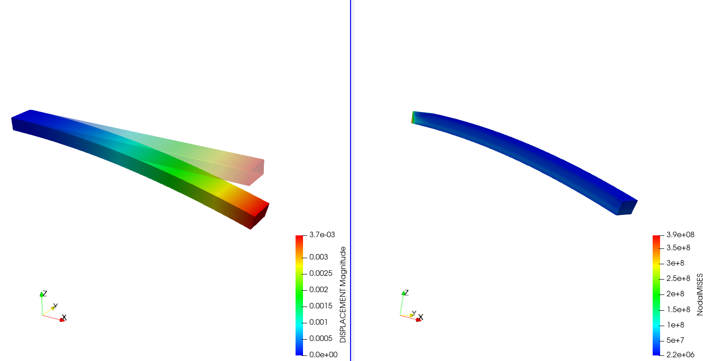
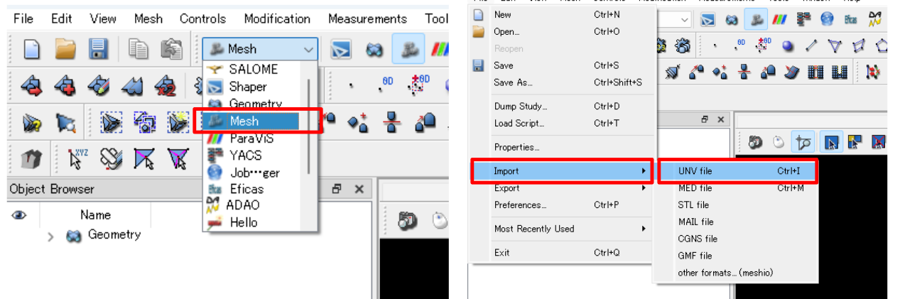
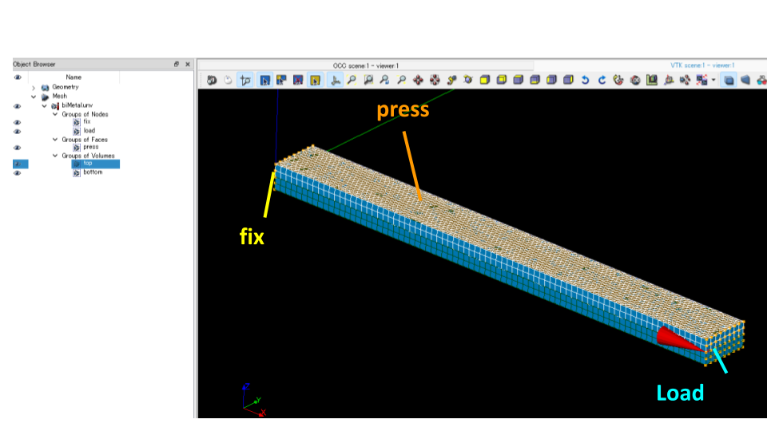
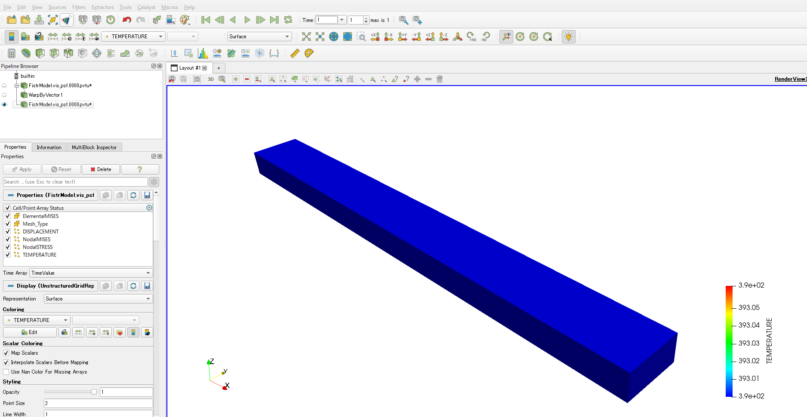

# 【FrontISTRで熱応力解析】バイメタルの温度条件から熱膨張

こんにちは。今回はFrontISTRで**バイメタル**の熱応力解析をやってみた話です。

バイメタルとは、線膨張係数（温度が上がったときにどれだけ伸びるかを表す係数）が違う2種類の金属板を貼り合わせた部材のことです。片方がよく伸びてもう片方があまり伸びないので、温度が変わると板全体が反ります。サーモスタットや温度センサーなどで実際に使われている仕組みです。

温度を与えたときにどれくらい反るのか、FrontISTRで確かめてみました。実際に組んだ.cntファイルの中身と、つまずいたポイントをまとめておきます。

今回は温度条件を直接与えることで熱膨張（熱応力、熱構造）を計算します。熱解析（熱伝導解析）は行っていません。次回の記事では、熱解析の温度分布から熱膨張（熱応力、熱構造）を計算する解析を紹介します。

先に結果です。



*変位（反り）とミーゼス応力分布。AluminumとSteelの線膨張係数の差で板が湾曲している。*

温度を293K（20℃）から393K（120℃）まで上げると、よく伸びるAluminum側に引っ張られる形で、板全体がSteel側にたわむ変形になりました。接合面のあたりは応力も高くなっています。

## この記事で分かること

- FrontISTRでバイメタルの熱応力解析をやる一連の流れ
- .cnt/.msh/.unv/hecmw_ctrl.dat、4つのファイルの役割の違い
- .cntファイルで温度を与える書き方（`!TEMPERATURE`, `!REFTEMP`, `!EXPANSION_COEFF`）
- 材料をtop/bottomの要素グループに割り当てる仕組み（`!SECTION`）
- 熱の与え方の種類（温度指定・熱伝達率・熱流束・体積発熱）と`!TEMPERATURE`/`!SFILM`の使い分け
- `!RESTART`, `!SOLVER`, `!BOUNDARY`など、その他の.cnt設定の意味
- 解析結果に温度分布（TEMP）を出す設定（`!OUTPUT_RES`, `!OUTPUT_VIS`）
- WSL上でfistr1を実行するコマンド
- ParaViewでTEMPのコンター図を出す方法
- 手計算（Timoshenkoの式）で結果が合っているか検算する方法

## こんな方におすすめ

- FrontISTRで構造解析は少しやったことがあって、次は熱応力解析にも挑戦したい方
- easyIstr・WSL環境でFrontISTRを動かしている方
- .cntファイルのどこに温度条件を書けばいいのか、いまいち分からない方
- ParaViewで結果を開いたのにTEMPが選択肢に出てこなくて困っている方

## 今回のモデル

片方をAluminum、もう片方をSteelにした2層構成のシンプルな板です。

- 形状：板（X=0〜200mm, Y=0〜20mm, 板厚5mm）
- メッシュ：SALOMEで作ったUNVファイルをFrontISTR形式に変換したもの
- 材料：Aluminum（線膨張係数が大きい） / Steel（線膨張係数が小さい）の2層
- 境界条件：片端を完全拘束（fix）
- 温度条件：基準温度293K → 全体393Kに加熱

材料物性はこちらです。

| 材料 | ヤング率 [Pa] | ポアソン比 | 密度 [kg/m³] | 線膨張係数 [1/K] |
|---|---|---|---|---|
| Aluminum | 7.00×10^10 | 0.345 | 2690 | 2.5×10^-5 |
| Steel | 2.06×10^11 | 0.29 | 7860 | 1.2×10^-5 |

Aluminumの線膨張係数はSteelの倍以上あり、この差が反りの原動力になります。

## .cnt / .msh / .unv / hecmw_ctrl.dat の違い

.cntの中身を見る前に、ファイルの役割を整理しておきます。

| ファイル | 役割 | 主な中身 |
|---|---|---|
| .unv | SALOMEなど外部プリプロセッサが吐き出すメッシュの中間ファイル（Universal File Format） | 節点座標・要素・グループ名など。FrontISTR専用の形式ではない |
| .msh | unv2fistr.py等で.unvから変換した、FrontISTR用のメッシュファイル | 節点・要素に加え、材料の初期値、`!SECTION`（材料と要素グループの対応）、`!NGROUP`/`!SGROUP`（境界条件用の節点・面グループ） |
| .cnt | 解析制御ファイル。「何を・どう解くか」を書くメインの設定ファイル | 解析の種類、境界条件・荷重、材料物性（.mshの値を上書きできる）、出力設定、ソルバー設定 |
| hecmw_ctrl.dat | 上のファイルたちを紐付ける、いわば目次役のファイル | `!MESH`, `!CONTROL`, `!RESULT`, `!RESTART` などで各ファイル名を指定する。fistr1が一番最初に読むのはこれ |

流れは、**.unv（形状・メッシュ）→ .msh（FrontISTR形式に変換）→ .cnt（解析条件を書く）** の順でファイルを用意し、**hecmw_ctrl.dat** がそれをまとめてfistr1に教える、というイメージです。

## 元になったUNVファイルをSALOMEで確認

今回使った `unv/biMetal.unv` は、**EasyIstrのサンプルデータ**からもらってきたものです。中身を確認するため、SALOMEで開いてみました。

SALOMEを起動したら、左上のモジュール切り替えで「Mesh」を選びます。続けて「File」→「Import」→「UNV file」で、biMetal.unvを読み込みます。



*Meshモジュールに切り替えてから、File→Import→UNV fileでbiMetal.unvを読み込む。*

読み込むと、Object Browser側に次のグループが定義されていました。

- Groups of Nodes：fix, load
- Groups of Faces：press
- Groups of Volumes：top, bottom

3Dビューで見た形状とグループの位置はこちらです。



*SALOMEで開いたbiMetal.unv。左端がfix（固定端）、上面がpress、右端の先端がLoadになっている。*

- **fix**：左端の固定端。ここに拘束をかけます
- **press**：上面全体。対流熱伝達（`!SFILM`）や、もともとの圧力荷重をかける面です
- **load**：右端の先端。温度や荷重を絡める場所として使います
- **top / bottom**（Volumeグループ）：それぞれAluminum、Steelを割り当てる要素グループです

このグループ名が、そのまま.cnt内の`!BOUNDARY`や`!SFILM`、`!FIXTEMP`などで指定するグループ名になります。.cntを書く前に、SALOME側でどんなグループが用意されているかを確認しておくと迷いません。

## .cntファイルで温度分布を設定する

FrontISTRで熱応力解析（熱による膨張だけを考える構造解析）をするには、.cntファイルに**温度条件**と**線膨張係数**を書き足します。今回使った設定は以下の通りです。

```
###############
# Temperature #
###############
!TEMPERATURE, GRPID=1
ALL, 393
!REFTEMP
293

############
# Material #
############
!MATERIAL, NAME=Aluminum
!ELASTIC, TYPE=ISOTROPIC
70000000000, 0.345
!DENSITY
2690
!EXPANSION_COEFF, DEPENDENCIES=0
0.000025

!MATERIAL, NAME=Steel
!ELASTIC, TYPE=ISOTROPIC
206000000000, 0.29
!DENSITY
7860
!EXPANSION_COEFF, DEPENDENCIES=0
0.000012
```

押さえておきたいのは次の3つのキーワードです。

- **!TEMPERATURE**：解析のときに与える温度です。ここでは全節点（ALL）に393Kを指定しています
- **!REFTEMP**：熱ひずみを計算するときの基準温度です。この温度からの差分でひずみが発生します
- **!EXPANSION_COEFF**：材料ごとの線膨張係数です。この数値が材料間で違うからこそ、バイメタル特有の反りが生まれます

熱ひずみは次の式で決まります。

$$
\varepsilon_{\mathrm{thermal}} = \alpha \left( T - T_{\mathrm{ref}} \right)
$$

$\alpha$が線膨張係数、$T$が与えた温度、$T_{\mathrm{ref}}$が基準温度（!REFTEMP）です。Aluminumの$\alpha$はSteelの約2倍あるので、同じだけ温度が上がってもAluminum側のほうがより伸びようとします。この差が板の反りになります。

## 材料のtop/bottomへの割り当て

`.cnt`の`!MATERIAL`ブロックには「Aluminumの中身はこれ」「Steelの中身はこれ」とは書いてありますが、どの要素にAluminumを使うか・どの要素にSteelを使うかは書かれていません。この割り当ては**`.msh`ファイル側**でやっています。

`FistrModel.msh`にはこう書かれています。

```
!ELEMENT, TYPE=351, EGRP=top
（...要素の並び...）
!ELEMENT, TYPE=351, EGRP=bottom
（...要素の並び...）

!MATERIAL, NAME=Aluminum, ITEM=3
（...ヤング率・密度・線膨張係数...）
!SECTION, TYPE=SOLID, EGRP=top, MATERIAL=Aluminum

!MATERIAL, NAME=Steel, ITEM=3
（...ヤング率・密度・線膨張係数...）
!SECTION, TYPE=SOLID, EGRP=bottom, MATERIAL=Steel
```

流れはこうです。

1. `.msh`側で、要素をあらかじめ`top`グループと`bottom`グループに分けておく（SALOMEで定義したVolumeグループ）
2. `!SECTION, TYPE=SOLID, EGRP=top, MATERIAL=Aluminum`で「`top`グループの要素には`Aluminum`という名前の材料を使う」と紐付ける
3. `.cnt`側の`!MATERIAL, NAME=Aluminum`ブロックで、その材料名の中身（ヤング率・密度・線膨張係数）を定義する

`!SECTION`が「どの要素」と「どの材料名」を結びつけ、`.cnt`の`!MATERIAL`が「その材料名の中身」を決める、という役割分担です。

## 熱の与え方の種類

今回は`!TEMPERATURE`で「全体を393Kにする」と温度を直接指定しましたが、FrontISTRで熱を与える方法はこれだけではありません。大きく分けると次の4種類があります。

| 与え方 | 使うキーワード | 内容 |
|---|---|---|
| 温度を直接指定 | `!TEMPERATURE`（構造解析）／`!FIXTEMP`（熱伝導解析） | 節点の温度そのものを指定する |
| 熱伝達率（対流）で指定 | `!FILM`／`!SFILM` | 熱伝達率 h [W/m²K] と周囲（流体）温度から、熱の出入りを計算する |
| 熱流束で指定 | `!CFLUX`（節点の集中熱流束）／`!DFLUX`・`!SFLUX`（要素面・面グループの分布熱流束） | 単位面積あたりの熱の出入り量を直接与える |
| 体積として熱量を与える（内部発熱） | `!DFLUX`（荷重タイプ=BF） | 要素全体に対して単位体積あたりの発熱量を与える。例：`!DFLUX` / `ALL, BF, 1.0` |

今回のバイメタル解析で使ったのは、このうち一番上の「温度を直接指定」です。もう一つの熱伝導解析の記事では、下から2番目の`!SFILM`（熱伝達率で指定）を使っています。この2つを比べると次のような違いがあります。

| | `!TEMPERATURE`（直接指定） | `!SFILM`（熱伝達率指定） |
|---|---|---|
| 与えるもの | 節点の温度そのもの | 熱伝達率 h [W/m²K] と周囲（流体）温度 |
| 解析の種類 | 温度が分かっているとして、構造解析（熱応力解析）にそのまま使える | 先に熱伝導解析で温度分布を求める必要がある |
| 境界条件のタイプ | Dirichlet型（温度を強制的に決める） | Robin型（熱の出入りを式で表現する） |
| 向いているケース | 温度がすでに分かっている・とりあえず単純化したい場合 | 自然対流・水冷など、周囲との熱のやり取りをリアルに再現したい場合 |

`!SFILM`は「面と周囲温度の差」から熱の出入りを計算する境界条件なので、他に熱源（`!FIXTEMP`や`!DFLUX`など）がないと、断熱面を除いたモデル全体が単純に周囲温度と同じ値に落ち着いてしまいます。温度に意味のある勾配を作りたいなら、どこかに熱源側の条件も必要です。

## 境界条件とソルバー設定

```
!RESTART, FREQUENCY=1
!SOLVER,METHOD=CG,PRECOND=1,ITERLOG=NO,TIMELOG=YES
 20000, 2
 1.00000e-06, 1.00000, 0.00000
 0.100000, 0.100000

!BOUNDARY, GRPID=1
fix, 1, 1, 0.0
fix, 2, 2, 0.0
fix, 3, 3, 0.0
```

**!RESTART, FREQUENCY=1** は、リスタートファイル（途中経過）を1ステップごとに書き出す設定です。

**!SOLVER** は連立方程式の解き方の設定です。

| 項目 | 値 | 意味 |
|---|---|---|
| METHOD | CG | 解法は共役勾配法（Conjugate Gradient）。対称行列に強い反復解法です |
| PRECOND | 1 | 前処理はSSOR（対称逐次過緩和法） |
| ITERLOG | NO | 反復ごとの収束履歴はログに出さない |
| TIMELOG | YES | ソルバーの計算時間はログに出す |

続く数値行は、最大反復回数=20000回・前処理の反復数=2回（1行目）、収束判定の打ち切り誤差=1.0×10⁻⁶（2行目）です。3行目はSSOR前処理の追加パラメータで、詳細は未確認ですがREVOCAP生成の実績あるテンプレート値なのでそのまま使えます。

**!BOUNDARY, GRPID=1** は拘束条件です。`fix`はSALOMEで定義した**節点グループ**の名前で、左端の固定端に含まれる節点の集まりです（前の節でSALOMEを開いたときに「Groups of Nodes: fix」として見えていたもの）。

書式は「グループ名, 開始DOF番号, 終了DOF番号, 与える値」です。DOF番号は1=X方向・2=Y方向・3=Z方向の並進変位を表し、`fix, 1, 1, 0.0`のように開始と終了に同じ番号を書くと「そのDOF1つだけを指定する」という意味になります。

- `fix, 1, 1, 0.0`：fixグループのX方向変位（DOF1〜DOF1）を0にする
- `fix, 2, 2, 0.0`：fixグループのY方向変位（DOF2〜DOF2）を0にする
- `fix, 3, 3, 0.0`：fixグループのZ方向変位（DOF3〜DOF3）を0にする

この3行を合わせることで、fixグループのX・Y・Z方向の変位をすべて0にする＝完全固定にしています。

## 結果に温度分布（TEMP）を出力する設定

ParaViewで温度分布を見るには、.cntファイルの出力設定に `TEMP, ON` を足しておく必要があります。デフォルトのままだと変位や応力しか出力されず、TEMPが結果に含まれません。

```
!OUTPUT_RES
DISP, ON
NMISES, ON
NSTRESS, ON
EMISES, ON
TEMP, ON

!OUTPUT_VIS
DISP, ON
NMISES, ON
NSTRESS, ON
EMISES, ON
TEMP, ON
```

**!OUTPUT_RES** がresファイル（数値データ）、**!OUTPUT_VIS** がvis_psf（ParaView用の可視化データ）への出力設定です。TEMPを見たいなら、両方にTEMP, ONを足します。

## 初めての設定手順（全体の流れ）

大まかな流れをまとめておきます。

1. SALOMEなどでジオメトリを作り、メッシュを切って **.unv** 形式で出力する（境界条件用にグループ名も付けておく）
2. unv2fistr.py等の変換ツールで.unvを **.msh** に変換する
3. **hecmw_ctrl.dat** を用意し、`!MESH`/`!CONTROL`/`!RESULT`などに.mshや.cnt、出力する結果ファイル名を書く
4. **.cnt** を書く。「解析の種類（`!SOLUTION,TYPE=...`）→境界条件・荷重→材料物性→出力設定」の順に書くと迷いにくい
5. WSLで `fistr1` を実行する
6. 出力された.vis_psf.\*.pvtuをParaViewで開いて結果を見る

1〜2はSALOME＋easyIstrのGUI操作でまとめてできます。3〜4は、既存の.cnt例をコピーして必要なところだけ書き換えるのが早いです。

## WSLでFrontISTRを実行する

WindowsのフォルダはWSLから `/mnt/d/...` のようにアクセスできます。作業フォルダに移動して `fistr1` を実行するだけです。

```bash
# 作業フォルダに移動（Windowsパスと対応）
# D:\work\002_CAE\frontistr\work\20260707_biMetal
cd /mnt/d/work/002_CAE/frontistr/work/20260707_biMetal

# FrontISTRソルバーを実行（1プロセス）
fistr1

# ログを画面表示しつつファイルにも残す場合
fistr1 | tee FistrModel.log

# 並列実行する場合（例: 4プロセス）
mpirun -np 4 fistr1
```

実行すると、`FistrModel.res.*`（数値結果）と `FistrModel.vis_psf.*`（ParaView用データ、拡張子.pvtu）が出力されます。

## 結果の確認：ParaViewでTEMPを表示する

出力された `FistrModel.vis_psf.*.pvtu` をParaViewで開きます。左側のプロパティパネルのColoringから**TEMP**を選ぶと、温度分布が表示されます。



*Coloringを TEMP に切り替えて表示した温度分布。293K→393Kの加熱が全体に反映されている。*

TEMPが選択肢に出てこない場合は、.cntの `!OUTPUT_VIS` にTEMP, ONが入っているか、解析をやり直して出力ファイルが更新されているかを確認してください。

## 手計算による検算

FEAの結果は見た目がそれっぽくても、桁や向きが間違っていることがあります。Timoshenkoのバイメタル梁の理論式で先端のたわみを手計算し、FEAの結果と突き合わせてみました。

### 曲率の式の導出

層の厚さが等しい（$t_1=t_2=t$、合計厚さ$h=2t$）バイメタル梁を考えます。界面を原点$y=0$とし、下層（材料2、厚さ$t$）を$y\in[-t,0]$、上層（材料1、厚さ$t$）を$y\in[0,t]$とします。

前提は次の2つです。

- 平面保持仮定：曲げ変形後も断面は平面のまま。2層は完全に接着され、界面ですべらない
- 外力なし：断面内の軸力・モーメントはどちらもゼロ（自由な熱変形）

断面内の全ひずみを、軸ひずみ$\varepsilon_0$と曲率$\kappa=1/\rho$を使って

$$
\varepsilon(y) = \varepsilon_0 + \kappa y
$$

と置きます。応力は、熱で伸びようとした分を差し引いて

$$
\sigma_i(y) = E_i\left[\varepsilon(y) - \alpha_i \Delta T\right]
$$

外力なしの条件（軸力=0、モーメント=0）を式にすると、

$$
\int_{-t}^{0}\sigma_2\,dy+\int_{0}^{t}\sigma_1\,dy=0, \qquad \int_{-t}^{0}\sigma_2\,y\,dy+\int_{0}^{t}\sigma_1\,y\,dy=0
$$

$\int_0^t dy=t,\ \int_0^t y\,dy=t^2/2,\ \int_0^t y^2dy=t^3/3$（下層側は符号が変わるだけ）を使って計算すると、次の2式になります。

$$
(E_1+E_2)\varepsilon_0=(E_1\alpha_1+E_2\alpha_2)\Delta T-\frac{\kappa t}{2}(E_1-E_2)
$$

$$
(E_1-E_2)\varepsilon_0=(E_1\alpha_1-E_2\alpha_2)\Delta T-\frac{2\kappa t}{3}(E_1+E_2)
$$

1本目の式から$\varepsilon_0$を求めて2本目に代入し、$\Delta\alpha=\alpha_1-\alpha_2$として整理すると、

$$
\kappa t\left[\frac{2}{3}(E_1+E_2)^2-\frac{1}{2}(E_1-E_2)^2\right]=2E_1E_2\,\Delta\alpha\,\Delta T
$$

左辺のカッコの中を展開すると$\dfrac{E_1^2+14E_1E_2+E_2^2}{6}$になるので、

$$
\kappa=\frac{12\,E_1E_2\,\Delta\alpha\,\Delta T}{t\,(E_1^2+14E_1E_2+E_2^2)}
$$

$t=h/2$を代入し、$n=E_1/E_2$で分子分母を$E_2^2$で割ると、

$$
\frac{1}{\rho}=\frac{24\,n\,\Delta\alpha\,\Delta T}{h\,(n^2+14n+1)}
$$

さらに恒等式$n^2+14n+1=n\left(12+\dfrac{(1+n)^2}{n}\right)$で$n$を約分すると、次の形になります。

$$
\frac{1}{\rho} = \frac{24\,\Delta\alpha\,\Delta T}{h\left(12 + \dfrac{(1+n)^2}{n}\right)}, \quad n = \frac{E_1}{E_2}
$$

この式は、「断面内の軸力とモーメントが両方ゼロになる」という条件だけから出てくるもので、特別な仮定を追加しているわけではありません（Timoshenkoの1925年論文もこのアプローチです）。

### 数値を当てはめる

今回のモデル（L=200mm、各層厚t=5mm、h=10mm、ΔT=100K、Aluminum: E₁=70GPa・α₁=25×10⁻⁶/K、Steel: E₂=206GPa・α₂=12×10⁻⁶/K）を当てはめます。

- n = E₁/E₂ = 70/206 ≈ 0.340
- (1+n)²/n ≈ 5.28、分母は12+5.28 ≈ 17.28
- Δα = α₁−α₂ = 13×10⁻⁶/K
- 1/ρ = 24×13×10⁻⁶×100 / (0.01×17.28) ≈ 0.1805 /m → ρ ≈ 5.54 m

先端の角度θ=L/ρは小さいので、放物線で近似して先端のたわみを見積もると、

$$
\delta \approx \frac{L^2}{2\rho} = \frac{0.2^2}{2\times5.54} \approx 3.61\ \mathrm{mm}
$$

FEA側で固定端の反対側の先端（X=0.2m、幅の中央、AluminumとSteelの接合面）の節点変位を見ると、Z方向のたわみは**3.637mm**でした。手計算の3.61mmとの差は約0.7%、反る向き（線膨張係数の大きいAluminum側とは逆方向に凸）も理論通りです。


*変位（反り）とミーゼス応力分布。この先端のZ方向変位が3.637mm。*

| | 先端たわみ（Z方向） |
|---|---|
| 手計算（Timoshenko式） | 約3.61mm |
| FEA（FrontISTR） | 3.637mm |
| 差 | 約0.7% |

## まとめ

- バイメタルの熱応力解析は、線膨張係数の違う2つの材料を組み合わせて温度を与えるだけで再現できます。
- .cntファイルでは`!TEMPERATURE`（与える温度）、`!REFTEMP`（基準温度）、`!EXPANSION_COEFF`（材料ごとの線膨張係数）を設定します。
- 材料の要素グループへの割り当ては`.msh`側の`!SECTION`で行います。
- 結果にTEMPを出したいときは、`!OUTPUT_RES`と`!OUTPUT_VIS`の両方にTEMP, ONを足します。
- WSLでは作業フォルダに移動してfistr1を実行するだけでOKです。
- Timoshenkoの式で手計算した結果とFEAの結果は約0.7%差で一致し、妥当性を確認できました。

次回の記事では、熱解析の温度分布から熱膨張（熱応力、熱構造）を計算する解析を紹介します。
