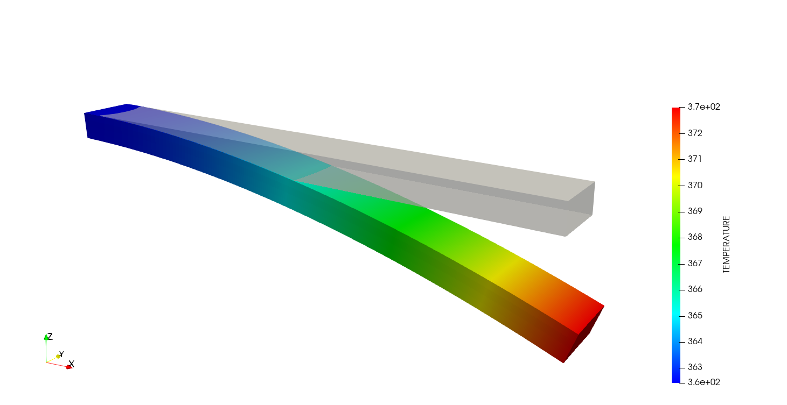
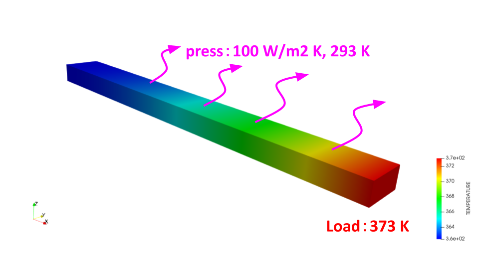

# 【FrontISTRで熱応力解析】熱伝導解析→温度分布→熱膨張

今回はFrontISTRで、**熱伝導解析で求めた温度分布を熱膨張解析に読み込む**という2ステップの連成解析をやってみた話です。

こんにちは（[@t_kun_kamakiri](https://twitter.com/t_kun_kamakiri)）

[前回のバイメタルの熱応力解析記事](#)では、温度を`!TEMPERATURE`で「全体を393Kにする」と直接指定しました。今回はその発展で、まず対流熱伝達（フィルム係数）から熱伝導解析で温度分布を求め、その結果をそのまま熱膨張解析に渡します。温度を直接与える場合と比べて、より実際の伝熱に近い温度分布を使えるのが特徴です。

温度分布は熱解析で求め、その温度条件を構造解析に引き継いで熱膨張を計算しています。

先に結果を示します。



*Step1で求めた温度分布（左）と、それを読み込んで計算したStep2の変形（右）。*

先端（X=200mm）を373Kに固定し、上面を対流冷却（周囲293K）することで温度勾配を作り、その温度分布を熱膨張解析に渡しています。

## この記事で分かること

- 熱伝導解析（`!SOLUTION,TYPE=HEAT`）と熱膨張解析（`!SOLUTION,TYPE=STATIC`）を2ステップに分けて連成させる方法
- 対流熱伝達境界条件`!SFILM`と、熱源としての`!FIXTEMP`の設定
- Step1の温度分布をStep2に読み込む`!TEMPERATURE, READRESULT, SSTEP`の使い方
- hecmw_ctrl.datで別フォルダの熱解析結果を相対パスで引き継ぐ方法
- フォルダを001_heat/と002_expansion/に分けて管理する構成
- 温度を直接与えた場合との変形量の違い

熱伝導解析の設定から、その結果を構造解析に引き継ぐ流れ、フォルダ分けの運用まで順番に見ていきます。次のような方に向けた内容です。

## こんな方におすすめ

- 温度を直接与えるのではなく、対流条件から現実的な温度分布を求めたい方
- 熱伝導解析の結果を構造解析（熱応力・熱膨張）に受け渡す方法が分からない方
- FrontISTRで複数ステップの解析をどうフォルダ分けして管理すればよいか知りたい方

*FrontISTR 5.9 / WSL2環境に構築*

## なぜ2ステップに分けるのか

前回のバイメタル記事では、`!TEMPERATURE`で温度を直接指定しました。温度分布が既に分かっている（あるいは単純化してよい）場合には手早い方法です。

一方で、実際の製品では「対流でどれくらい冷える／温まるか」「どこが何度になるか」自体が知りたいことも多くあります。この場合は先に熱伝導解析で温度分布を求め、それを構造解析に渡して熱膨張・熱応力を計算する、という2段階の流れになります。FrontISTRでは次のように分けて実行します。

- **Step1（`001_heat`フォルダ）**：`!SOLUTION,TYPE=HEAT`で温度分布を求める
- **Step2（`002_expansion`フォルダ）**：`!SOLUTION,TYPE=STATIC`で、Step1の温度分布を`!TEMPERATURE, READRESULT`で読み込みながら変形・応力を求める

Step1は`001_heat`、Step2は`002_expansion`と作業フォルダを分け、それぞれに.cntを用意してfistr1を実行します（後述）。

## フォルダ構成

Step1とStep2のファイルを同じフォルダに混在させると、hecmw_ctrl.datやFistrModel.cntの使い回しで事故りやすいため、フォルダを2つに分けました。**まず `001_heat` フォルダで熱伝導解析を行い、次に `002_expansion` フォルダで熱膨張を計算する**という流れです。

```
20260707_biMetal_heatFilm/
  001_heat/               ← Step1: 熱伝導解析
    FistrModel.msh
    FistrModel.cnt
    hecmw_ctrl.dat
    FistrModel.res.0.1    ← この温度分布をStep2が読む
  002_expansion/           ← Step2: 熱膨張（熱応力）解析
    FistrModel.cnt          (温度は001_heatの結果を読み込むだけなので境界条件は少ない)
    hecmw_ctrl.dat           (../001_heat/FistrModel.msh, ../001_heat/FistrModel.res を参照)
```

フォルダ名の頭に `001_` `002_` と番号を付けているのは、実行する順番を分かりやすくするためです。002_expansion/hecmw_ctrl.datから001_heat/側のメッシュと結果ファイルを相対パスで直接参照します。メッシュファイルをコピーする必要がなく、Step1の結果が更新されればStep2はそれを参照するだけなので、ファイルの二重管理を避けられます。メッシュはbiMetalと同じもの（Aluminum/Steelの2層板）を使っています。

## Step1：熱伝導解析の設定

上面（press面）に対流熱伝達、先端（load：X=200mmのノードグループ）に固定温度を与えて、温度勾配を作ります。今回の熱解析の条件は次のとおりです。



*先端を373Kに固定し、上面から100 W/m²K・周囲293Kで対流冷却する。右端（高温）から左端（低温）へ温度勾配ができる。*

ここでのポイントは、熱伝導解析では構造解析のような**変位の拘束条件が要らない**ことです。構造解析では物体が動いてしまわないように固定端を設けますが、熱伝導解析で解くのは温度であって物体は動きません。境界条件として与えるのは「温度」や「熱の出入り」だけで、`!BOUNDARY`のような変位拘束は不要です。

```
!SOLUTION,TYPE=HEAT
!HEAT
 0.0

!OUTPUT_RES
TEMP, ON
!OUTPUT_VIS
TEMP, ON

# press面（上面全体）に対流熱伝達（フィルム）境界条件を設定
# 面グループ名, 熱伝達率[W/m^2K], 周囲温度[K]
!SFILM
press, 100.0, 293.0

# 熱源：load面（X=0.2の先端、ノードグループ）を固定温度373Kにする
!FIXTEMP
load, 373.0

!MATERIAL, NAME=Aluminum
!CONDUCTIVITY, TYPE=ISOTROPIC
237.0

!MATERIAL, NAME=Steel
!CONDUCTIVITY, TYPE=ISOTROPIC
50.0
```

- `!SOLUTION,TYPE=HEAT` + `!HEAT` / `0.0` で定常熱伝導解析を指定します（`0.0`が定常、非定常なら時間刻みを書く）
- `!SFILM`は面グループに対流熱伝達を与えます。書式は「面グループ名, 熱伝達率, 周囲温度」です
- `!FIXTEMP`は節点グループに温度を固定します
- 熱伝導率は`!CONDUCTIVITY`で材料ごとに与えます

設定で気をつけた点が2つあります。

1つ目は、`!SFILM`は面グループ(SGROUP)しか参照できないことです。今回のメッシュには先端だけを切り出した面グループがなく、ノードグループ(NGROUP)の`load`はそのまま`!SFILM`には使えません（fistr1はNGROUPをSGROUPとして受け付けない）。そのため先端は`!FIXTEMP`で固定温度として扱いました。

2つ目は、熱源がないと定常解が一様になることです。press面の対流だけ・他は断熱という設定では、内部発熱も固定温度もないため、定常解は周囲温度293Kで一様になってしまいます。`!FIXTEMP`で先端を373Kに固定して、初めて温度勾配のある結果になります。

実行すると、先端（373K固定）から反対側にかけて温度が下がり、最低温度は約362.4Kでした。Aluminum・Steelとも熱伝導率が高いため、200mm程度の長さでは対流だけではあまり冷えず、勾配は緩やかです。

## Step2：熱膨張解析の設定

Step1の温度分布を読み込んで、変位・応力を計算します。Step2は構造解析なので、Step1の熱解析とは違って変位の拘束が必要です。左端を完全拘束し、そこに熱解析で求めた温度分布を与えます。


*左端を完全拘束（fix）し、Step1で計算した温度分布を与える。灰色が変形前、色付きが変形後で、線膨張係数の差により板が反っている。*

```
!SOLUTION,TYPE=STATIC
!STATIC

!OUTPUT_RES
DISP, ON
NMISES, ON
NSTRESS, ON
EMISES, ON
TEMP, ON
!OUTPUT_VIS
DISP, ON
NMISES, ON
NSTRESS, ON
EMISES, ON
TEMP, ON

!BOUNDARY, GRPID=1
fix, 1, 1, 0.0
fix, 2, 2, 0.0
fix, 3, 3, 0.0

# Step1(heatFilm)の結果を読み込む
!TEMPERATURE, READRESULT=1, SSTEP=1
!REFTEMP
293
```

今回の肝は`!TEMPERATURE, READRESULT=1, SSTEP=1`です。各オプションの意味は次のとおりです。

- **READRESULT=1**：熱伝導解析の結果を1ステップ分読み込む
- **SSTEP=1**：その最初のステップから読む

これを指定すると、温度の値そのものは書きません（節点番号・温度の並びは不要）。

ここで注意したいのは、**この.cntには「どのファイルから温度を持ってくるか」は書かれていない**ことです。.cntの`!TEMPERATURE, READRESULT`は「熱解析結果から温度を読む」というスイッチにすぎず、実際にどの結果ファイルを読むかは次の節で説明する`hecmw_ctrl.dat`側で指定します。つまり熱条件の引き継ぎは、.cntと001_heatの結果ファイルを`hecmw_ctrl.dat`が仲介する形になっています。

`!REFTEMP`は熱ひずみの基準温度で、293Kにしています。ここからの差分でひずみが発生します。

材料の弾性率・密度・線膨張係数は`.msh`ファイルに埋め込まれているため、Step2の.cntで再定義していません。同じメッシュをStep1と共有しているためです。

## hecmw_ctrl.datで熱解析の温度を引き継ぐ

**熱条件を実際に引き継いでいるのはこのhecmw_ctrl.datです。** 002_expansion側のhecmw_ctrl.datで、メッシュと温度入力（fstrTEMP）を001_heatフォルダから相対パスで参照します。

```
!MESH, NAME=fstrMSH, TYPE=HECMW-ENTIRE
../001_heat/FistrModel.msh

!CONTROL,NAME=fstrCNT
FistrModel.cnt

!RESULT,NAME=fstrRES,IO=OUT
FistrModel.res

!RESULT,NAME=fstrTEMP,IO=IN
../001_heat/FistrModel.res
```

このファイルは「キーワード行」と「その次の行のファイル名」が1組になっています。上から順に見ていきます。

- **`!MESH, NAME=fstrMSH`** → `../001_heat/FistrModel.msh`
  使うメッシュを指定します。001_heatのメッシュをそのまま参照します（Step1と同じメッシュ）。
- **`!CONTROL, NAME=fstrCNT`** → `FistrModel.cnt`
  解析制御ファイル（.cnt）を指定します。002_expansion内の自分のFistrModel.cntです。
- **`!RESULT, NAME=fstrRES, IO=OUT`** → `FistrModel.res`
  Step2の計算結果を**書き出す**先です。002_expansion内のFistrModel.resに出力します。
- **`!RESULT, NAME=fstrTEMP, IO=IN`** → `../001_heat/FistrModel.res`
  温度として**読み込む**ファイルです。001_heat（Step1）の結果を読み込み、これがStep2に引き継ぐ温度分布になります。

ポイントは末尾の`IO`です。`IO`は Input/Output（入力/出力）の略で、そのファイルを読み込むのか書き出すのかの向きを表します。

- **IO=IN**：入力。fistr1がそのファイルを読み込む
- **IO=OUT**：出力。fistr1がそのファイルに結果を書き出す

`fstrTEMP`に`IO=IN`を付けることで「001_heatの結果を温度として読み込む」という意味になり、Step1で求めた温度分布がStep2に渡されます。一方の`fstrRES`は`IO=OUT`かつ002_expansion内の別ファイル名なので、Step1の結果を上書きしません。

なお、.cntの`!TEMPERATURE, READRESULT`は「熱解析結果から温度を読む」というスイッチ、このhecmw_ctrl.datの`fstrTEMP, IO=IN`は「読み込むファイルの場所」で、この2つがセットになって初めて温度が引き継がれます。

## 実行手順（WSL）

001_heatと002_expansionで、この順にfistr1を実行します。

```bash
cd /mnt/d/work/002_CAE/frontistr/work/20260707_biMetal_heatFilm

# Step1: 熱伝導解析
cd 001_heat
fistr1
cd ..

# Step2: 熱膨張解析（Step1の温度分布を読み込む）
cd 002_expansion
fistr1
cd ..
```

002_expansion/FistrModel.vis_psf.\*.pvtuをParaViewで開けば、DISP（熱膨張による変形）とTEMPの両方を確認できます。

## 結果：温度の与え方で変形量が変わる

先端中央（X=200mm、幅中央、AluminumとSteelの接合面）の節点変位を、前回のbiMetal（温度を直接指定）と比べてみます。

| | 温度の与え方 | 先端Z方向変位 |
|---|---|---|
| 前回（biMetal） | `!TEMPERATURE`で全体を393Kに直接指定（ΔT=100K一様） | 3.637mm |
| 今回（heatFilm） | 先端373K固定＋対流冷却で生じた温度分布（373K→362K、非一様） | 2.586mm |

最高温度はどちらも近い値（393K vs 373K）ですが、heatFilmは温度上昇が先端付近に偏っていて全体の平均的なΔTが小さいため、変位はひとまわり小さくなりました。温度を一様に与えるか、実際の熱伝導・対流から分布を求めるかで、同じ「最高温度」でも変形量が変わることが確認できます。

## まとめ

- FrontISTRでは、熱伝導解析（`!SOLUTION,TYPE=HEAT`）と構造解析（`!SOLUTION,TYPE=STATIC`）を2つの.cnt・2回のfistr1実行に分けて連成できます。
- 対流境界条件は`!SFILM`で面グループ(SGROUP)に対して設定します。ノードグループには使えません。
- 対流条件だけでは温度勾配が生まれないことがあるため、`!FIXTEMP`などの熱源を別途用意します。
- Step2側は`!TEMPERATURE, READRESULT=1, SSTEP=1`で「熱解析結果から温度を読む」スイッチを入れます。
- 実際にどの結果ファイルから温度を引き継ぐかは`hecmw_ctrl.dat`の`NAME=fstrTEMP, IO=IN`で相対パス指定します（.cntではありません）。
- 温度の与え方（直接指定か、対流から求めるか）によって、同程度の最高温度でも変形量は変わります。

次回は、対流の熱伝達率や周囲温度を変えたときに温度分布・変形がどう変化するか、パラメータを振って試してみようと思います。
