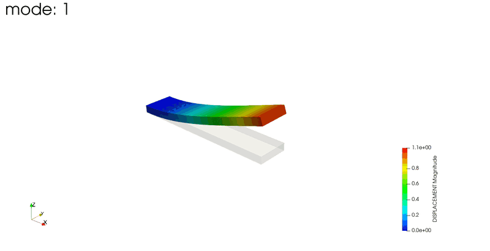
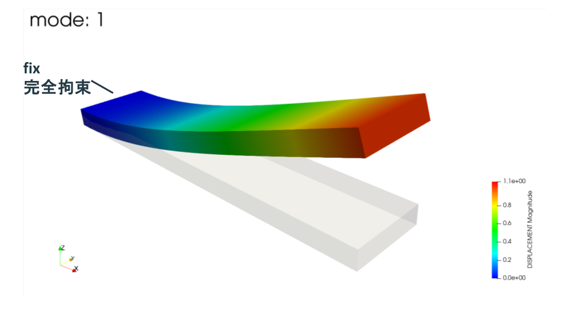
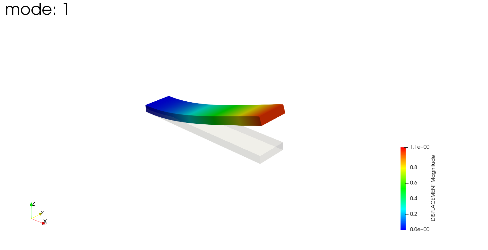
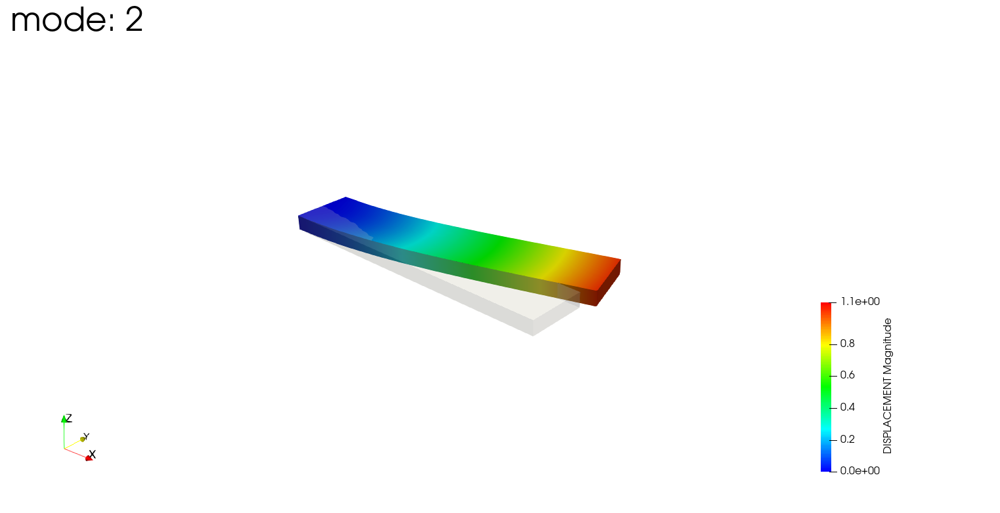
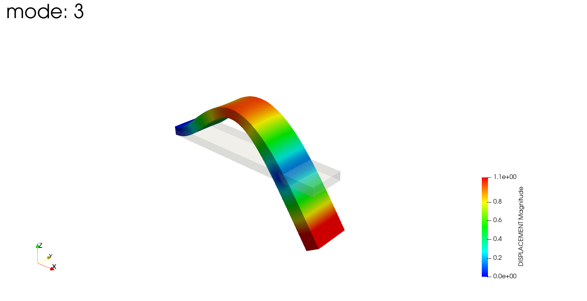
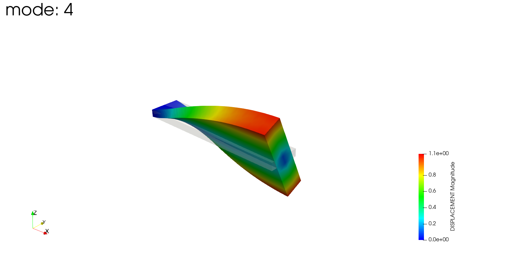
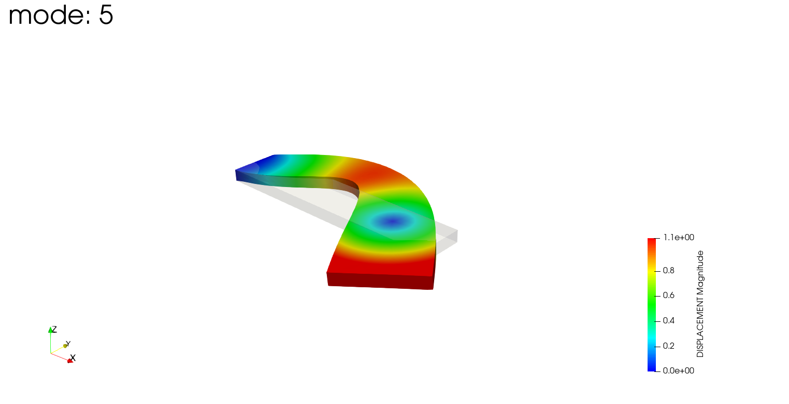

# 【FrontISTRで固有値解析】片持ち板の固有振動数を梁理論と比較

今回はFrontISTRで、片持ちの平板（plate）の**固有値解析**をやってみた話です。単純な片持ち梁は理論式で固有振動数を計算できるので、FEAの結果と理論値を突き合わせて、どれくらい合うかを確認します。

こんにちは（[@t_kun_kamakiri](https://twitter.com/t_kun_kamakiri)）

固有値解析は、構造が持つ「振動しやすい振動数（固有振動数）」と「その振動の形（モード）」を求める解析です。次回、この結果を使って周波数応答解析（特定の振動数で加振したときの応答）を行う予定なので、その前段として固有振動数を押さえておきます。

まずは、固有値解析で得られたモードの動きを見てください。片端を固定した平板が、低次から順に「板厚方向の曲げ → 幅方向の曲げ → 2次曲げ → ねじり → 3次曲げ」と、それぞれ違う形で揺れているのが分かります。



*モード1〜5を順に表示したアニメーション。1つの平板でも、振動数ごとに曲げ・ねじりといった違う変形をします。*

この動きの「揺れやすい振動数（固有振動数）」が、理論式でどこまで言い当てられるのかが今回のテーマです。

先に結果です。梁理論とFEAを比べると、**板厚方向（薄い方向）の曲げモードはFEAが約30%高め**に出て、**幅方向（広い方向）の曲げモードはほぼ一致**しました。この差が何から来るのかも考察します。

| モード | 理論値 [Hz] | FEA [Hz] | 差 |
|---|---|---|---|
| 板厚方向 1次曲げ | 414 | 536 | +29% |
| 幅方向 1次曲げ | 1654 | 1640 | −0.8% |

## この記事で分かること

- FrontISTRで固有値解析を行う`.cnt`の設定（`!SOLUTION,TYPE=EIGEN`, `!EIGEN`）
- 固有値解析でソルバーに直接法（`DIRECT`）を使う理由（反復法だとハングする）
- 片持ち梁の固有振動数の理論式（オイラー・ベルヌーイ梁）の導出
- FEA結果と理論値の比較・考察
- 1次要素（四面体）で固有振動数が高めに出る理由

*FrontISTR 5.9 / WSL2環境に構築*

## 解析モデル

easyIstrのサンプル `plate.unv` を使いました。形状は細長い平板で、片端を完全固定した片持ち梁です。

- 形状：100 × 20 × 5（長さ×幅×板厚）の平板
- メッシュ：SALOMEで作成したUNVを1次四面体（341）に変換、5468要素・1731節点
- 材料：Steel（ヤング率 206 GPa, ポアソン比 0.29, 密度 7860 kg/m³）
- 拘束：`fix` グループ（X=0の端面）を完全固定（X/Y/Z）
- 求める固有値数：20（次回の周波数応答で使うため多めに取得。この記事では低次5モードを理論と比較します）

この解析で使う節点グループは2つです。

- `fix`：X=0側の端面（40節点）。この面を完全固定して固定端にします。
- `load`：X=100側の端面（36節点）。次回の周波数応答解析で、ここに荷重を与えます。

つまり、`fix` 側を固定端、`load` 側を自由端とした片持ち梁になっています。



*左端の `fix` 面を完全拘束（X/Y/Z）した片持ち構成です。灰色が変形前、色付きがmode1（Z方向の1次曲げ）の変形で、固定端から自由端に向かって大きく曲がっているのが分かります。*

## 単位系の確認（mmかmか）

単位には注意が必要です。UNVファイルの単位レコードには「SI: Meter」と書かれていますが、節点座標の値は 100, 20, 5 です。

- もし額面通り**メートル**なら、100m × 20m × 5m の巨大な鋼の塊になり、非現実的です
- 実際に妥当なのは 100mm × 20mm × 5mm の板で、この場合1次曲げが数百Hzオーダーになります

固有振動数は形状の絶対寸法で決まるので、単位の解釈を間違えると桁がずれます。今回は**mm単位**として扱い、座標をmmのままにするため、材料物性も**mm-kg-s系**で入力します。

- ヤング率 E = 2.06×10⁸（kg/(mm·s²)）
- 密度 ρ = 7.86×10⁻⁶（kg/mm³）

この系では時間が秒なので固有振動数はそのままHzで出ます。力はmN、応力はkPaになります。（※ 固有振動数そのものは E/ρ の比で決まるので、mm-tonne-s系やm-kg-s系にしても同じHzになります。）

## .cntファイルの設定

固有値解析は`!SOLUTION,TYPE=EIGEN`と`!EIGEN`で指定します。

```
!SOLUTION,TYPE=EIGEN
# 固有値数, 許容差, 最大反復数
!EIGEN
 5, 1.0e-8, 100

!SOLVER,METHOD=DIRECT,ITERLOG=NO,TIMELOG=YES
 20000, 1
 1.00000e-06, 1.00000, 0.00000

# fix グループを完全固定（X/Y/Z）
!BOUNDARY, GRPID=1
fix, 1, 1, 0.0
fix, 2, 2, 0.0
fix, 3, 3, 0.0

!MATERIAL, NAME=Steel
!ELASTIC, TYPE=ISOTROPIC
2.06e8, 0.29
!DENSITY
7.86e-6
```

- `!EIGEN` は「固有値数, 許容差, 最大反復数」の順。ここでは低次から5個求めます
- `!BOUNDARY` で fix を完全固定（DOF1〜3=X/Y/Z を 0 に）

### ソルバーは必ず直接法（DIRECT）にする

最初、静解析と同じ`!SOLVER,METHOD=CG`（反復法）にしていたら、**計算が終わらなくなりました**。具体的には、`fistr1` はCPUを数分間フル稼働させ続けているのに、結果ファイル（`0.log` など）は空のまま、いつまでたっても計算が完了しませんでした（このように、プログラムが動き続けているのに処理が先に進まず終わらない状態を「ハングする」と言います）。

原因は、反復法（CG）が収束しなかったことです。固有値解析は内部でシフト反転という手法を使い、連立方程式を何度も解きます。このとき反復法だと、解が収束せずに反復を繰り返し続けてしまい、計算が終わらなくなります。

そこで、固有値解析では**直接法**を使います。直接法に変えたら数秒で完了しました。公式のサンプルもeigenでは直接法を使っています。

反復法と直接法の違いは次の通りです。

- **反復法（`CG`など）**：初期値から少しずつ解を改善し、答えに近づけていく方法です。近似を繰り返すため、うまく収束すれば速いですが、今回のように収束しないと終わりません。
- **直接法（`DIRECT`）**：連立方程式を（ガウスの消去法のように）変形して、反復せずに一度で解を求める方法です。収束するかどうかを気にしなくてよいので、固有値解析のように内部で方程式を何度も解く計算でも確実に答えが出ます。

FrontISTRで直接法を指定する書き方は2つあります。

- `!SOLVER,METHOD=DIRECT`：FrontISTR標準の直接法ソルバーです。今回のように1台のPCで動かす（MPI並列なし）場合はこちらを使います。
- `!SOLVER,METHOD=MUMPS`：MUMPSという外部の直接法ライブラリを使う指定です。複数のプロセスで分担して解く並列計算（MPI）に対応しており、大規模モデルを並列環境で解くときに向いています。ただしFrontISTRがMUMPS対応でビルドされている必要があります。

今回はPC1台での実行なので `DIRECT` を選びました。

## 実行

WSLのFrontISTRで実行します。

```bash
cd 001_eigen
~/local/frontistr/bin/fistr1
```

## 結果：固有振動数

得られた固有振動数と、有効質量から判定したモードの種類は次の通りです。

| モード | FEA振動数 [Hz] | モードの種類 |
|---|---|---|
| 1 | 536 | Z方向（板厚方向）の1次曲げ |
| 2 | 1640 | Y方向（幅方向）の1次曲げ |
| 3 | 3303 | Z方向の2次曲げ |
| 4 | 4612 | ねじり |
| 5 | 8835 | Z方向の3次曲げ |

板厚が5mmと薄いZ方向が一番曲がりやすいので、1次モードはZ方向の曲げになります。幅は20mmと厚いので、Y方向の曲げ（モード2）はより高い振動数になります。

## モード形状の確認

冒頭のアニメーション（モード1〜5）を、あらためて1モードずつ静止画で見ていきます。灰色が変形前、色付きが各モードの変形です。

**モード1：Z方向（板厚方向）の1次曲げ**



板厚方向にゆるやかに1回曲がる、最も低い振動数のモードです。

**モード2：Y方向（幅方向）の1次曲げ**



曲げる向きが幅方向に変わったモードです。幅は板厚より厚いので、モード1より高い振動数になります。

**モード3：Z方向の2次曲げ**



板厚方向の曲げですが、途中に節（動かない点）が1つでき、S字状に2回曲がります。

**モード4：ねじり**



曲げではなく、板が長さ方向の軸まわりにねじれるモードです。断面の左右で変位の向きが逆になります。

**モード5：Z方向の3次曲げ**



板厚方向の曲げで、節が2つできて3回曲がる、より高次のモードです。

こうして並べると、最初の1次曲げがどの方向に出るか、どのモードがねじれかを直感的に追えます。次の周波数応答解析では、この1次モード付近の周波数にピークが出ることを確認します。

## 理論値の導出（オイラー・ベルヌーイ梁）

片持ち梁の曲げ振動は、オイラー・ベルヌーイの梁の運動方程式から求められます。

$$
EI\frac{\partial^4 w}{\partial x^4} + \rho A \frac{\partial^2 w}{\partial t^2} = 0
$$

$w(x,t)=W(x)e^{i\omega t}$ と置くと、

$$
\frac{d^4 W}{dx^4} - \beta^4 W = 0, \qquad \beta^4 = \frac{\rho A \omega^2}{EI}
$$

片持ち梁の境界条件（固定端 $x=0$ でたわみ・傾き=0、自由端 $x=L$ でモーメント・せん断力=0）を課すと、次の振動数方程式が得られます。

$$
\cos(\beta L)\cosh(\beta L) + 1 = 0
$$

この解は $\beta_n L = 1.875,\ 4.694,\ 7.855,\ \dots$ です。固有角振動数と固有振動数は、

$$
\omega_n = (\beta_n L)^2 \sqrt{\frac{EI}{\rho A L^4}}, \qquad
f_n = \frac{\omega_n}{2\pi} = \frac{(\beta_n L)^2}{2\pi}\sqrt{\frac{EI}{\rho A L^4}}
$$

ここで $L$ は梁の長さ、$A$ は断面積、$I$ は断面二次モーメントです。曲げの向きによって $I$ が変わります。

- Z方向（板厚方向）の曲げ：$I_z = \dfrac{b h^3}{12}$（$b$=幅20mm, $h$=板厚5mm）
- Y方向（幅方向）の曲げ：$I_y = \dfrac{h b^3}{12}$

## FEAと理論値の比較

L=100mm, b=20mm, h=5mm, E=206GPa, ρ=7860kg/m³ を代入して計算した理論値と、FEAを比較します。

### Z方向（板厚方向）の曲げモード

| モード | 理論値 [Hz] | FEA [Hz] | 差 |
|---|---|---|---|
| Z 1次 | 414 | 536 | +29% |
| Z 2次 | 2592 | 3303 | +27% |
| Z 3次 | 7258 | 8835 | +22% |

### Y方向（幅方向）の曲げモード

| モード | 理論値 [Hz] | FEA [Hz] | 差 |
|---|---|---|---|
| Y 1次 | 1654 | 1640 | −0.8% |

## 考察：なぜ板厚方向の曲げだけ高めに出るのか

Y方向（幅方向）の曲げは理論値とほぼ一致するのに、Z方向（板厚方向）の曲げはFEAが2〜3割も高く出ました。この差の原因は、**1次四面体要素（341）の曲げ剛性の過大評価（ロッキング）**です。

1次四面体要素は、曲げ変形を表現するのが苦手で、曲げ方向に要素が数個しか並んでいないと剛性を過大に見積もります。剛性が高めに出れば、固有振動数も高めに出ます（$f \propto \sqrt{k/m}$）。

- **Z方向の曲げ**：曲げるのは板厚5mmの薄い方向で、そこに要素が2〜3個しか並んでいない → ロッキングが強く、振動数が高めに出る
- **Y方向の曲げ**：曲げるのは幅20mmの広い方向で、要素が十数個並んでいる → ロッキングがほぼ無く、理論値と一致する

つまり「曲げる方向に要素が何個並んでいるか」で精度が決まります。薄い方向の曲げ精度を上げたいなら、板厚方向の要素分割を増やすか、2次要素（342）を使うのが有効です。

理論値と完全一致とはいきませんでしたが、**FEAが高めに出る理由が要素特性から説明できる**こと、そして要素が十分並んだ方向（幅方向）ではきちんと一致することが確認できました。これは1次四面体でメッシュを切るときの重要な注意点です。

## まとめ

- 固有値解析は`!SOLUTION,TYPE=EIGEN`＋`!EIGEN`で設定する。
- ソルバーは直接法（`DIRECT`）にする。反復法（`CG`）だと収束せずハングする。
- 単位系は座標に合わせる（今回はmm）。間違えると固有振動数の桁がずれる。
- 片持ち梁の固有振動数はオイラー・ベルヌーイ梁の式で計算できる。
- 1次四面体要素は、曲げ方向の要素数が少ないと剛性を過大評価し、固有振動数が高めに出る（板厚方向で+約30%）。
- 曲げ方向に要素が十分並んでいれば（幅方向）、理論値とほぼ一致する。

次回は、この固有値解析の結果を読み込んで、周期荷重をかけたときの**周波数応答解析**を行います。
