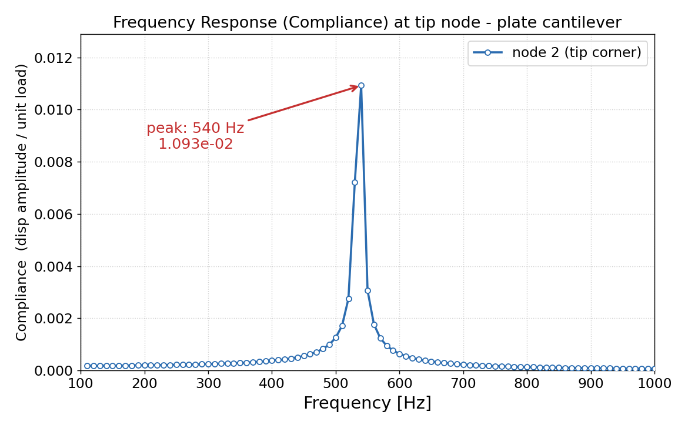
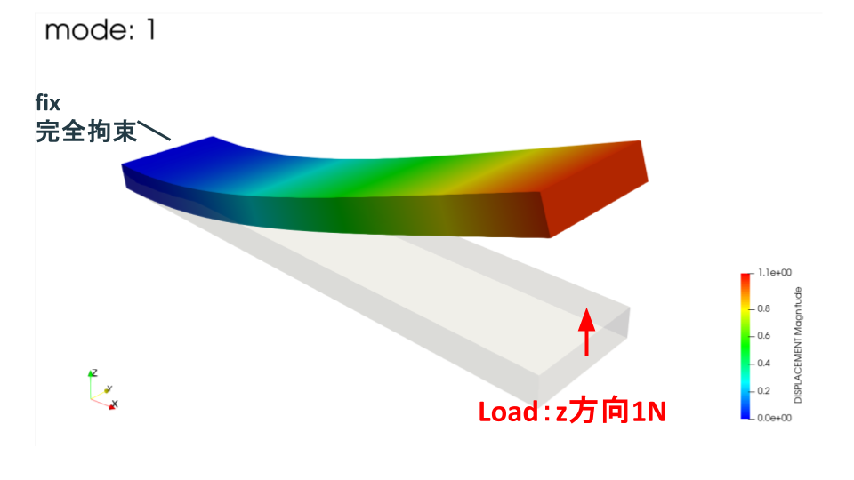

# 【FrontISTRで周波数応答解析】固有値解析結果を読み込んでコンプライアンスを確認

今回はFrontISTRで、前回求めた片持ち板の**固有値解析結果を読み込んで、周波数応答解析**を行った話です。

こんにちは（[@t_kun_kamakiri](https://twitter.com/t_kun_kamakiri)）

前回は `001_eigen` フォルダで片持ち板の固有値解析を行い、1次固有振動数が約536Hzになることを確認しました。今回はその結果を `002_freqResponse` フォルダから読み込み、先端に周期荷重を与えたときの応答振幅を見ます。

### どういう条件で解析したか

今回の周波数応答解析は、次の条件で行いました。

- **加振する場所**：先端の `load` 面（自由端）
- **加振方向**：Z方向（板厚方向、DOF=3）
- **荷重**：振幅1.0の周期荷重。単位荷重なので、応答振幅がそのままコンプライアンス（単位荷重あたりの変位）になります
- **周波数範囲**：100〜1000Hzを90ステップ（10Hz刻み）でスキャン
- **減衰**：Rayleigh減衰（Rm=0.1, Rk=0）
- **モニタ節点**：node 2（先端の1点）の変位

### どのモードのコンプライアンスを見ているか

前回の固有値解析では、**1次モードがZ方向（板厚方向）の1次曲げ**で、その固有振動数は約536Hzでした。この1次モードの変形は次のような形です。


*1次モード（Z方向の1次曲げ、約536Hz）。灰色が変形前、色付きが変形形状で、固定端から自由端に向かって板厚方向に大きく曲がります。*

そこで今回は、その1次モードを狙って**先端をZ方向に加振**し、1次固有振動数の近くで応答（コンプライアンス）がどう大きくなるかを見ます。つまり、この記事のコンプライアンス波形は**1次モード（Z方向曲げ）の共振**を捉えたものです。

先に結果を示します。



*先端をZ方向に加振し、100〜1000Hzを10Hz刻みで計算したコンプライアンス波形。540Hzで最大応答になり、1次モード（Z方向曲げ）の固有振動数536Hzの近くで共振していることが分かります。*

今回のピークは **540Hz、振幅 1.093×10⁻²** でした。固有値解析で得た1次固有振動数536Hz（Z方向の1次曲げ）にかなり近い位置で応答が大きくなっており、狙った1次モードの共振を捉えられています。

## この記事で分かること

- FrontISTRで固有値解析結果を読み込んで周波数応答解析を行う方法
- `!EIGENREAD` が読んでいるもの
- `hecmw_ctrl.dat` で `001_eigen` の固有ベクトルを参照する仕組み
- メッシュを「001から参照する方法」と「002に直接置く方法」の2通りと、easyIstrで開くにはどちらが必要か
- 周波数範囲（スキャン範囲）の決め方
- `!FLOAD` で周期荷重を与える方法
- コンプライアンス曲線だけが目的のときに、`.res` や `.pvtu/.vtu` の出力を止める方法

*FrontISTR 5.9 / WSL2環境に構築*

## 解析の流れ

今回の解析は2ステップです。

```
20260712_plateEigeResponse/
  001_eigen/                 ← Step1: 固有値解析
    FistrModel.msh
    FistrModel.cnt
    hecmw_ctrl.dat
    0.log                    ← 固有値・固有振動数
    FistrModel.res.0.1...20  ← 固有ベクトル

  002_freqResponse/          ← Step2: 周波数応答解析
    FistrModel.cnt
    FistrModel.msh           ← 001からコピー（後述の方法2）
    hecmw_ctrl.dat
    0.log                    ← 周波数-応答振幅
    docs/
      compliance.csv
      img/compliance.png
```

Step2の周波数応答解析では、Step1で作成した固有値解析の結果を入力として使います。固有値解析と周波数応答解析をフォルダで分けることで、どの結果を次の解析に渡しているかを追いやすくなります。

## 002が読み込む3つの情報

周波数応答解析では、固有値解析で得られたモード情報を使って、指定した周波数で構造がどれくらい応答するかを計算します。そのため、002側では次の3種類の情報を用意します。

- **メッシュ**：節点・要素・節点グループ（`fix`, `load` など）
- **固有値・固有振動数**：各モードが何Hzか
- **固有ベクトル**：各モードでどのように変形するか

メッシュは解析対象の形状と節点グループを決める情報です。固有値・固有振動数は、どの周波数で共振しやすいかを表します。固有ベクトルは、各モードでどの方向にどのように変形するかを表します。002の周波数応答解析は、この3つを組み合わせて計算します。

このうち**固有値・固有振動数（`0.log`）と固有ベクトル（`FistrModel.res`）は、必ず001の固有値解析結果を読み込みます**。`../001_eigen/...` は「いま実行している `002_freqResponse` フォルダから見て、1つ上の階層へ戻り、そこにある `001_eigen` フォルダ内のファイルを読む」という意味です。

| 002側のファイル | 書いてある参照先 | 読み込むもの | 役割 |
|---|---|---|---|
| `FistrModel.cnt` | `../001_eigen/0.log` | 固有値・固有振動数 | 1〜20モードの周波数を使う |
| `hecmw_ctrl.dat` | `../001_eigen/FistrModel.res` | 固有ベクトル | 各モードの変形形状を使う |

一方、**メッシュ（`FistrModel.msh`）の与え方には2通り**あります。次の節で両方を説明します。

## メッシュの与え方：001を参照するか、002に直接置くか

メッシュは001と002で同じものを使います。この同じメッシュを002にどう渡すかで、2通りのやり方があります。どちらでも計算結果は同じです。

### 方法1：001のメッシュを参照する

`hecmw_ctrl.dat` で001のメッシュを相対パスで指定します。002フォルダにはメッシュファイルを置きません。

```
!MESH, NAME=fstrMSH, TYPE=HECMW-ENTIRE
../001_eigen/FistrModel.msh
```

- メッシュの実体が001だけにあるので、二重管理になりません。
- メッシュを修正するときは001だけ直せばよく、002は常に最新を参照します。
- フォルダ間の依存（`../001_eigen`）があるため、002だけを別の場所へ移すと動かなくなります。

### 方法2：002にメッシュを直接置く

001のメッシュを002フォルダにコピーし、`hecmw_ctrl.dat` では相対パスなしで指定します。

```
!MESH, NAME=fstrMSH, TYPE=HECMW-ENTIRE
FistrModel.msh
```

- 002フォルダ内でメッシュが完結するので、フォルダをそのまま移動・共有できます。
- **easyIstrで002フォルダを直接読み込めます**。easyIstrは作業フォルダ内に `FistrModel.msh` がある前提で動くため、GUIで設定を確認・修正したい場合はこの方法が必要です。
- メッシュを修正したときは001と002の両方を更新する必要があります（二重管理）。

今回は**easyIstrで002フォルダを開けるようにするため、方法2（直接置く）を採用**しています。GUIを使わずコマンドだけで完結させたい場合や、メッシュの二重管理を避けたい場合は方法1が向いています。

なお、どちらの方法でも**固有ベクトル（`hecmw_ctrl.dat` の `result-in, IO=IN`）は001の `../001_eigen/FistrModel.res` を参照**します。ここは002にコピーせず、001を参照したままで問題ありません。

## FistrModel.cntで固有値・固有振動数を読む設定

周波数応答解析本体は `FistrModel.cnt` に書きます。

固有値・固有振動数を読む指定は `!EIGENREAD` です。

```
!EIGENREAD
 ../001_eigen/0.log
 1, 20
```

この指定では、`../001_eigen/0.log` から固有値解析で得た固有値・固有振動数を読み込みます。次の `1, 20` は、1〜20モードを使うという意味です。

`0.log` には前回の固有値解析で得たモードごとの固有振動数が記録されています。今回の周波数応答解析は、この固有振動数を使って応答を計算します。

## hecmw_ctrl.datで固有ベクトルを読む設定

`!EIGENREAD` だけでは、どの固有ベクトルを使うかまでは完結しません。固有ベクトルやメッシュの参照先は `hecmw_ctrl.dat` 側で指定します。

```
!MESH, NAME=fstrMSH, TYPE=HECMW-ENTIRE
FistrModel.msh

!CONTROL,NAME=fstrCNT
FistrModel.cnt

!RESULT,NAME=fstrRES,IO=OUT
FistrModel.res

!RESULT,NAME=fstrDYNA,IO=OUT
FistrModel_dyna.res

!RESULT,NAME=result-in,IO=IN
../001_eigen/FistrModel.res
```

上から順に意味を整理します。

- `!MESH, NAME=fstrMSH`：解析に使うメッシュを読む（今回は002に直接置いた `FistrModel.msh`。参照する場合は前節の方法1のように `../001_eigen/FistrModel.msh` と書く）
- `!CONTROL, NAME=fstrCNT`：002内の `FistrModel.cnt` を解析制御ファイルとして読む
- `!RESULT, NAME=fstrRES, IO=OUT`：002の結果出力先を指定する
- `!RESULT, NAME=fstrDYNA, IO=OUT`：動解析結果の出力先を指定する
- `!RESULT, NAME=result-in, IO=IN`：001の固有ベクトル `../001_eigen/FistrModel.res` を入力として読む

最後の `result-in, IO=IN` が重要です。ここで指定している `FistrModel.res` は、実体としては次のようなファイル群です。

```
../001_eigen/FistrModel.res.0.1
../001_eigen/FistrModel.res.0.2
...
../001_eigen/FistrModel.res.0.20
```

この固有ベクトルと、`!EIGENREAD` で読んだ固有値を組み合わせて、周波数応答解析を行います。

## 周波数応答解析の設定

周波数応答解析は `!SOLUTION,TYPE=DYNAMIC` と `!DYNAMIC` で指定します。

```
!SOLUTION,TYPE=DYNAMIC

# 周波数応答解析の設定
!DYNAMIC
# 解析種別: 2 = 周波数応答
 11, 2
# 周波数範囲: 開始Hz, 終了Hz, ステップ数, 変位計算Hz
 100, 1000, 90, 1000.0
# 時間範囲
 0.0, 6.6e-5
# 荷重ケースとRayleigh減衰: 実部, 虚部, Rm, Rk
 1, 1, 0.1, 0.0
# モニタ出力: sampling数, 出力指定, nodeID
 10, 2, 2
# 出力内容: 変位, 速度, 加速度, 反力, ひずみ, 応力
 1, 0, 0, 0, 0, 0
```

設定内容を整理すると次の通りです。

- `!SOLUTION,TYPE=DYNAMIC`
  - 動解析を行う指定です。周波数応答解析も `DYNAMIC` の中で設定します。
- `11, 2`
  - `2` が周波数応答解析を表します。
- `100, 1000, 90, 1000.0`
  - 100〜1000Hzの範囲を90ステップで計算します。
  - 今回見たい1次固有振動数536Hzが、この範囲に入るようにしています。
  - 出力される周波数は110, 120, ... 1000Hzとなり、10Hz刻みでピークを確認できます。
- `0.0, 6.6e-5`
  - 開始時間と終了時間です。
  - 周波数応答の設定として、easyIstrのサンプル設定に合わせています。
- `1, 1, 0.1, 0.0`
  - 荷重ケースとRayleigh減衰の指定です。
  - `Rm=0.1`, `Rk=0.0` として減衰を与えています。
- `10, 2, 2`
  - モニタ出力の指定です。
  - `nodeID=2` の応答を出力します。
- `1, 0, 0, 0, 0, 0`
  - 出力する物理量の指定です。
  - 今回は変位だけを出力します。

## 周期荷重の設定

荷重をどの面にどの向きで与えるかを図で示します。



*左端の `fix` 面を完全拘束し、右端の `load` 面（自由端）にZ方向（板厚方向）の周期荷重（1N）を与えます。赤い矢印が加振位置と向きです。*

荷重は `!FLOAD` で与えます。

```
# LOAD CASE=1 の周期荷重を与える
!FLOAD, LOAD CASE=1
# loadグループ, Z方向(DOF=3), 荷重振幅1.0
load, 3, 1.0
```

設定内容を整理すると次の通りです。

- `!FLOAD, LOAD CASE=1`
  - 周期荷重を定義します。
  - `LOAD CASE=1` は、先ほどの `!DYNAMIC` で指定した荷重ケースと対応します。
- `load`
  - 荷重を与える節点グループです。
  - 今回は片持ち板の自由端側の節点グループです。
- `3`
  - 荷重方向です。
  - FrontISTRでは `1=X方向`, `2=Y方向`, `3=Z方向` を表します。
- `1.0`
  - 荷重振幅です。

前回の固有値解析では、1次モードがZ方向曲げでした。そのため、自由端側にZ方向の周期荷重を与えることで、1次モード付近の共振を確認しやすくしています。

## 出力を最小限にする設定

FrontISTRでは、設定を有効にすると周波数応答解析の結果をファイルとして細かく出力できます。代表的な出力は次の2種類です。

- `.res`：各周波数点の解析結果
- `.pvtu/.vtu`：ParaViewなどで開く可視化用ファイル

コンプライアンス曲線だけが目的なら、必要なのは基本的に `0.log` です。そのため、現在は結果ファイルとVTK可視化出力をコメントアウトしています。

```
#!WRITE,RESULT
#!WRITE,VISUAL
#!WRITE, VISUAL, FREQUENCY=1
```

この3行の意味は次の通りです。

- `#!WRITE,RESULT`
  - 各周波数点の結果ファイルを出力しない設定です。
  - 有効にすると `FistrModel.res.0.*` が出力されます。
- `#!WRITE,VISUAL`
  - 可視化用ファイルを出力しない設定です。
  - 有効にすると `.pvtu/.vtu` 出力につながります。
- `#!WRITE, VISUAL, FREQUENCY=1`
  - 周波数ステップごとに可視化ファイルを出力しない設定です。
  - 有効にすると、各周波数点の可視化ファイルが大量に出力されます。

VTK出力設定もコメントアウトしています。

```
#!VISUAL,method=PSR
#!surface_num=1
#!surface 1
#!output_type=VTK
```

この4行は、可視化ファイルの形式を指定する設定です。

- `#!VISUAL,method=PSR`
  - 可視化出力の方式を指定します。
- `#!surface_num=1`, `#!surface 1`
  - 出力するサーフェス数と対象を指定します。
- `#!output_type=VTK`
  - VTK形式で出力する指定です。
  - 有効にするとParaViewで開ける `.pvtu/.vtu` が出力されます。

`hecmw_ctrl.dat` 側の可視化用指定もコメントアウトしています。

```
#!MESH, NAME=mesh, TYPE=HECMW-ENTIRE
#FistrModel.msh

#!RESULT,NAME=vis_out,IO=OUT
#FistrModel.vis
```

この指定は、可視化用メッシュと可視化結果の出力名です。

- `#!MESH, NAME=mesh, TYPE=HECMW-ENTIRE`
  - 可視化用に使うメッシュを指定します。
- `#FistrModel.msh`
  - 可視化用メッシュを読む指定です（方法1で参照する場合は `#../001_eigen/FistrModel.msh` と書きます）。
- `#!RESULT,NAME=vis_out,IO=OUT`
  - 可視化結果の出力先を指定します。
- `#FistrModel.vis`
  - 可視化結果のファイル名です。

この状態で再計算すると、`.pvtu/.vtu` は出力されません。変形分布をParaViewで見たい場合だけ、該当行の先頭 `#` を外します。

### `(null)_psf.*` というファイルが出たとき

可視化出力を有効にしたまま実行すると、フォルダに次のようなファイル・フォルダが生成されることがあります。

```
(null)_psf.0001.pvtu
(null)_psf.0001/
(null)_psf.0002.pvtu
...
```

これはFrontISTRが出す可視化用（VTK系）のファイルです。`(null)` が付いているのは、可視化出力の名前が空のままになっているためで、その状態で `!WRITE, VISUAL` 系が有効だと、周波数ステップごとにこの名前で出力されます。

コンプライアンス波形だけが目的なら不要なので、削除して問題ありません。

```bash
cd 002_freqResponse
rm -rf '(null)_psf.'*
```

再発を防ぐには、上で説明した `!WRITE, VISUAL...` と `!VISUAL...` をコメントアウトしたままにしておきます。こうすれば、次回以降 `(null)_psf.*` は生成されません。

## 実行

FrontISTRを実行します。

```bash
cd 002_freqResponse
~/local/frontistr/bin/fistr1
```

実行ログには、001の固有値ログを読んでいることが表示されます。

```
--frequency analysis--
read from=../001_eigen/0.log
start mode=           1
end mode=          20
start frequency:   100.00000000000000
end frequency:   1000.0000000000000
number of the sampling points          90
monitor nodeid=           2
```

この `read from=../001_eigen/0.log` が、001の固有値結果を読んでいることを示しています。

## 結果：コンプライアンス波形

`0.log` から周波数と応答振幅を取り出し、グラフにしました。


最大値は次の通りです。

| 周波数 | 応答振幅 |
|---|---|
| 540Hz | 1.0928×10⁻² |

前回の固有値解析では1次固有振動数が約536Hzでした。今回の周波数応答では10Hz刻みで計算しているため、最も近いサンプル点である540Hzにピークが出ています。

この結果から、固有値解析で得た固有振動数の近くで応答が大きくなることを確認できました。

## まとめ

- 周波数応答解析は `!SOLUTION,TYPE=DYNAMIC` と `!DYNAMIC` で設定します。
- 002では、001のメッシュ・固有値・固有ベクトルをそれぞれ入力として読み込みます。
- `!EIGENREAD` は `../001_eigen/0.log` から固有値・固有振動数を読み込みます。
- `hecmw_ctrl.dat` の `result-in, IO=IN` は `../001_eigen/FistrModel.res` から固有ベクトルを読み込みます。
- メッシュは「001を参照する方法」と「002に直接置く方法」の2通りがあります。easyIstrで002フォルダを開きたい場合は、直接置く方法を使います。
- 002で再計算しているのは固有値解析ではなく、001の結果を使った周波数応答解析です。
- コンプライアンス曲線だけが目的なら、`.res` や `.pvtu/.vtu` は不要なのでコメントアウトして出力を抑えられます。
- 今回は540Hzで最大応答となり、1次固有振動数536Hz付近の共振を確認できました。
