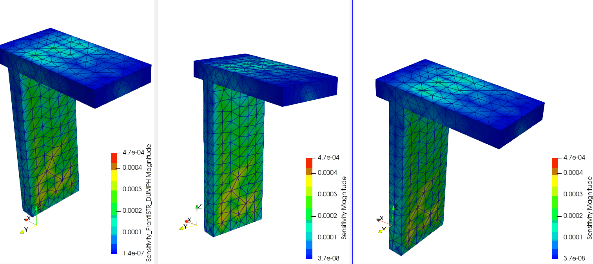

# CalculiX でも K・H・W・VTK を出す（DUMPKH 改造、一次要素 C3D4）

## 0. このドキュメントで分かること

FrontISTR で作った熱感度解析（剛性 `K`、温度荷重 `H`、感度 `W = K^-1 H`、その VTK）を、
**CalculiX (ccx) でも同じようにできるか**を確認した記録。結論は **できる**。

- CalculiX を**ソースからビルド**（インストール）する手順（SPOOLES + ccx、sudo 不要）
- CalculiX を**改造**して `K`・`H`・`W`・VTK を**すべてソルバ内部**で出力する
  （**どのファイルをどう変えたか＋数式とプログラムの対応**： $K_e$ ・ $K$ ・ $H_e$ ・ $H$ ・ $W$ ・VTK）
- FrontISTR の結果との一致（相関 0.9995、W 相対差 約 3%）と、4 並列の計算時間比較

対象は **一次四面体 C3D4（＝FrontISTR の 341）だけ**。モデルは FrontISTR と同じ
Quad4_FEM_Tji（570 節点）で、元の `Quad4_FEM_Tji.inp` が既に CalculiX/Abaqus 形式
（`*NODE` / `*ELEMENT,TYPE=C3D4` / `*ELASTIC` / `*EXPANSION`）なのでそのまま使える。

> **フォルダについて**：`20260810_KinvH/` の下を **`frontistr/`** と **`calculix/`** に分けてある
> （どちらも `model/` `patch/` `post/` `docs/` を持つ）。この文書は `calculix/docs/01`。
> FrontISTR 側（`frontistr/model/011_Tji_DUMPW`、`frontistr/patch/frontistr_dumpw_tet.patch`、
> `frontistr/docs/13`・`14`）と混ざらないようにしてある。

---

## 1. CalculiX をソースからビルドする（sudo 不要・ユーザー空間）

`apt` の `calculix-ccx` は入れられる環境なら手軽だが、**改造にはソースが要る**うえ
パスワード無し `sudo` が無かったので、FrontISTR と同様に**ユーザー空間でソースビルド**した。

### 1.1 必要物のダウンロード

```bash
mkdir -p $HOME/src/calculix_build && cd $HOME/src/calculix_build
curl -sSL -o ccx_2.21.src.tar.bz2 http://www.dhondt.de/ccx_2.21.src.tar.bz2
curl -sSL -o spooles.2.2.tgz       http://www.netlib.org/linalg/spooles/spooles.2.2.tgz
tar xjf ccx_2.21.src.tar.bz2                 # -> CalculiX/ccx_2.21/src/
mkdir -p SPOOLES.2.2 && tar xzf spooles.2.2.tgz -C SPOOLES.2.2
```

- **ARPACK** はシステムの `libarpack.so.2` を使う（`lapack`/`blas` も同様）。
- **SPOOLES** は自前ビルド（下記）。

### 1.2 SPOOLES をビルド（`spooles.a`）

`SPOOLES.2.2/Make.inc` を今の gcc 向けに直す（`-fcommon` が無いと古いコードがリンクできない）。

```bash
cd $HOME/src/calculix_build/SPOOLES.2.2
# Make.inc:  CC = gcc  /  CFLAGS = $(OPTLEVEL) -fcommon
sed -i 's#^  CC = .*#  CC = gcc#' Make.inc
sed -i 's#^  CFLAGS = \$(OPTLEVEL)$#  CFLAGS = $(OPTLEVEL) -fcommon#' Make.inc
make lib          # -> spooles.a （数分）
```

### 1.3 ccx の Makefile を今の環境向けに直してビルド

`CalculiX/ccx_2.21/src/Makefile` を次のように変更した（詳細は `patch/` のメモも参照）。

| 元 | 変更後 | 理由 |
|---|---|---|
| `FFLAGS = -Wall -O2` | `FFLAGS = -Wall -O2 -fallow-argument-mismatch` | gfortran 10+ は引数不一致がエラーになる |
| `CC=cc` | `CC=gcc` | |
| `../../../ARPACK/libarpack_INTEL.a` | `/lib/x86_64-linux-gnu/libarpack.so.2 -llapack -lblas` | システムの ARPACK を使う |
| `ccx_2.21: … $(LIBS)` | `ccx_2.21: … $(DIR)/spooles.a` | `-l…` を前提（ターゲット）にしない |

```bash
cd $HOME/src/calculix_build/CalculiX/ccx_2.21/src
make              # -> ccx_2.21 （実行ファイル、数分）
```

`ccx_2.21` ができれば OK。まず**素のまま**でモデルが解けることを確認した（次章の入力で
`$HOME/src/calculix_build/CalculiX/ccx_2.21/src/ccx_2.21 ccx_tji` → `ccx_tji.frd` が出る）。

---

## 2. 入力デック（CalculiX 形式）

`calculix/model/011_Tji_ccx/` に次を置く。

| ファイル | 役割 |
|---|---|
| `Quad4_FEM_Tji.inp` | 元メッシュ＋材料（Abaqus/CalculiX 形式、C3D4 570 節点） |
| `mesh.inp` | 上から `*PLASTIC` を除いた線形弾性版（K を線形剛性にするため） |
| `ccx_tji.inp` | 解析デック（`mesh.inp` を include ＋ 境界・温度・ステップ） |

`ccx_tji.inp` の要点：

```text
*INCLUDE, INPUT=mesh.inp
*NSET, NSET=NALL, GENERATE
1, 570, 1
*NSET, NSET=NFIX
13, 14, 15, 16, 101, 102, 103, 104, 105, 120, 121, 122, 123, 124, 125, 126
327, 328, 329, 330, 331
*INITIAL CONDITIONS, TYPE=TEMPERATURE
NALL, 0.
*STEP
*STATIC
*BOUNDARY
NFIX, 1, 3, 0.
*TEMPERATURE
NALL, 0.
19, 1.0
*NODE FILE
U, NT
*EL FILE
S
*END STEP
```

- `NFIX`（21 節点）＝FrontISTR の固定境界と同じ。`Point_A=19`、`Point_O=103`。
- 温度は全節点に定義が要る（CalculiX の仕様）。`NALL, 0.` の後に `19, 1.0` で node19 だけ加熱。
  ただし `K`・`H` はこの温度に依らない（intrinsic）ので、値は何でもよい。
- `*PLASTIC` を外すのは、材料を**線形弾性**にして CalculiX を線形静解析（`linstatic`）に通し、
  FrontISTR と同じ線形剛性 `K` を得るため。

---

## 3. 改造：どのファイルをどう変えたか

改造したのは **1 ファイルだけ**：

```
CalculiX/ccx_2.21/src/linstatic.c   （線形静解析ドライバ）
```

差分は `calculix/patch/ccx_2.21_dumpkh.patch`。環境変数 **`CCX_DUMPKH`** を立てたときだけ、
剛性 `K` の組み立て直後に `K.mtx`・`H.mtx`・`nactdof.txt` を書き出して**終了**する
（通常の解析には一切影響しない）。

### 3.1 なぜ linstatic.c か

`linstatic.c` の中で `mafillsmmain(...)` が呼ばれ、その戻りで

- 全体剛性 `K` が `ad`（対角）/`au`（下三角の非対角）/`icol`/`irow` に組み上がっている
- 温度荷重 `fext`（= H·T）もできている

CalculiX は**固定(SPC)自由度を系から除く**ので、`K` は「アクティブ自由度（方程式）番号」
neq×neq で出る（`neq=1647`。全 3×570=1710 から固定 63 を除いた数）。この対応表が
`nactdof`（`(節点, 方向) -> 方程式番号`、0 以下は固定）。改造はこの `mafillsmmain` の直後に入れた。

### 3.2 K の出力（CalculiX が組んだものをそのまま書き出す）

**要素剛性 $K_e$**（各要素）と**全体剛性 $K$**（組み立て）は次式。CalculiX が標準で計算する。

$$K_e = \int_{V_e} B^{\mathsf T} D\, B \; dV, \qquad K = \sum_e P_e^{\mathsf T} K_e\, P_e$$

$B$ はひずみ-変位マトリクス、 $D$ は弾性マトリクス、 $P_e$ は局所→全体自由度のスキャッタ。
CalculiX では $K_e$ を **`e_c3d.f`**（要素ルーチン）が、その全体組み立て（ $K$ を `ad`/`au` へ）を
**`mafillsm.f`/`mafillsmmain.c`** が行う。**ここには手を触れていない**。改造は、組み上がった
`ad`（対角）/`au`（下三角の非対角）/`icol`/`irow` を MatrixMarket（対称・下三角）で `K.mtx` に
書き出すだけ。実コードの要点：

```c
/* 対角 */
for(id_i=0;id_i<neqd;id_i++)
  fprintf(fK,"%ld %ld %.12e\n",(long)(id_i+1),(long)(id_i+1),ad[id_i]);
/* 非対角（列 i、その列の icol[i] 個、行は irow[]） */
id_l=0;
for(id_i=0;id_i<neqd;id_i++)
  for(id_j=0;id_j<icol[id_i];id_j++){
    fprintf(fK,"%ld %ld %.12e\n",(long)irow[id_l],(long)(id_i+1),au[id_l]);
    id_l++;
  }
```

`nactdof.txt` も `(node, dir, eq)` で全節点分書き出す（改造版が Point_A/Point_O の方程式番号を引くため）。

### 3.3 H の出力（**ソルバ内で自前計算**）

当初 `mafillsmmain` を節点ごとに呼び直して `fext = H[:,j]` を集めようとしたが、
CalculiX 2.21 では **mafillsm の再入で segfault** した。そこで **C3D4 の熱荷重を自前で計算**
する方式にした（FrontISTR の `TLOAD_C3` に相当する処理を、要素の幾何と材料から直接組む）。

C3D4 は**ひずみ行列 B が要素内で一定**・温度が線形なので、要素熱荷重の各列は解析的に

$$H_e[:,k] = \frac{V}{4}\, B^{\mathsf T} (D\,\alpha\,m), \qquad m=[1,1,1,0,0,0]^{\mathsf T}$$

（ $\int_{V_e} N_k\,dV = V/4$ なので**どの局所節点 k でも同じ**）。ここで $V$ は要素体積、
$D$ は弾性マトリクス、 $\alpha$ は線膨張係数。これを active DOF（`nactdof`）へ散らして
全体 $H$ （neq×節点数）を組み、`H.mtx` に出す。実コードの流れ：

```c
/* 材料定数（第1材料、等方）: elcon[0]=温度,1=E,2=ν ; alcon[0]=温度,1=α */
Emod=elcon[1+...]; nu=elcon[2+...]; alpha=alcon[1+...];
lam=Emod*nu/((1+nu)*(1-2*nu)); mu=Emod/(2*(1+nu));
Dm[0]=Dm[1]=Dm[2]=alpha*(3*lam+2*mu);        /* D·α·m の法線成分 = α·E/(1-2ν) */

for(e=0; e<*ne; e++){                          /* 全要素ループ */
  if(strcmp1(&lakon[8*e],"C3D4")!=0) continue; /* C3D4 だけ対象 */
  /* 4 節点座標から Jacobian J, 体積 V, 逆行列 Ji を作り、形状関数勾配 g[node][xyz] を得る */
  /* B^T·Dm を Bt_Dm[12] に、hcol = (V/4)*Bt_Dm を作る（B が定数なので 1 回でよい） */
  for(a=0;a<4;a++){                            /* 列＝節点 k */
    kg=nod[a];
    for(b2=0;b2<4;b2++){                        /* 行＝節点 j の x,y,z */
      jg=nod[b2];
      for(dir=1;dir<=3;dir++){
        eqn=nactdof[mt*(jg-1)+dir];             /* 方程式番号（固定なら<=0） */
        if(eqn>0) Hd[(eqn-1)*(*nk)+(kg-1)] += hcol[3*b2+(dir-1)];
      }
    }
  }
}
/* Hd の非ゼロを H.mtx（MatrixMarket, 一般）で書き出す */
```

- **要素の剛性計算（`STF`/`e_c3d`）や温度荷重の標準処理には手を触れていない**。K は CalculiX が
  組んだものをそのまま出し、H だけ「同じ物理式」を独立に組んで出している（DUMPW と同じ考え方）。
- 制限：**C3D4・単一の等方材料**のみ（FrontISTR DUMPW と同じ範囲）。

### 3.4 W（感度）を CalculiX 内部で解く（アジョイント法）

`W = K^{-1} H` の測定点差

$$W_{\text{diff}}[c,n] = (z_{A,c} - z_{O,c})^{\mathsf T} H[:,n], \qquad z_{P,c} = K^{-1} e_{\,\text{eq}(P,c)}$$

を CalculiX の中で解く。Point_A/Point_O の各方向（x,y,z）に立てた単位ベクトル $e$ を右辺にして
`K z = e` を解けばよく、必要な solve は**6 本（Point_O が固定なら 3 本）だけ**。CalculiX は
SPOOLES を持つので、**K を 1 回因子分解して 3〜6 回 back-substitution** する（アジョイント法）。
実コード（`linstatic.c` パッチ内）：

```c
/* K を因子分解（K.mtx は先に書き出し済み。ここで ad/au は分解で上書きされる） */
spooles_factor(ad,au,adb,aub,&sigma,icol,irow,neq,nzs,&symmetryflag,&inputformat,&nzs[2]);
for(cc=0;cc<3;cc++){               /* c = x,y,z */
  if(eqA[cc]>0){                    /* Point_A の方程式に単位ベクトル */
    for(rr=0;rr<neqd;rr++) bvec[rr]=0.0;  bvec[eqA[cc]-1]=1.0;
    spooles_solve(bvec,neq);        /* bvec = z = K^-1 e （後退代入だけ） */
    for(nn=0;nn<*nk;nn++){          /* Wdiff[c,n] += z^T H[:,n] */
      s=0.0; for(rr=0;rr<neqd;rr++) s+=bvec[rr]*Hd[rr*(*nk)+nn];
      Wd[cc*(*nk)+nn]+=s;
    }
  }
  if(eqO[cc]>0){ /* Point_O が自由なら同様に引く。固定(<=0)なら寄与0 */ }
}
```

Point_A / Point_O は **`sensitivity_points.dat`**（1 行 `19 103`、`#`/`!` はコメント）で指定する。
**このファイルが無い／読めないと、必要なファイル名と書式を表示してエラー停止する**
（FrontISTR DUMPW と同じ）。読み取りとエラー処理の実コード：

```c
/* Point_A / Point_O は必須。無い／読めなければ書式を表示して停止 */
FILE *fp=fopen("sensitivity_points.dat","r"); char ln[256];
if(fp!=NULL){
  while(fgets(ln,256,fp)!=NULL){
    if(ln[0]=='#'||ln[0]=='!'||ln[0]=='\n') continue;   /* コメント・空行を飛ばす */
    if(sscanf(ln,"%d %d",&pa_i,&po_i)==2) break;         /* pa_i=Point_A, po_i=Point_O */
  }
  fclose(fp);
}
if(pa_i<=0||po_i<=0){
  printf(" CCX_DUMPKH ERROR: cannot read \"sensitivity_points.dat\".\n");
  printf("   Put a file \"sensitivity_points.dat\" next to the input, with ONE line:\n");
  printf("     <Point_A global node id> <Point_O global node id>\n");
  printf("   (# or ! start a comment). Example:\n");
  printf("       #Point_A, Point_O\n       19 103\n");
  FORTRAN(stop,());
}
```

グローバル節点番号を、`nactdof` で**方程式番号**に直す（node19 → eq 43,44,45。固定は 0 以下）：

```c
for(cc=0;cc<3;cc++){                              /* cc = 0,1,2 = x,y,z */
  eqA[cc]=nactdof[mt*(pa_i-1)+(cc+1)];             /* Point_A の x/y/z 方程式 */
  eqO[cc]=(po_i>0)?nactdof[mt*(po_i-1)+(cc+1)]:0;  /* Point_O（固定なら<=0） */
}
```

（`mt=mi[1]+1`。`nactdof[mt*(node-1)+dir]` の dir は 1=x,2=y,3=z。上の 3.4 の `eqA[cc]` が
これ。）

### 3.5 VTK 出力（CalculiX 内部）

$W_{\text{diff}}$ （節点ごとの 3 成分）を、節点座標 `co` と C3D4 の連結 `kon`/`ipkon` を使って
レガシー ASCII VTK（`VTK_TETRA`、ベクトル場 `Sensitivity`）で `sensitivity_Wdiff_ccx.vtk` に
書き出す。`Wdiff_ccx.txt`（`node wx wy wz`）も同時に出す。実コード：

```c
ITG nc4=0;
for(jj=0;jj<*ne;jj++) if(strcmp1(&lakon[8*jj],"C3D4")==0) nc4++;   /* C3D4 要素数 */
fp=fopen("sensitivity_Wdiff_ccx.vtk","w");
fprintf(fp,"# vtk DataFile Version 2.0\n");
fprintf(fp,"CalculiX sensitivity Wdiff (Point_A - Point_O per unit nodal temperature)\n");
fprintf(fp,"ASCII\nDATASET UNSTRUCTURED_GRID\n");
fprintf(fp,"POINTS %ld double\n",(long)(*nk));                     /* 節点座標 co */
for(nn=0;nn<*nk;nn++)
  fprintf(fp,"%.12e %.12e %.12e\n",co[3*nn],co[3*nn+1],co[3*nn+2]);
fprintf(fp,"CELLS %ld %ld\n",(long)nc4,(long)(5*nc4));             /* 連結 kon/ipkon（0始まり） */
for(jj=0;jj<*ne;jj++){
  if(strcmp1(&lakon[8*jj],"C3D4")!=0) continue;
  fprintf(fp,"4 %ld %ld %ld %ld\n",
          (long)(kon[ipkon[jj]+0]-1),(long)(kon[ipkon[jj]+1]-1),
          (long)(kon[ipkon[jj]+2]-1),(long)(kon[ipkon[jj]+3]-1));
}
fprintf(fp,"CELL_TYPES %ld\n",(long)nc4);
for(ic4=0;ic4<nc4;ic4++) fprintf(fp,"10\n");                       /* 10 = VTK_TETRA */
fprintf(fp,"POINT_DATA %ld\nVECTORS Sensitivity double\n",(long)(*nk));
for(nn=0;nn<*nk;nn++)                                             /* Wdiff をベクトル場に */
  fprintf(fp,"%.12e %.12e %.12e\n",Wd[0*(*nk)+nn],Wd[1*(*nk)+nn],Wd[2*(*nk)+nn]);
fclose(fp);
```

### 3.6 実行（K・H・W・VTK を 1 回で）

```bash
cd calculix/model/011_Tji_ccx
export OMP_NUM_THREADS=4
CCX_DUMPKH=1 $HOME/src/calculix_build/CalculiX/ccx_2.21/src/ccx_2.21 ccx_tji
# -> K.mtx, H.mtx, nactdof.txt, Wdiff_ccx.txt, sensitivity_Wdiff_ccx.vtk
#    （最後に FORTRAN stop で終了：これは正常）
```

`CCX_DUMPKH` を付けなければ通常の CalculiX（`ccx_tji.frd` を出す普通の解析）として動く。
`sensitivity_points.dat` が無いと（上記のとおり）エラー停止する。

> **まとめ**：K は CalculiX 標準の組み立て（`e_c3d.f` の要素剛性 → `mafillsm`）をそのまま出し、
> H は同じ物理式を自前で組み、W は CalculiX の SPOOLES で解く。**K・H・W・VTK すべてが
> 改造版 CalculiX の中で出る**（Python は使わない。参考用に `post/ccx_wdiff.py` も残してある）。

---

## 4. W・VTK も Python でやる方法（参考）

`W`・VTK は 3.4/3.5 のとおり CalculiX 内部で出るが、`K.mtx`・`H.mtx`・`nactdof.txt` から
Python でも同じものを作れる（結果一致）。通常は不要。

```bash
python3 ../../post/ccx_wdiff.py --workdir . --inp Quad4_FEM_Tji.inp
```

---

## 5. 結果：FrontISTR と一致するか

同じモデルの FrontISTR DUMPW 結果（`frontistr/model/011_Tji_DUMPW/Wdiff_fistr.txt`）と比較：

| 指標 | 値 |
|---|---|
| 相関係数 | `0.9995` |
| ノルム比 `‖ccx‖/‖fistr‖` | `0.997` |
| W 相対差 `‖ccx-fistr‖/‖fistr‖` | 約 `3%` |
| H 相対差（active DOF, 対 FrontISTR H） | 約 `4.5%`（**最大成分は完全一致**） |

支配的な成分は一致し、分布はほぼ同一（相関 0.9995）。残る数 % は、**独立した 2 つの FEM
コードの一次四面体（線形四面体）の実装差**によるもので、この要素特有の範囲内。
**「CalculiX でも同じ K・H・W・VTK 出力ができる」ことは確認できた。**

ParaView で見た感度 |W| の比較（左：FrontISTR DUMPH〔1 次〕、中：FrontISTR DUMPW〔1 次〕、
右：**CalculiX**〔1 次〕。3 つとも同じ色スケール 4.7e-4）。分布はそっくり。



### 5.1 計算時間（4 並列 OMP=4、K・H・W・VTK すべてソルバ内）

| ソルバ | 実測（wall, ×3） | 出力 |
|---|---|---|
| FrontISTR DUMPW | 約 `0.16 – 0.19 s` | K・H・W・VTK |
| CalculiX DUMPKH | 約 `0.13 – 0.15 s` | K・H・W・VTK |

同規模の 570 節点 C3D4 では両者ほぼ同じ（この例では CalculiX がわずかに速い）。どちらも
「K を 1 回因子分解 → 数本の後退代入」なので、W の追加コストは小さい。

---

## 6. どのフォルダのどれを見ればよいか

| 見たいもの | 場所 |
|---|---|
| CalculiX 改造パッチ（linstatic.c） | `calculix/patch/ccx_2.21_dumpkh.patch` |
| 実行用の入力一式 | `calculix/model/011_Tji_ccx/`（`ccx_tji.inp` / `mesh.inp` / `Quad4_FEM_Tji.inp`） |
| K・H・nactdof の出力 | `calculix/model/011_Tji_ccx/K.mtx` / `H.mtx` / `nactdof.txt` |
| W・VTK の後処理 | `calculix/post/ccx_wdiff.py` → `Wdiff_ccx.txt` / `sensitivity_Wdiff_ccx.vtk` |
| FrontISTR 版（比較元） | `frontistr/model/011_Tji_DUMPW/`、`frontistr/docs/13`・`frontistr/docs/14`、`frontistr/patch/frontistr_dumpw_tet.patch` |
