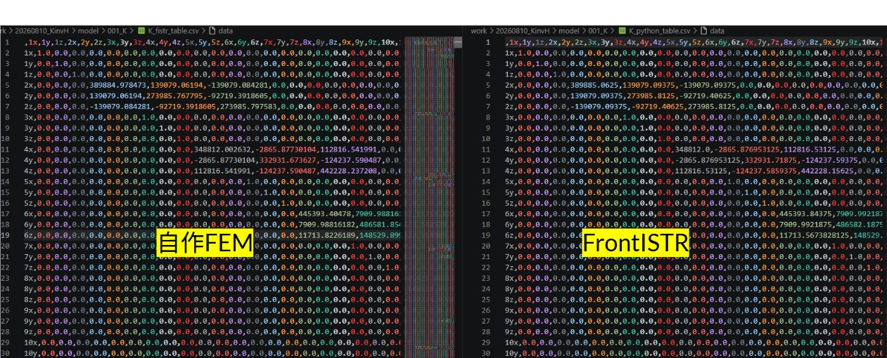

# 手順メモ：FrontISTR と 自作Python の 全体剛性行列 K を出力・比較する

> 別の人が見返しても再現できるように、「**何を設定すると何が出るか**」を手順ごとに書く。

---

## 0. このメモで分かること

- FrontISTR で全体剛性行列 K をファイル出力する方法（`.cnt` の設定）
- 自作Python(`Quad4_main.py`) で同じモデルの K を出力する方法
- 2つの K を「行・列をそろえて」比較する方法とその結果
- つまずきポイント（自由度の並び順、境界条件、予約語、材料の置き場所）

**結論（先に）**：FrontISTR の K と Python の K は **一致**した
（自由度を整列後 `‖Kf−Kp‖/‖Kf‖ = 2.3×10⁻⁷`。残差はPython側 float32 の精度）。



*行×列の表（`K_fistr_table.csv` と `K_python_table.csv`）を並べたもの。自由度を整列すると、同じセル（例 2x-2x=389884…）の値が一致する。*

---

## 1. 対象モデルと環境

- モデル：`sample/001_3DFEM/Quad4_structual/Inp_Data/Quad4_FEM_00.inp`
  - Abaqus形式。**C3D4（線形四面体）＝ FrontISTR の 341 要素**
  - 425節点・1403要素、材料 FC300
  - 節点セット：`Fixed`（25節点＝固定端）, `Force`（節点283＝荷重点）
- FrontISTR：`~/local/frontistr/bin/fistr1`（WSL, 5.9）
- 作業ディレクトリ：`20260810_KinvH/`
  - `model/` … FrontISTR用（変換・実行）
  - `sample/…/Quad4_structual/` … 自作Python
  - `post/` … 比較・変換の後処理スクリプト

## 2. 単位系（mm-ton-s ＝ N-mm）

自作Python が `YOUNG=130000 (MPa)` なので、それに合わせる。

| 量 | 単位 | 値 |
|---|---|---|
| 長さ | mm | inp座標そのまま |
| ヤング率 E / 応力 | MPa (=N/mm²) | 130000 MPa = 130 GPa |
| 力 | N | |
| 時間 | s | |
| 質量 | tonne | |
| 密度 | tonne/mm³ | 7.4e-9 (=7400 kg/m³) |

- **K の比較には単位は無関係**（両者が同じ数値 E・座標を使えば K は同じ）。
- 密度は静解析のKには使わない（動解析をやる時だけ効く）。

---

## 3. 手順

### Step 1：inp → FrontISTR形式(.msh) に変換

**設定/コマンド：**
```bash
cd 20260810_KinvH/model
python3 inp2fistr.py \
  ../sample/001_3DFEM/Quad4_structual/Inp_Data/Quad4_FEM_00.inp \
  001_K/FistrModel.msh
```

**何が出るか：** `001_K/FistrModel.msh`（NODE / ELEMENT(341) / NGROUP fix,force /
材料(HECMW形式) / SECTION）。`nodes=425, elems=1403` と表示されれば成功。

**注意（つまずき）：**
- 要素グループ名に **`ALL` は使えない**（予約語エラー `HECMW-IO-E0003`）→ `body` にした。
- 材料は `.cnt` だけでなく **`.msh` に HECMW形式で埋め込む**必要（`!MATERIAL,…,ITEM=2`）。
  埋め込まないと `SECTION: MATERIAL not found`（E1025）。

### Step 2：FrontISTR で K を出力

**設定（`001_K/FistrModel.cnt` の SOLVER 行）：**
```
!SOLVER,METHOD=DIRECT,ITERLOG=NO,TIMELOG=YES, DUMPTYPE = CSR, DUMPEXIT = NO
```
- **`DUMPTYPE`** … 行列を出力する（`NONE/MM/CSR/BSR`）。`MM`=MatrixMarket, `CSR`=CSR形式。
- **`DUMPEXIT`** …
  - `NO`  → K をダンプした後、**そのまま解く**（K も 変位 も1回で得る）
  - `YES` → ダンプ直後に**終了**（K だけ欲しい時）
- 材料・境界条件・荷重（Python と一致させた）：
  - `!BOUNDARY fix,1,3` 完全固定、`!CLOAD force,1,-100`（X方向 -100N）
  - `!MATERIAL FC300`：E=130000, ν=0.27

**コマンド：**
```bash
cd 001_K
~/local/frontistr/bin/fistr1
```

**何が出るか：**
- `dump_matrix_1_0.csr` … **全体剛性行列 K（境界条件適用後, 1275×1275）** → `K_bc.csr` にリネーム保存
- `dump_matrix_1_0.rhs` … 右辺ベクトル（荷重）
- `FistrModel.res.0.1` … 変位（`DUMPEXIT=NO` の時）

**K の中身（重要）：**
- ダンプされる K は **ソルバー入口＝境界条件適用後**（`AddBC`後）。
  拘束された自由度（fix 25節点×3=75個）は「対角=1・他=0」になっている。
- **生の K（境界条件適用前）** が欲しい時は `.cnt` の `!BOUNDARY` を
  コメントアウトして `DUMPEXIT=YES` で実行 → `K_raw.csr` として保存済み。

### Step 3：自作Python で K を出力

`Quad4_main.py` は実行すると最後（変位・VTK）まで走るので、
**K だけ保存する“ドライバ”** `Kexport.py`（元コードのコピー＋保存2行）を用意。

**設定（`Kexport.py` の追加分）：**
```python
K = make_K()                      # 生K
sparse.save_npz("K_python_raw.npz", K.tocsr())
...
U, F, K = set_baoudary_U_F()      # BC適用後K
sparse.save_npz("K_python_bc.npz", K.tocsr())
```

**コマンド：**
```bash
cd sample/001_3DFEM/Quad4_structual
python3 Kexport.py
```

**何が出るか：** `K_python_raw.npz`（生K）, `K_python_bc.npz`（BC適用後K）。

### Step 4：K を比較（行・列をそろえる）

**設定/コマンド：**
```bash
cd 20260810_KinvH
python3 post/compare_K.py model/001_K/K_bc.csr \
        sample/001_3DFEM/Quad4_structual/K_python_bc.npz
```

**何が分かるか：** 整列前後の相対誤差。
```
[整列なし] ||Kf-Kp||/||Kf|| = 4.3e-01     ← 並びが違うので大きくズレる
[x,y整列 ] ||Kf-Kp||/||Kf|| = 2.3e-07     ← 一致（float32精度）
```

**行×列の表で見たい時：**
```bash
python3 post/K_dense_compare.py           # ラベル付き表(CSV)を出力＋一部を画面表示
python3 post/K_dense_compare.py --block 10 13   # 節点10..13のブロックを表示
```
→ `model/001_K/` に `K_fistr_table.csv` / `K_python_table.csv` / `K_diff_table.csv`
（行・列ラベル＝節点番号＋成分 例:`2x,2y,2z,3x…`）。Excelで開ける。

---

## 4. 最重要ポイント：自由度の並び順が違う

同じ物理でも**行・列（自由度）の順序**が違うため、そのままでは 43% ずれる。

| | 節点n の自由度の並び |
|---|---|
| **FrontISTR** | (3(n-1), +1, +2) = **(x, y, z)**（自然順）|
| **Python** | (3g=**y**, 3g+1=**x**, 3g+2=z) … `make_K` の添字式で **x と y が入替** |

- 節点の並び自体は両者とも inp順（1..425）で一致。
- したがって **「各節点で x↔y を入れ替える置換」** で行・列をそろえると一致する。
- `post/compare_K.py`・`post/K_dense_compare.py` はこの整列を内部で行っている。

---

## 5. 検算：変位も一致

同じ条件（E=130000, X方向-100N, fix完全固定）で解くと、変形の形も大きさもそろう。


*左=自作FEM(Python)、右=FrontISTR の変位コンター。カラースケール(0〜1.1e-2)も変形形状もほぼ一致。*

数値でも：

| | \|u\|max [mm] | force節点283 の変位 (x,y,z) |
|---|---|---|
| FrontISTR | 1.118e-2 | (−1.112e-2, −1.008e-4, 6e-7) |
| Python | 1.107e-2 | (−1.101e-2, −1.008e-4, 4e-6) |

差 ~1% は Python が float32（さらに逆行列を明示計算）による精度落ち。→ 実質一致。

---

## 6. 成果物（どれを見れば何が分かるか）

FrontISTR側 `model/001_K/`：
| ファイル | 中身 |
|---|---|
| `K_bc.csr` | ★K（境界条件適用後, CSR生ダンプ）|
| `K_raw.csr` | 生K（境界条件適用前）|
| `K_bc.mtx` / `K_bc.csv` | K を MatrixMarket / 三つ組CSV に変換したもの |
| `K_fistr_table.csv` | ★K を行×列のラベル付き表にしたもの |
| `K_python_table.csv` | Python K を FrontISTR並びに整列した表 |
| `K_diff_table.csv` | 差（FrontISTR − Python）|
| `FistrModel.res.0.1` | 変位 |

Python側 `sample/001_3DFEM/Quad4_structual/`：
| ファイル | 中身 |
|---|---|
| `Kexport.py` | K出力ドライバ（`Quad4_main.py` のコピー＋保存2行。元コードは無改造）|
| `K_python_bc.npz` / `K_python_raw.npz` | K（BC適用後 / 生）|

後処理 `post/`：
| スクリプト | 役割 |
|---|---|
| `read_fistr_matrix.py` | FrontISTRのCSR/MMダンプ・RHSを読む |
| `compare_K.py` | 自由度を整列して K同士を比較 |
| `csr_to_mtx_csv.py` | .csr → .mtx / 三つ組CSV / 密CSV |
| `K_dense_compare.py` | 行×列のラベル付き表＋差分を出力 |

---

## 7. 再現コマンドまとめ（コピペ用）

```bash
cd 20260810_KinvH
# Step1: 変換
python3 model/inp2fistr.py \
  sample/001_3DFEM/Quad4_structual/Inp_Data/Quad4_FEM_00.inp \
  model/001_K/FistrModel.msh
# Step2: FrontISTRでK出力（001_K/FistrModel.cnt に DUMPTYPE=CSR,DUMPEXIT=NO 済）
( cd model/001_K && ~/local/frontistr/bin/fistr1 && mv dump_matrix_1_0.csr K_bc.csr )
# Step3: PythonでK出力
( cd sample/001_3DFEM/Quad4_structual && python3 Kexport.py )
# Step4: 比較
python3 post/compare_K.py model/001_K/K_bc.csr \
        sample/001_3DFEM/Quad4_structual/K_python_bc.npz
# 表で比較
python3 post/K_dense_compare.py
```
