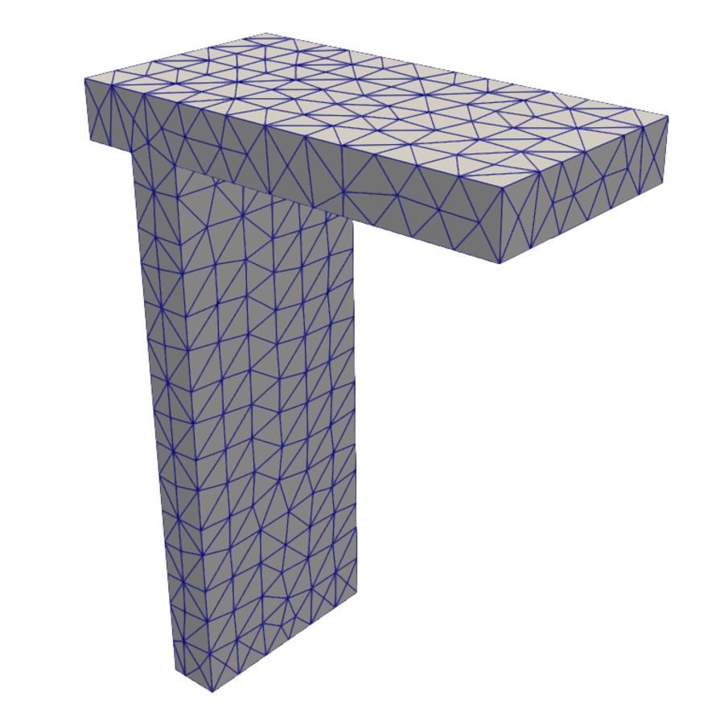
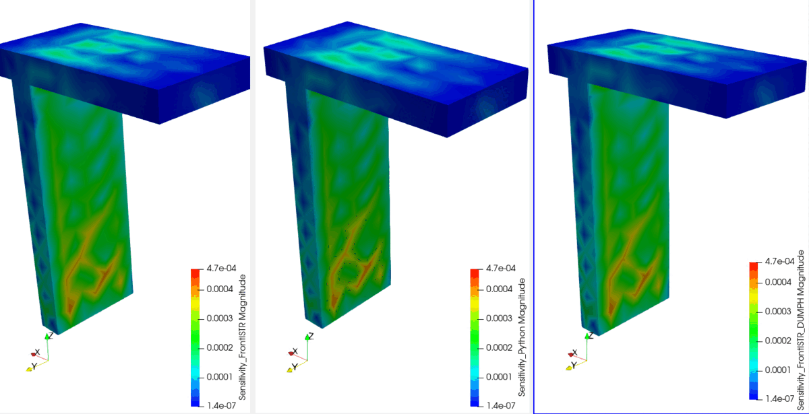

# 手順: PythonとFrontISTRでK・H・Wを比較する

## 対象モデル

`sample/002_thermalSensitive/Inp_Data/Quad4_FEM_Tji.inp`（570節点・1699要素・C3D4四面体一次要素）。
Point_A=節点19（測定ツール点）、Point_O=節点103（基準点）、Fixed=21節点（全自由度固定）。
材料定数はinpの実際の値を使う: E=130000000, ν=0.27, density=7.4e-06, **CTE=1.2e-05**。



T字型のブラケット形状。上面の平板部と下に伸びるリブ状の脚部からなる。
この570節点・1699要素のメッシュ（以下「元メッシュ」）を、
[`12_手順_リファインメッシュでのK_H_W比較.md`](12_手順_リファインメッシュでのK_H_W比較.md)では
細分割してより大きい問題サイズ（22,123節点）でも同じ比較を行っている。

比較する2つの実装は次の通り。

- **Python**: `sample/002_thermalSensitive/Inp_Data/ThermoSenseAnalyzer_00.py`と同じ数式
  （`make_D`/`make_CTE`/`make_B`/`make_He`/`make_Ke`）。
  `ThermoSenseAnalyzer_00.py`自体は`setting/settings.yml`が本リポジトリに無く単体実行できないため、
  同じ数式だけを移植した2つの単体版を使う（どちらも同じ結果になることを確認済み）。
  - `sample/002_thermalSensitive/Inp_Data/ThermoSenseAnalyzer_standalone.py`
    （`ThermoSenseAnalyzer_00.py`と同じフォルダに置いた版）
  - `post/python_H_tji.py`（`model/008_Tji_compare`に出力する版、比較パイプライン用）
- **FrontISTR**: 標準機能のみの版と、`DUMPH=YES`改造版の2通り。

## 1. K行列の出力手順

### Python側

`post/python_H_tji.py`（または`ThermoSenseAnalyzer_standalone.py`）が、要素ループの中でHと同時に
Kも組み立てる。境界条件（固定節点の行・列を単位行列化）を適用したあと、
`K_python_tji_bc.mtx`として保存する。

```bash
cd 20260810_KinvH
python3 post/inp_to_fistr_msh.py   # 先にメッシュ変換（初回のみ）
python3 post/python_H_tji.py
```

### FrontISTR側

標準の`fistr1`で、`!BOUNDARY`（全節点固定）を与え、`DUMPTYPE=MM, DUMPEXIT=YES`で1回実行すると、
境界条件適用後のKがMatrixMarket形式で出力される。

**「ダンプする」とは**: 行列（Kなど）をファイルに書き出すことを指す。普段のFrontISTRは、
内部でKを組み立てて連立方程式`K u = f`を解き、結果（変位など）だけを`.res`ファイルに
出力する。Kそのものはメモリ上で使われるだけで、ファイルには残らない。
`DUMPTYPE=MM`は「解く前にKをファイルに書き出す（ダンプする）」という設定で、さらに
`DUMPEXIT=YES`を付けると「書き出したらそこで終了し、実際には解かない」という動作になる。

ダンプされるファイルは次の2つ。**ファイル名は固定**で、`fistr1`を実行した
カレントディレクトリに出力される（`model/008_Tji_compare`で実行すれば
`model/008_Tji_compare/dump_matrix_1_0.mm`のように、そのフォルダの直下に出る）。

| ファイル名 | 内容 |
|---|---|
| `dump_matrix_1_0.mm` | K（境界条件適用後）、MatrixMarket形式 |
| `dump_matrix_1_0.rhs` | RHSベクトル`f`（1値/行） |

**注意**: `DUMPEXIT=YES`は「RHS（右辺ベクトル）が非ゼロ」のときだけ発動する。
`!BOUNDARY`だけで荷重が何も無い（RHS=0、Case A）で実行すると、

```
ZERO RHS norm
```

と表示され、`DUMPTYPE=MM, DUMPEXIT=YES`を指定していても**ダンプ（ファイルへの書き出し）が
スキップされ**、`dump_matrix_1_0.mm`も`dump_matrix_1_0.rhs`も作られないまま、
いつも通り（普通に）方程式を解いて（この場合は自明にゼロ変位）、そのまま終了してしまう。
（この検証は`/tmp`の作業用コピーで行った。同じ`FistrModel.msh`を使えば、
`model/008_Tji_compare`など任意のフォルダで再現できる。）
`!CLOAD`でも`!TEMPERATURE`でもよいので、何かしら荷重を与えてRHSを非ゼロにする必要がある
（Case B）。Kの計算自体は荷重に依存しないので、Hの計算で使っている`!TEMPERATURE`と
同じ条件をそのまま使えば十分（`!CLOAD`は必須ではない）。実際、
`model/008_Tji_compare/dump_matrix_1_0.mm`（後述の手順で`K_fistr_tji.mm`にリネームする）は、
この確認のとおり`!TEMPERATURE`だけで問題なく出力されたものである。

```text
model/008_Tji_compare/FistrModel.cnt:
  !BOUNDARY
   fix, 1, 3, 0.0
  !TEMPERATURE
   19, 1.0
  !SOLVER,METHOD=DIRECT,ITERLOG=NO,TIMELOG=NO, DUMPTYPE = MM, DUMPEXIT = YES
```

実行後、固定名で出力される`dump_matrix_1_0.mm`を、他のcntファイルと混同しないように
`K_fistr_tji.mm`へ手動でリネームする。

```bash
mv dump_matrix_1_0.mm K_fistr_tji.mm
```

### 比較結果（実際の値）

K全体（1710×1710=2,924,100成分）での差:

| 比較 | 最大絶対差 | 相対差(Frobenius) |
|---|---|---|
| Python vs FrontISTR | 4.858e-02 | 1.312e-12 |

対角成分（行番号=列番号の成分 K[i,i]、90刻みで19点。固定自由度は`1.0`になる）を
並べると次の通り。行0,90,180,270,450,...は非固定でおよそ1e9〜1e10オーダー、
行360,990などは固定自由度で厳密に`1.0`になっている。

| (行番号, 列番号) | Python | FrontISTR |
|---|---|---|
| (0,0) | 1.282191e+09 | 1.282191e+09 |
| (90,90) | 3.643090e+09 | 3.643090e+09 |
| (180,180) | 1.728929e+09 | 1.728929e+09 |
| (270,270) | 2.482776e+09 | 2.482776e+09 |
| (360,360) | 1.000000e+00 | 1.000000e+00 |
| (450,450) | 2.112094e+09 | 2.112094e+09 |
| (540,540) | 6.823656e+09 | 6.823656e+09 |
| (630,630) | 5.252511e+09 | 5.252511e+09 |
| (720,720) | 6.929291e+09 | 6.929291e+09 |
| (810,810) | 3.621232e+09 | 3.621232e+09 |
| (900,900) | 4.681050e+09 | 4.681050e+09 |
| (990,990) | 1.000000e+00 | 1.000000e+00 |
| (1080,1080) | 3.574829e+09 | 3.574829e+09 |
| (1170,1170) | 6.455319e+09 | 6.455319e+09 |
| (1260,1260) | 5.032692e+09 | 5.032692e+09 |
| (1350,1350) | 3.483123e+09 | 3.483123e+09 |
| (1440,1440) | 1.239884e+10 | 1.239884e+10 |
| (1530,1530) | 1.280561e+10 | 1.280561e+10 |
| (1620,1620) | 5.351324e+09 | 5.351324e+09 |

いずれも有効桁6桁まで一致。固定自由度（(360,360)や(990,990)）も`1.0`同士で正しく一致している。

### どこを見ればいいか

Python側は`model/008_Tji_compare/K_python_tji_bc.mtx`、FrontISTR側は
`model/008_Tji_compare/K_fistr_tji.mm`（どちらも`.gitignore`対象でローカルのみ）。

## 2. H行列の出力手順

### Python側

Kと同じループ内で、要素ごとの温度荷重行列`He`を組み立て、`H_python_tji.npz`として保存する
（境界条件なしの生のH）。

### FrontISTR側（標準機能で、全節点を1つずつ計算する力任せの方法）

改造していない標準`fistr1`には、Hを1回で出力する機能が無い。そこで、570節点に単位温度を
1つずつ与えて570回実行し、出てきたRHS（`f = H T`の1列分）を集めてHを組み立てる。

```bash
python3 post/build_H_tji.py
```

### FrontISTR側（DUMPH改造版、1回実行）

`patch/frontistr_dumph_341.patch`を当てたFrontISTRを使うと、`!SOLVER`に`DUMPH=YES`を
追加するだけで、Hを1回の実行で直接出力できる。ビルド手順は
[`05_手順_FrontISTR_DUMPH追加とビルド.md`](05_手順_FrontISTR_DUMPH追加とビルド.md)を参照
（インストール先は`$HOME/local/frontistr-dumph`）。

```text
model/009_Tji_H_direct/FistrModel.cnt:
  !TEMPERATURE
   19, 1.0
  !SOLVER,METHOD=DIRECT,ITERLOG=NO,TIMELOG=YES,DUMPTYPE=MM,DUMPH=YES,DUMPEXIT=YES
```

```bash
cd model/009_Tji_H_direct
$HOME/local/frontistr-dumph/bin/fistr1
# -> H_matrix.mtx が1回の実行で出力される
```

### 出力された `H_matrix.mtx` の読み方

`H_matrix.mtx`は**MatrixMarket coordinate形式**という、疎行列（ほとんどがゼロの行列）を
「ゼロでない成分だけ」列挙する標準フォーマットである。中身は次のようになっている。

```text
%%MatrixMarket matrix coordinate real general   ← 形式の宣言
% Thermal load matrix: f_thermal = H * T          ← コメント（Hの意味）
66369 22123 5219328                               ← 行数 列数 非ゼロ成分数
652 218  0.245426267897E+001                      ← 行 列 値
653 218 -0.225886575802E+001
654 218  0.302723778864E+001
9943 218 -0.270859993748E+001
...
```

- 3行目の`66369 22123 5219328`は「行数=66369、列数=22123、非ゼロ成分数=5219328」の意味
  （この例は22123節点モデル。行数=22123節点×3自由度=66369、列数=節点数22123）。
- 4行目以降が実データで、各行は`行番号 列番号 値`の3つ組。**すべて1始まり**。
- **列番号** = 節点番号（「どの節点に単位温度を与えたか」に対応する $H$ の列 $j$ ）。
- **行番号** = 全体自由度番号。`節点 = (行番号 - 1) ÷ 3 + 1`、
  `成分 = (行番号 - 1) mod 3`（0=x, 1=y, 2=z）で節点と方向に戻せる。
- **値** = その単位温度によって生じる等価節点力。

たとえば`652 218 2.454`は、`節点 = (652-1)÷3+1 = 218`、`成分 = (652-1) mod 3 = 0 = x`なので、
「**節点218に単位温度を与えると、節点218自身のx方向に +2.454 の等価力が生じる**」と読む。
列が同じ`218`で連続しているのは、節点218を含む要素群の寄与がまとまって書き出されている
ためで、行が652→653→654（節点218のx,y,z）と続いたあと、9943→9944→9945
（節点3315のx,y,z＝節点218と要素を共有する隣の節点）へ飛ぶ、という構造になる。

この`.mtx`を扱うプログラムは`post/`にある。

| 目的 | プログラム |
|---|---|
| `.mtx`を`scipy`の疎行列として読み込む | `post/read_fistr_matrix.py`（`read_mm`関数）。単独実行すると行列サイズ・対称性・対角の様子を表示する |
| `.mtx`を人が見やすいCSV（`row,col,value`）や密行列CSVに変換する | `post/csr_to_mtx_csv.py` |
| $H$ を使って感度行列 $W$ を計算する | `post/wdiff_adjoint.py` / `post/compute_kinvH_tji.py` |
| 結果をParaViewで色分け表示する（一番「見て分かる」形） | `post/write_sensitivity_vtk.py`（VTK出力） |

```bash
# 例: .mtx を row,col,value の3列CSVに変換する（Excelでも開ける）
python3 post/csr_to_mtx_csv.py model/009_Tji_H_direct/H_matrix.mtx
# -> H_matrix.csv
```

ただし22123節点モデルの`H_matrix.mtx`は169MB・約520万成分あり、CSV化するとさらに大きくなる。
行列の生の数値そのものより「 $H$ を使った結果（感度分布）」を見たい場合は、
`write_sensitivity_vtk.py`でVTK化してParaViewで見るのが実用的である。

### 比較結果（実際の値）

H全体（1710×570=974,700成分）での差（3通りをそれぞれ突き合わせ）:

| 比較 | 最大絶対差 | 相対差(Frobenius) |
|---|---|---|
| Python vs FrontISTR(570回) | 5.002e-07 | 1.475e-12 |
| Python vs FrontISTR(DUMPH) | 5.254e-07 | 4.505e-13 |
| FrontISTR(570回) vs FrontISTR(DUMPH) | 1.000e-06 | 1.537e-12 |

`H`は`f = H T`の変換行列なので、列19（節点19に単位温度1.0を与えたとき）を見ると、
「その荷重によって各自由度に生じる節点力」が並ぶ。節点19は12個の要素にしか
属していないため、列19はほとんどの行が0で、非ゼロなのは以下の30行だけである。
その全行を3通りの計算方法（Python、FrontISTR標準機能570回、FrontISTR DUMPH1回実行）で比較する。

| (行番号, 列番号=節点19) | Python | FrontISTR(570回) | FrontISTR(DUMPH) |
|---|---|---|---|
| (51,19) | -4.036007e+04 | -4.036007e+04 | -4.036007e+04 |
| (52,19) | 4.168478e+04 | 4.168478e+04 | 4.168478e+04 |
| (53,19) | -3.365186e+04 | -3.365186e+04 | -3.365186e+04 |
| (54,19) | -1.247593e+05 | -1.247593e+05 | -1.247593e+05 |
| (55,19) | -7.625111e-03 | -7.625111e-03 | -7.625068e-03 |
| (56,19) | -2.281940e+05 | -2.281940e+05 | -2.281940e+05 |
| (57,19) | -6.585103e+04 | -6.585103e+04 | -6.585103e+04 |
| (58,19) | -8.490224e+04 | -8.490224e+04 | -8.490224e+04 |
| (59,19) | -2.663893e+04 | -2.663893e+04 | -2.663893e+04 |
| (510,19) | 4.155065e+04 | 4.155065e+04 | 4.155065e+04 |
| (511,19) | -4.372230e+04 | -4.372230e+04 | -4.372230e+04 |
| (512,19) | -1.043648e+05 | -1.043648e+05 | -1.043648e+05 |
| (519,19) | 2.135575e+05 | 2.135575e+05 | 2.135575e+05 |
| (520,19) | 7.654411e+04 | 7.654411e+04 | 7.654411e+04 |
| (521,19) | -5.738418e+04 | -5.738418e+04 | -5.738418e+04 |
| (522,19) | 3.650656e+04 | 3.650656e+04 | 3.650656e+04 |
| (523,19) | 4.075402e+04 | 4.075402e+04 | 4.075402e+04 |
| (524,19) | -3.290046e+04 | -3.290046e+04 | -3.290046e+04 |
| (594,19) | 6.624019e+04 | 6.624019e+04 | 6.624019e+04 |
| (595,19) | 4.380795e+04 | 4.380795e+04 | 4.380795e+04 |
| (596,19) | 1.171909e+05 | 1.171909e+05 | 1.171909e+05 |
| (762,19) | -4.971504e+04 | -4.971504e+04 | -4.971504e+04 |
| (763,19) | 1.343276e+05 | 1.343276e+05 | 1.343276e+05 |
| (764,19) | 1.461942e+05 | 1.461942e+05 | 1.461942e+05 |
| (1380,19) | -1.664010e+05 | -1.664010e+05 | -1.664010e+05 |
| (1381,19) | -7.416632e+04 | -7.416632e+04 | -7.416632e+04 |
| (1382,19) | 1.377492e+05 | 1.377492e+05 | 1.377492e+05 |
| (1632,19) | 8.923156e+04 | 8.923156e+04 | 8.923156e+04 |
| (1633,19) | -1.343276e+05 | -1.343276e+05 | -1.343276e+05 |
| (1634,19) | 8.199986e+04 | 8.199986e+04 | 8.199986e+04 |

いずれも有効桁6桁までほぼ完全に一致している（(55,19)のように値そのものが小さい成分は、
下の桁でわずかに丸め誤差が見える）。

### どこを見ればいいか

Python側は`model/008_Tji_compare/H_python_tji.npz`（同内容が
`sample/002_thermalSensitive/Inp_Data/Results/H_python_tji.npz`にも）。
FrontISTR側は、標準機能570回実行なら`model/008_Tji_compare/H_fistr_tji.npz`、
DUMPH改造版1回実行なら`model/009_Tji_H_direct/H_matrix.mtx`。
いずれも`.gitignore`対象でローカルのみ。

## 3. W行列（K⁻¹H、測定点間の感度）の出力手順

Wそのもの（K⁻¹H全体、1710×570）は大きいので、実務上は測定に関係する行だけを取り出す。
`Wdiff = W[Point_A行] - W[Point_O行]`（3×570行列）とし、「各節点の単位温度が
Point_A-Point_O間の相対変位をどれだけ動かすか」という感度として扱う。

### Python側

`post/python_H_tji.py`の中で、境界条件を適用したKをLU分解し、Hの各列について
1回ずつ解いてW全体を求め、Point_A(節点19)-Point_O(節点103)の行だけを`Wdiff_python_tji.npy`
として保存する。

### FrontISTR側

FrontISTR自体はK⁻¹Hを計算しないので、FrontISTRが出力したK・HをPythonで読み込み、
同じ手順（LU分解を1回だけ行い、Hの列ごとに解く）でWを計算する。

```bash
python3 post/compute_kinvH_tji.py
# -> model/008_Tji_compare/Wdiff_fistr_tji.npy
```

### ParaViewで見るVTKの出し方

`Wdiff`（3×570の感度行列）を、節点ごとのベクトル場としてVTK(legacy ASCII)に書き出す。
`post/write_sensitivity_vtk.py`は、`.npy`のWdiffと`Quad4_FEM_Tji.inp`のメッシュ形状
（`inp_to_fistr_msh.parse_inp`で読む）を合わせて1つの`.vtk`を作る汎用スクリプトなので、
Python側・FrontISTR側どちらの`Wdiff`にもそのまま使える。

```bash
python3 post/write_sensitivity_vtk.py \
  --wdiff model/008_Tji_compare/Wdiff_python_tji.npy \
  --out   model/008_Tji_compare/Wdiff_python_tji.vtk \
  --field-name Sensitivity_Python

python3 post/write_sensitivity_vtk.py \
  --wdiff model/008_Tji_compare/Wdiff_fistr_tji.npy \
  --out   model/008_Tji_compare/Wdiff_fistr_tji.vtk \
  --field-name Sensitivity_FrontISTR
```

**009（DUMPH改造版）でのVTK出力方法**

009はもともとHしか出していなかった（Kが無いのでWが計算できなかった）ので、
先に`!BOUNDARY`を追加して`K_fistr_tji.mm`（境界条件適用後のK）も同時に出す必要がある
（1回の実行でK・H両方出る理由は本ページ「1. K行列の出力手順」の注意を参照）。

```text
model/009_Tji_H_direct/FistrModel.cnt に !BOUNDARY を追加:
  !BOUNDARY
   fix, 1, 3, 0.0
  !TEMPERATURE
   19, 1.0
  !SOLVER,METHOD=DIRECT,ITERLOG=NO,TIMELOG=YES,DUMPTYPE=MM,DUMPH=YES,DUMPEXIT=YES
```

```bash
cd model/009_Tji_H_direct
$HOME/local/frontistr-dumph/bin/fistr1
mv dump_matrix_1_0.mm K_fistr_tji.mm
cd -

# Wdiffを計算（compute_kinvH_tji.py は --workdir でフォルダを切り替えられる）
python3 post/compute_kinvH_tji.py \
  --workdir model/009_Tji_H_direct \
  --k K_fistr_tji.mm --h H_matrix.mtx --out Wdiff_fistr_tji.npy

# VTKを書き出す
python3 post/write_sensitivity_vtk.py \
  --wdiff model/009_Tji_H_direct/Wdiff_fistr_tji.npy \
  --out   model/009_Tji_H_direct/Wdiff_fistr_tji.vtk \
  --field-name Sensitivity_FrontISTR_DUMPH
```

009の`Wdiff_fistr_tji.npy`は、008（標準機能で570回、節点を1つずつ計算する力任せの方法）の`Wdiff_fistr_tji.npy`
と相対差7.3e-10で一致した（DUMPH改造版と標準機能版、どちらで求めても同じ結果になる）。

`--wdiff`にWdiffの`.npy`、`--out`に出力先の`.vtk`パス、`--field-name`にParaView上での
ベクトル場の名前（`Sensitivity_Python`のように、PythonとFrontISTRを区別できる名前に
しておくと、2つを同時に開いたときに見分けやすい）を指定する。値は変位そのものではなく
感度なので、元の`ThermoSenseAnalyzer_00.py`の`outputvtk()`が使っている紛らわしい
`Displacement`という名前は避けている。

ParaViewでは、出力された`.vtk`を開き、`Coloring`（着色対象）をこの`--field-name`で
指定したフィールド（例: `Sensitivity_FrontISTR`）にして`Magnitude`を選べば、
下図のような感度分布のコンター図が見られる。

**Python vs FrontISTR(標準機能570回) vs FrontISTR(DUMPH1回)**



左からFrontISTR(570回、節点を1つずつ計算する力任せの方法、`model/008_Tji_compare`)、Python(`python_H_tji.py`)、
FrontISTR(DUMPH1回実行、`model/009_Tji_H_direct`)。カラースケール（1.4e-07〜4.7e-04）を
揃えて並べており、3つとも同じ感度分布（縦リブに沿ったオレンジ〜赤の高感度域）になっている。
数値比較（相対差2e-8〜1e-13）と一致する結果である。

### 比較結果（実際の値）

Wdiff全体（3×570=1,710成分）での差:

| 比較 | 最大絶対差 | 相対差(Frobenius) |
|---|---|---|
| Python vs FrontISTR | 1.161e-11 | 2.426e-08 |

`Wdiff`は「節点jに単位温度を与えたとき、Point_A(節点19)-Point_O(節点103)間の
相対変位がどれだけ変化するか」を表す(x,y,z成分×節点)。570節点のうち30刻みで19節点、
x・y・z全成分を並べる。

| 節点 | Python x | FrontISTR x | Python y | FrontISTR y | Python z | FrontISTR z |
|---|---|---|---|---|---|---|
| 1 | 8.23159e-08 | 8.23159e-08 | -8.63639e-07 | -8.63639e-07 | 7.62240e-07 | 7.62240e-07 |
| 31 | -1.40547e-05 | -1.40547e-05 | -3.54796e-05 | -3.54796e-05 | 4.36778e-05 | 4.36778e-05 |
| 61 | 6.86503e-07 | 6.86502e-07 | -3.55574e-08 | -3.55574e-08 | 3.78078e-06 | 3.78078e-06 |
| 91 | 6.48997e-05 | 6.48997e-05 | -1.89691e-05 | -1.89691e-05 | 6.95745e-05 | 6.95745e-05 |
| 121 | -1.13828e-04 | -1.13828e-04 | 8.01605e-05 | 8.01605e-05 | -7.16306e-05 | -7.16306e-05 |
| 151 | -1.25075e-05 | -1.25075e-05 | -6.52514e-06 | -6.52514e-06 | -3.14182e-05 | -3.14182e-05 |
| 181 | -4.11452e-05 | -4.11452e-05 | -2.15557e-05 | -2.15557e-05 | 6.08499e-05 | 6.08499e-05 |
| 211 | 2.10207e-06 | 2.10207e-06 | 1.89451e-05 | 1.89451e-05 | -7.35385e-05 | -7.35385e-05 |
| 241 | -1.70205e-05 | -1.70205e-05 | -9.62753e-05 | -9.62753e-05 | -7.38739e-05 | -7.38739e-05 |
| 271 | 6.03287e-06 | 6.03287e-06 | 3.76637e-05 | 3.76637e-05 | 1.33905e-04 | 1.33905e-04 |
| 301 | 3.04974e-04 | 3.04974e-04 | 1.06919e-05 | 1.06919e-05 | 2.31061e-04 | 2.31061e-04 |
| 331 | 1.50272e-05 | 1.50272e-05 | 2.09211e-04 | 2.09211e-04 | 3.48282e-05 | 3.48282e-05 |
| 361 | -2.75060e-05 | -2.75060e-05 | -4.33201e-06 | -4.33201e-06 | -7.37442e-05 | -7.37442e-05 |
| 391 | -8.55148e-05 | -8.55148e-05 | -3.69076e-05 | -3.69076e-05 | -2.12412e-04 | -2.12412e-04 |
| 421 | -5.30697e-06 | -5.30697e-06 | 1.72217e-05 | 1.72217e-05 | 5.42121e-06 | 5.42121e-06 |
| 451 | 1.22393e-04 | 1.22393e-04 | -3.79143e-06 | -3.79143e-06 | 8.70741e-05 | 8.70741e-05 |
| 481 | -1.29117e-05 | -1.29117e-05 | 1.55921e-04 | 1.55921e-04 | 1.53028e-05 | 1.53028e-05 |
| 511 | 5.47843e-06 | 5.47843e-06 | -6.07068e-05 | -6.07068e-05 | 4.19162e-05 | 4.19162e-05 |
| 541 | -1.04869e-05 | -1.04869e-05 | 3.55420e-05 | 3.55420e-05 | 1.18375e-05 | 1.18375e-05 |

こちらも有効桁5〜6桁までほぼ完全に一致している。

### どこを見ればいいか

Python側は`model/008_Tji_compare/Wdiff_python_tji.npy`、FrontISTR側は
`model/008_Tji_compare/Wdiff_fistr_tji.npy`（どちらも`.gitignore`対象でローカルのみ）。
ParaViewで見る場合は同じフォルダの`Wdiff_python_tji.vtk` / `Wdiff_fistr_tji.vtk`
（`.vtk`は`.gitignore`対象外）。

## 4. 計算時間

**注意（並列数がそろっていない）**: 以下の時間はハードウェアリソースが同条件ではない。
FrontISTRは実行ログの`threads: 48 / cores: 48`が示す通り、OpenMPで**48コアすべて**を
自動的に使用している。一方Python側は、W計算に使う`scipy.sparse.linalg.factorized`
（SuperLU）が**実質シングルスレッド**（マルチスレッド版SuperLU_MTではない）で、
要素ループのnumpy演算もOpenBLASのスレッド数上限が2（ビルド時設定）と、
ほぼ1コードで動いている。したがって「Pythonが同等かやや速い」という結果は、
Pythonが48倍少ないリソースで達成していることになる。

| 出力 | Python | FrontISTR |
|---|---|---|
| K（境界条件適用後） | 0.45 s（Hと同じループ内） | 0.79 s（1回実行） |
| H（生） | 0.45 s + 保存0.07 s | 標準機能570回実行: **484 s** ／ DUMPH改造版1回実行: **1.81 s**（約270倍高速） |
| W = K⁻¹H | 境界条件0.17 s + 求解0.26 s | 読込0.34 s + 求解0.28 s |

FrontISTR標準機能でHを取ろうとすると、節点数と同じ回数だけ`fistr1`を再実行する必要があり、
このモデル（570節点）では8分以上かかる。`DUMPH`パッチを当てて1回で出力すれば、
Kの出力と同程度（2秒未満）まで短縮できる。

### 4スレッド同士でそろえた再計測

上の表は並列数がそろっていなかったため、両方とも`OMP_NUM_THREADS=4`
（Pythonは`OPENBLAS_NUM_THREADS=4`も）に制限して再計測した。実行コマンドはそれぞれ次の通り。

```bash
# FrontISTR: K（model/008_Tji_compare、標準機能、1回実行）
cd model/008_Tji_compare
OMP_NUM_THREADS=4 ~/local/frontistr/bin/fistr1

# FrontISTR: K+H同時（model/009_Tji_H_direct、DUMPH改造版、1回実行）
cd model/009_Tji_H_direct
OMP_NUM_THREADS=4 $HOME/local/frontistr-dumph/bin/fistr1

# Python: K・H・BC・Wを一括
OMP_NUM_THREADS=4 OPENBLAS_NUM_THREADS=4 python3 post/python_H_tji.py

# FrontISTR側のWをPythonで計算（compute_kinvH_tji.py自体はPython実行なので同様に制限）
OMP_NUM_THREADS=4 OPENBLAS_NUM_THREADS=4 python3 post/compute_kinvH_tji.py \
  --workdir model/009_Tji_H_direct --k K_fistr_tji.mm --h H_matrix.mtx --out Wdiff_fistr_tji.npy
```

| 処理 | 48スレッド | 4スレッド |
|---|---|---|
| FrontISTR K（008、標準機能1回実行） | 0.79 s | 1.20 s |
| FrontISTR K+H同時（009、DUMPH1回実行） | 1.66 s | 2.04 s |
| Python K・H・BC・W一括（`python_H_tji.py`、real） | 3.01 s | 2.14 s |
| FrontISTR側W計算（`compute_kinvH_tji.py`、009向け、内部計測合計） | 1.10 s | 0.96 s |

Python側の時間がスレッド数を4→48に増やしてもほとんど変わらないのは、W計算の主役である
`scipy.sparse.linalg.factorized`（SuperLU）が実質シングルスレッドだから。FrontISTR側は
逆にスレッド数を減らすとやや遅くなっている（並列化の恩恵が実際に出ている）。
4スレッド同士でそろえても、Pythonの一括処理（2.14秒）とFrontISTR
（K+H 2.04秒 + W 0.96秒 ≈ 3.0秒）は同じオーダーで、Pythonがやや速いという傾向は変わらない。

### ThermoSenseAnalyzer_00.py自体を実際に実行した結果

`post/python_H_tji.py`は同じ数式の移植版だが、`ThermoSenseAnalyzer_00.py`**本体**を
実際に動かして実測した。実行にあたり、これまで「settings.ymlが無いので動かせない」と
説明していたが、調べたところ原因はそれだけではなく、アップロードされた
`ThermoSenseAnalyzer_00.py`と`INP_Data_import/Data_import.py`が**壊れていた**
（`[`という文字がすべて`&#91;`というHTMLエンティティに置き換わっており、Pythonの
構文エラーになる。コピー&ペースト時に壊れたと思われる。371箇所該当）。
さらに、`Dipt.data_import_01(...)`という呼び出しも、`import ... as Dipt`で
モジュール（`Data_import.py`という「ファイル」）をインポートしているのに、
クラス`Data_import`のクラスメソッドを直接呼び出そうとしていて、本来は
`from ... import Data_import as Dipt`（クラスの方をインポート）が必要という
バグもあった。この2点だけ修正した`ThermoSenseAnalyzer_00_fixed.py`
（`sample/002_thermalSensitive/`直下、`setting\settings.yml`という
バックスラッシュ入りファイル名も用意）を作り、実際に実行した。

```bash
cd sample/002_thermalSensitive
python3 ThermoSenseAnalyzer_00_fixed.py Quad4_FEM_Tji.inp 4    # 第2引数=コア数
```

**材料定数の違いに注意**: `ThermoSenseAnalyzer_00.py`はE=130000.0, CTE=1e-5を
ハードコードしており、`Quad4_FEM_Tji.inp`の実際の値（E=130000000, CTE=1.2e-5）とは
一致しない。そのため実行結果のWdiffは、本ページで使っているinpの実際の値による
Wdiffとは**17%程度**異なる（`docs/img/...`の比較ではない、材料定数が違うため）。
同じハードコード値（E=130000.0, CTE=1e-5）で計算し直すと、相対差0.5%まで一致した
（残差はおそらく元スクリプトが多用している`dtype="float32"`による精度差）。
つまり**アルゴリズムは完全に同じ**で、違いは材料定数の扱い（inpを読むか、ハードコードか）
だけだった。

**実測時間**（4コア指定、`/usr/bin/time`実測）:

| コア数指定 | K・H組立+BC (内部計測) | 合計(内部計測、W計算・vtk出力含む) | real |
|---|---|---|---|
| 4 | 4.321 s | 4.575 s | 4.96 s |
| 48 | 4.640 s | 4.930 s | 5.35 s |

節点数570に対してコア数48は分割しすぎ（1コアあたり約12節点）で、プロセス生成の
オーバーヘッドが並列化の恩恵を上回り、**48コア指定の方がむしろ遅い**という結果になった。
4コアでも合計4.575秒で、こちらの`python_H_tji.py`（同アルゴリズム、シングルプロセス、
1.72秒）より遅い。マルチプロセス化（プロセスごとに`splu(K_csc)`を再度LU分解している）の
オーバーヘッドが、この程度の問題サイズでは効いていないことが分かる。

### ThermoSenseAnalyzer_00.py方式（全列forward solve）でのW計算時間

`python_H_tji.py`も`compute_kinvH_tji.py`も、現時点では`ThermoSenseAnalyzer_00.py`の
`make_W_xyz_i`/`make_W_xyz_end`と**同じ計算方法**（Kを1回LU分解し、Hの全列について
1列ずつforward solveしてWの全行を求め、そこからPoint_A/Point_O行だけ抜き出す）を使っている。
`/usr/bin/time`で実測した内訳は次の通り（節点19に対応するK・Hを使用）。

| 由来 | K・Hの読込 | W求解（全570列） | 合計 |
|---|---|---|---|
| `model/008_Tji_compare`（標準機能で570回、節点を1つずつ計算したHを使用） | 0.336 s | 0.282 s | 0.740 s |
| `model/009_Tji_H_direct`（DUMPH1回実行のH使用） | 0.769 s | 0.250 s | 1.100 s |

どちらもK・Hの中身は数値誤差レベルで同じなので、W求解時間もほぼ同じ（0.25〜0.28秒）。
読込時間の差は、008の`H_fistr_tji.npz`(scipy npz形式)と009の`H_matrix.mtx`
(テキストのMatrixMarket形式)というファイル形式の違いによるもの。

この「全列forward solve」方式は節点数が増えると急激に遅くなる。3314節点の
リファインメッシュ（`model/010_Tji_fine_H_direct`）では同じ方式でW求解だけで
約24.7秒かかった（節点数5.8倍に対して時間は約88倍）。詳細と、さらに大きい問題向けの
効率的な計算方法（アジョイント法）は
[`12_手順_リファインメッシュでのK_H_W比較.md`](12_手順_リファインメッシュでのK_H_W比較.md)を参照。

### トータル計算時間（K・H・W一式）

各処理を1回だけ実行し、`/usr/bin/time`で実測したプロセス全体の壁時計時間（Pythonの
起動やファイルI/Oも含む）。Pythonは`post/python_H_tji.py`1本でK・H・BC・Wまで
すべて計算するのに対し、FrontISTRはK出力・H出力・W計算(`compute_kinvH_tji.py`)の
3つのプロセスに分かれるため、その合計で比較する。

| 経路 | 内訳 | トータル |
|---|---|---|
| **Python**（`python_H_tji.py`1本） | K・H組立+保存+BC+W求解を1プロセスで実行 | **3.01 s** |
| **FrontISTR + DUMPH改造版** | K出力0.79 s + H出力(DUMPH)1.81 s + W計算1.03 s | **3.63 s** |
| **FrontISTR + 標準機能のみ** | K出力0.79 s + H出力(570回)484.2 s + W計算1.03 s | **486.0 s** |

DUMPH改造版を使えば、FrontISTR側もPythonとほぼ同じ数秒で一式そろう。
改造しない標準機能だけでは、節点を1つずつ計算してHを求める処理が支配的になり
**Pythonの約160倍**の時間がかかる。

## 5. どのフォルダのどれを見ればいいか

| 見たいもの | Python側 | FrontISTR側 |
|---|---|---|
| H（生、境界条件なし） | `model/008_Tji_compare/H_python_tji.npz`<br>（同内容: `sample/002_thermalSensitive/Inp_Data/Results/H_python_tji.npz`） | `model/008_Tji_compare/H_fistr_tji.npz`（570回、節点を1つずつ計算）<br>`model/009_Tji_H_direct/H_matrix.mtx`（DUMPH1回実行） |
| K（境界条件適用後） | `model/008_Tji_compare/K_python_tji_bc.mtx` | `model/008_Tji_compare/K_fistr_tji.mm` |
| Wdiff（節点19-103の感度） | `model/008_Tji_compare/Wdiff_python_tji.npy` | `model/008_Tji_compare/Wdiff_fistr_tji.npy` |
| ParaViewで見るVTK | `model/008_Tji_compare/Wdiff_python_tji.vtk` | `model/008_Tji_compare/Wdiff_fistr_tji.vtk` |
| 数値比較の結果・考察 | [`model/008_Tji_compare/README.md`](../model/008_Tji_compare/README.md)（H・K・Wdiffの相対差、計算時間） | [`model/009_Tji_H_direct/README.md`](../model/009_Tji_H_direct/README.md)（DUMPH1回実行の詳細） |
| 全スクリプトの説明・再現手順 | [`post/README.md`](../post/README.md) | 同左 |

いずれも`.mtx` / `.npy` / `.npz`は`.gitignore`で除外されるためローカルにのみ存在し、
GitHubにはpushされない（再実行すれば再現できる）。`.vtk`は除外対象外。

## 結果

H・K・Wdiffいずれも、Python実装とFrontISTR（標準機能・DUMPH改造版とも）で
相対差1e-8〜1e-13（数値誤差レベル）で一致した。ParaViewでの可視化（`docs/img/004_FrontISTR_python.png`）
でも、感度分布（縦リブに沿った高感度域）が完全に一致することを確認している。
