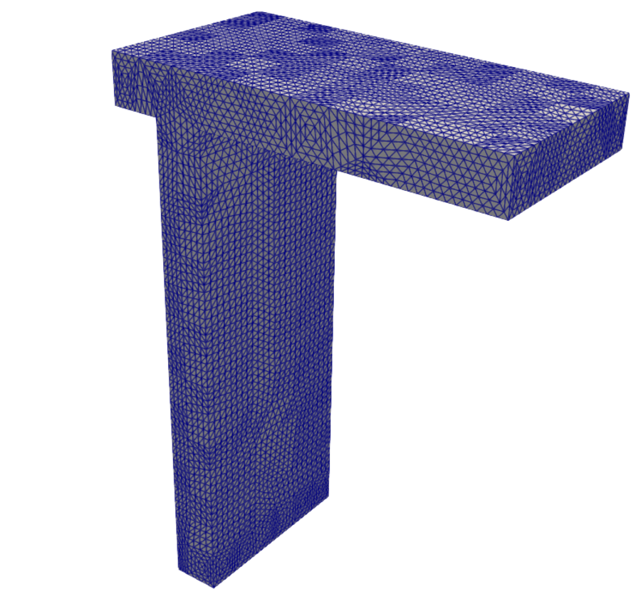
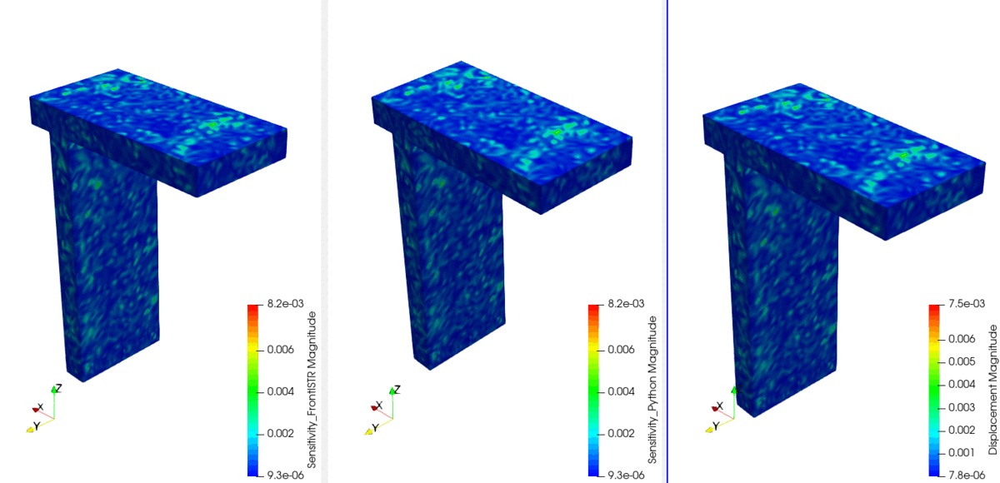

# 手順: リファインしたTjiメッシュでK・H・Wを比較する（改造版FrontISTR基準）

[`11_手順_PythonとFrontISTRのK_H_W比較.md`](11_手順_PythonとFrontISTRのK_H_W比較.md)の
570節点モデルを、より大きい問題サイズでも同じ結論になるか確認するため、メッシュを
リファイン（細分割）して同様の比較を行った。FrontISTR側は`005_H_direct`と同じ
`DUMPH=YES`改造版のみを使う（標準機能で570回のように節点を1つずつ計算する力任せの
方法は、節点数が増えると非現実的な時間になるため今回は行っていない）。

## 対象モデル

`sample/002_thermalSensitive/Inp_Data/Quad4_FEM_Tji.inp`（570節点・1699要素、元ファイルは
一切変更しない）の各四面体要素を8分割する一様細分割（red refinement、各辺に中点を追加）を
**2回繰り返し**（`--levels 2`）てリファインしたメッシュ。Fixed・Point_A(19)・Point_O(103)は
元の節点番号のまま。

| 元メッシュ（570節点・1699要素） | リファイン後（22,123節点・108,736要素） |
|---|---|
|  |  |

並べて見ると、四面体が大幅に細かくなっているのが分かる。以下の表で「リファイン後」と
呼ぶのは、このリファインしたメッシュの計算結果を置いている `model/010_Tji_fine_H_direct`
フォルダのことである。

| | 元メッシュ | リファイン後（`model/010_Tji_fine_H_direct`） |
|---|---|---|
| 節点数 | 570 | **22,123** |
| 要素数 | 1,699 | **108,736** |
| 自由度(DOF_TOTAL) | 1,710 | **66,369** |

材料定数は`11`と同じ: E=130000000, ν=0.27, density=7.4e-06, CTE=1.2e-05。

## 1. リファインメッシュの作り方

`post/refine_tji_mesh.py`が元の`Quad4_FEM_Tji.inp`を読み、リファイン後のメッシュを
FrontISTR形式（`model/010_Tji_fine_H_direct/FistrModel.msh`）、Python計算スクリプトが
読む中間形式（`mesh_fine.npz`: 節点座標・要素接続・Fixed・Point_A/O・材料定数）、
そして`ThermoSenseAnalyzer_00.py`が読めるAbaqus形式（`Quad4_FEM_Tji_fine.inp`）の
3つに書き出す。`--levels 2`で2段リファイン（このフォルダの実体）になる。

```bash
cd 20260810_KinvH
python3 post/refine_tji_mesh.py --levels 2
```

## 2. K・H行列の出力手順

### FrontISTR側（DUMPH改造版、K・Hを1回の実行で同時に取得）

`11`で確認した通り、`!BOUNDARY`（RHSを非ゼロにする）＋`!TEMPERATURE`＋`DUMPH=YES`＋
`DUMPTYPE=MM`＋`DUMPEXIT=YES`を同時に指定すると、1回の実行で境界条件適用後のK
(`dump_matrix_1_0.mm`)とHの生値(`H_matrix.mtx`)が両方出力される。

```text
model/010_Tji_fine_H_direct/FistrModel.cnt:
  !BOUNDARY
   fix, 1, 3, 0.0
  !TEMPERATURE
   19, 1.0
  !SOLVER,METHOD=DIRECT,ITERLOG=NO,TIMELOG=YES,DUMPTYPE=MM,DUMPH=YES,DUMPEXIT=YES
```

```bash
cd model/010_Tji_fine_H_direct
$HOME/local/frontistr-dumph/bin/fistr1
mv dump_matrix_1_0.mm K_fistr_tji_fine.mm
```

実行時間: **98.57 s**（108736要素）。570節点モデルの1.81 sから要素数が64倍
（1403→108736ではなく1699→108736、約64倍）に増え、実行時間は約54倍になった。

### Python側

```bash
python3 post/python_H_tji_fine.py
```

`mesh_fine.npz`を読み、`python_H_tji.py`と同じ数式でK・Hを組み立てる
（内訳は4節を参照）。

## 3. W行列（K⁻¹H）の出力手順

### アジョイント法（節点数によらず6回のsolveで済む計算方法）

最終的に欲しいのは、Point_A（節点19）とPoint_O（節点103）の変位がx・y・z方向に
どれだけ動くかという**6行分の数値**だけである（Wdiff）。W全体（K⁻¹H）は自由度数×節点数の
大きな行列だが、その中のこの6行しか使わない。

これまでの計算方法（`compute_kinvH_tji.py`や`python_H_tji.py`）は、この6行を得るために
W全体をいったん求めていた。W全体を求めるには、Hの列（＝節点）ごとに連立方程式を1回ずつ
解く必要があり、節点数と同じ回数（22123節点なら22123回）solveする。欲しいのは6行なのに
節点数ぶんのsolveをする、という無駄がある。

アジョイント法は、Kが対称行列であることを利用して計算の順番を入れ替え、**知りたい6行に
対応する6回のsolveだけ**で同じ答えを出す。solve回数が節点数に依存しなくなるのがポイントで、
メッシュが大きいほど効果が大きい。

### 数式で見るとどうなるか

Wの中で、自由度 $i$ （ $i \in \{A_x,A_y,A_z,O_x,O_y,O_z\}$ ）に対応する1行を $e_i^T W$ と書く
（ $e_i$ は自由度 $i$ だけが1で他は0のベクトル）。求めたいWdiffは、この行のPoint_A分とPoint_O分の差である。

$$\mathrm{Wdiff}_x = e_{A_x}^T W - e_{O_x}^T W,\quad \mathrm{Wdiff}_y = e_{A_y}^T W - e_{O_y}^T W,\quad \mathrm{Wdiff}_z = e_{A_z}^T W - e_{O_z}^T W$$

これまでの方法は、 $W=K^{-1}H$ の**全体**を、Hの列 $j$ （節点 $j$ ）ごとに $K w_j = H_{:,j}$ を解いて求める
（列数＝節点数と同じ回数のsolveが必要）。

アジョイント法は、 $K$ が対称行列（ $K^{-1}$ も対称）であることを使って、次のように計算順序を入れ替える。

$$e_i^T W = e_i^T K^{-1} H = (K^{-1} e_i)^T H = z_i^T H \quad \text{ここで} \quad z_i = K^{-1} e_i$$

つまり $K z_i = e_i$ を解いて $z_i$ を求めれば、Wの行 $i$ は $z_i^T H$ （ベクトルと行列の掛け算だけ）で
計算できる。 $K z_i = e_i$ は「自由度 $i$ だけに単位の力（または熱）を与えたときの変形を求める」という、
通常の構造解析1回分と同じ計算である。6つの自由度について解けば、

$$K z_{A_x}=e_{A_x},\ K z_{A_y}=e_{A_y},\ K z_{A_z}=e_{A_z},\ K z_{O_x}=e_{O_x},\ K z_{O_y}=e_{O_y},\ K z_{O_z}=e_{O_z}$$

$$\mathrm{Wdiff}_x = (z_{A_x}-z_{O_x})^T H,\quad \mathrm{Wdiff}_y = (z_{A_y}-z_{O_y})^T H,\quad \mathrm{Wdiff}_z = (z_{A_z}-z_{O_z})^T H$$

必要なsolveは常に**6回**で、Hの列数（節点数）が何万に増えても変わらない
（`post/wdiff_adjoint.py`で実装）。

### Kの逆行列（K⁻¹）をまるごと求める計算との違い

「 $W=K^{-1}H$ なら、先に $K^{-1}$ を計算しておけばいいのでは」と思うかもしれないが、
**素朴な方法・アジョイント法のどちらも、 $K^{-1}$ を行列としてまるごと求めることは
一度もしていない**。この違いが重要なので補足する。

$K^{-1}$ を行列として明示的に求めるには、単位行列 $I$ を使って $KX=I$ を解けばよいが、
$I$ の列数は自由度数（今回のモデルでは66369）ぶんある。つまり**66369回のsolve**が
必要になり、これは素朴な方法（節点数=22123回）よりも3倍多く、アジョイント法（6回）とは
比べ物にならないほど多い。** $K^{-1}$ を丸ごと求めるのが実は一番割に合わない方法**である
（ $W$ の計算に $K^{-1}$ の全成分は要らないのに、全部計算してしまうことになるため）。

実際にコンピュータが「solveする」ときにやっていることは、 $K^{-1}$ を作ることではなく、

1. $K$ を1回だけLU分解する（ $K=LU$ 、 $L$ は下三角、 $U$ は上三角の行列に分解する。
   これが計算コストの大部分を占める）
2. 欲しい右辺ベクトル $b$ それぞれについて、 $Ly=b$ （前進代入）→ $Ux=y$ （後退代入）という
   軽い計算だけで $x=K^{-1}b$ を求める（LU分解は1回で済み、 $b$ を変えるたびの計算は軽い）

という手順である。**素朴な方法とアジョイント法の違いは、この手順自体ではなく、
「右辺ベクトル $b$ を何本、どれだけ用意するか」だけ**である。

| 方法 | LU分解 | 右辺ベクトル $b$ の本数 | 内容 |
|---|---|---|---|
| $K^{-1}$ を丸ごと求める | 1回 | 自由度数（66369本） | 単位行列の全列 |
| 素朴な方法 | 1回 | 節点数（22123本） | Hの全列 |
| アジョイント法 | 1回 | 知りたい行の数（6本） | Point_A/Point_Oの単位荷重 |

LU分解はどの方法でも1回だけ（共通）。差が出るのは、その後の「軽い計算」を
何回繰り返すかだけであり、これがそのまま計算時間の差になる。

### 具体的な数値で確認する（6自由度・3節点のおもちゃの例）

言葉ではなく、実際に数を入れて両方の方法を計算し、同じ答えになることを確認する。
実際の問題を小さくした、6自由度・3節点（各節点2自由度の2次元弾性のイメージ）の例を使う
（すべて`numpy`で実際に計算した値）。

$$K=\begin{bmatrix}6&-1&0&-2&0&-1\\-1&6&-2&0&-1&0\\0&-2&6&-1&0&-1\\-2&0&-1&6&-1&0\\0&-1&0&-1&6&-2\\-1&0&-1&0&-2&6\end{bmatrix},\qquad H=\begin{bmatrix}2&0&1\\0&1&0\\1&2&0\\0&0&2\\1&0&1\\0&1&0\end{bmatrix}$$

$K$ は6×6の対称正定値行列（実際の剛性行列と同じ性質）。 $H$ は6自由度×3節点。
実際の問題のPoint_A・Point_Oに相当するものとして、ここでは**行0（自由度0）と行4（自由度4）の
差**を知りたいとする。求めたいのは次の1×3ベクトル（3節点それぞれの温度に対する感度）である。

$$\mathrm{Wdiff}=(\text{$W$の行0})-(\text{$W$の行4}),\qquad W=K^{-1}H$$

#### 素朴な方法（Hの列ごとに全部solve）― 手順を1つずつ

**手順1**: $H$ は3列ある（節点1・2・3にそれぞれ対応）。1列ずつ、 $K$ を使った連立方程式
$Kw_j=H_{:,j}$ を解く。これを3回繰り返す（ $j=1,2,3$ ）。これが「3回のsolve」の中身である。

**手順2**: 3回の求解結果を並べると、 $W=K^{-1}H$ の全体（6行×3列）が得られる。

| | 節点1の列 | 節点2の列 | 節点3の列 |
|---|---|---|---|
| 行0 | 0.5143 | 0.2000 | 0.4286 |
| 行1 | 0.2571 | 0.4286 | 0.2000 |
| 行2 | 0.3429 | 0.5714 | 0.2000 |
| 行3 | 0.2857 | 0.2000 | 0.5714 |
| 行4 | 0.3429 | 0.2286 | 0.3714 |
| 行5 | 0.2571 | 0.3714 | 0.2286 |

**手順3**: 6行×3列の表を全部計算したが、実際に欲しいのは行0と行4だけ。そこだけ取り出す。

$$W_{\text{行0}}=[0.5143,\ 0.2000,\ 0.4286],\qquad W_{\text{行4}}=[0.3429,\ 0.2286,\ 0.3714]$$

**手順4**: 行0から行4を引く。これがWdiff（求めたかった答え）。

$$\mathrm{Wdiff}=W_{\text{行0}}-W_{\text{行4}}=[\,0.1714,\ -0.0286,\ 0.0571\,]$$

→ 表の12個の数値（6行×3列-6個の未使用分）のうち、実際に使ったのは6個（行0と行4の3個ずつ）だけ。
残りの8個は計算したのに捨てている。

#### アジョイント法（欲しい2行だけを逆から解く）― 手順を1つずつ

**手順1**: 「行0が欲しい」を「自由度0だけに単位の力を与える」というベクトル
$e_0=[1,0,0,0,0,0]^T$ に、「行4が欲しい」を $e_4=[0,0,0,0,1,0]^T$ に置き換える
（0番目・4番目の場所だけ1で、あとは全部0）。

**手順2**: $Kz=e_0$ という式の意味は、そもそもの問題 $Ku=f$ （Kは剛性、uは変位、fは荷重）と
**全く同じ形**で、右辺（荷重）を $e_0$ （自由度0だけに1の力、他は0の力）に差し替えただけである。
つまり「自由度0の場所だけを1の力でつつき、他の場所には何も力をかけなかったら、
構造物全体（6自由度すべて）はどう変形するか」を求める、ごく普通の1回の構造解析である。
その答え（変形＝変位ベクトル）を $z_0$ と呼んでいる。 $e_4$ についても同様に、
「自由度4の場所だけを1の力でつついたときの変形」を $z_4$ として求める。
これを2回（ $e_0$ 用と $e_4$ 用）行う。

$$K z_0=e_0 \implies z_0=[0.2143,\ 0.0571,\ 0.0429,\ 0.0857,\ 0.0429,\ 0.0571]^T$$

$$K z_4=e_4 \implies z_4=[0.0429,\ 0.0571,\ 0.0429,\ 0.0571,\ 0.2143,\ 0.0857]^T$$

**手順3**: 2つの結果 $z_0$ と $z_4$ の差を取る（成分ごとの引き算、6個の数値の並び）。

$$z_0-z_4=[0.1714,\ 0.0000,\ 0.0000,\ 0.0286,\ -0.1714,\ -0.0286]$$

**手順4**: この6個の数値（横ベクトル）と、 $H$ （6行3列の表）を掛け算する。行列とベクトルの
掛け算1回だけで、3節点ぶんの答えが一度に出る。

$$(z_0-z_4)^T H=[\,0.1714,\ -0.0286,\ 0.0571\,]$$

→ 素朴な方法のように「6行×3列を全部計算してから2行を捨てて選ぶ」のではなく、
最初から「欲しい2行に対応する2パターン（ $e_0,e_4$ ）だけ」を解いているので、
無駄な計算が発生しない。

#### 結論

素朴な方法の $[0.1714, -0.0286, 0.0571]$ と、アジョイント法の $[0.1714, -0.0286, 0.0571]$ は
**完全に一致する**（手順は違うが、数学的に同じ答えを導く2通りの経路であるため）。

- 素朴な方法: solveを **Hの列数ぶん（この例では3回、実際の問題では22123回）** 行い、
  6行×3列すべてのWを計算してから2行だけ抜き出す。
- アジョイント法: solveを **欲しい行数ぶん（この例では2回、実際の問題では6回）** だけ行う。

この例ではHの列数が3と小さいので差はわずかだが、実際の問題ではHの列数（＝節点数）が
22123まで増える。素朴な方法はそれに比例して22123回solveするのに対し、アジョイント法は
何節点でも6回のまま。だからメッシュが大きいほど差が開く（22123節点での実測は4節参照）。

### FrontISTR側

FrontISTR自体はWを計算しないので、出力したK・Hを`wdiff_adjoint.py`（アジョイント法、
上記参照）に読ませて計算する。22123節点では列ごとに全部解く`compute_kinvH_tji.py`は
現実的でない時間がかかるため、こちらを使う。`--mesh-npz`でリファインメッシュの
節点対応を渡す。

```bash
python3 post/wdiff_adjoint.py \
  --workdir model/010_Tji_fine_H_direct \
  --k K_fistr_tji_fine.mm --h H_matrix.mtx \
  --out Wdiff_fistr_tji_fine.npy --mesh-npz mesh_fine.npz
```

### Python側

`python_H_tji_fine.py`の中で、境界条件を適用したKをLU分解した後、アジョイント法で
Point_A/Point_Oの6自由度分だけ解いて、Wdiff（Point_A-Point_O行、3×22123）まで計算する。

### ParaViewで見るVTK

```bash
python3 post/write_sensitivity_vtk.py \
  --wdiff model/010_Tji_fine_H_direct/Wdiff_python_tji_fine.npy \
  --out   model/010_Tji_fine_H_direct/Wdiff_python_tji_fine.vtk \
  --field-name Sensitivity_Python --mesh-npz model/010_Tji_fine_H_direct/mesh_fine.npz

python3 post/write_sensitivity_vtk.py \
  --wdiff model/010_Tji_fine_H_direct/Wdiff_fistr_tji_fine.npy \
  --out   model/010_Tji_fine_H_direct/Wdiff_fistr_tji_fine.vtk \
  --field-name Sensitivity_FrontISTR --mesh-npz model/010_Tji_fine_H_direct/mesh_fine.npz
```

`write_sensitivity_vtk.py`は`--mesh-npz`を指定すると、`Quad4_FEM_Tji.inp`を直接
パースする代わりに`mesh_fine.npz`のメッシュ形状を使うようになっている（570節点用と
共通のスクリプト）。

## 4. 計算時間（すべて4並列でそろえて計測）

このメッシュ（22123節点・108736要素）について、**FrontISTRもPythonも4並列にそろえて**
実測した。FrontISTRは`OMP_NUM_THREADS=4`、Pythonの各スクリプトは
`OMP_NUM_THREADS=4 OPENBLAS_NUM_THREADS=4`を指定している
（`ThermoSenseAnalyzer_00.py`は第2引数のコア数を`4`にして4プロセスで実行）。

比較する3つの経路は次の通り。

- **`python_H_tji_fine.py`**（K・H組立 + アジョイント法でWdiff）
- **FrontISTR(`fistr1` DUMPH改造版) + `wdiff_adjoint.py`**（K・H出力 + アジョイント法でWdiff）
- **`ThermoSenseAnalyzer_00.py`**（`ThermoSenseAnalyzer_00_fixed.py`、K・H組立 + 列ごとに
  全部solveする従来方式でWdiff）

| 処理 | `python_H_tji_fine.py`（アジョイント法） | FrontISTR + `wdiff_adjoint.py`（アジョイント法） | `ThermoSenseAnalyzer_00.py`（列ごとに全部solve） |
|---|---|---|---|
| K・H組立 + 境界条件処理 | 31.7 + 110.1 = 141.8 s | 92.41 s（`fistr1`、K・H同時出力） | 291.6 s（組立 + 境界条件） |
| W = K⁻¹H | 16.5 s（アジョイント6回） | 58.97 s（読込38.5 + アジョイント6回19.8） | 約1033 s（全22123列をsolve） |
| **トータル** | **212.6 s** | **151.4 s**（92.41 + 58.97） | **1324.9 s** |

（`ThermoSenseAnalyzer_00.py`の「W約1033s」は、合計1324.9s − K・H組立291.6s から算出。
このスクリプトはVTK出力まで含む。）

### この表から分かること

**(1) 同じアジョイント法どうし（`python_H_tji_fine.py` vs FrontISTR）**:
トータルはFrontISTR側（151.4s）の方が速い。`python_H_tji_fine.py`は境界条件処理が
110秒と大きく（後述）、これが効いている。W求解自体はどちらも16〜20秒で同程度。

**(2) 同じPython・同じメッシュで、Wの求解方式だけを変えた場合
（`python_H_tji_fine.py` vs `ThermoSenseAnalyzer_00.py`）**:
W求解が16.5秒（アジョイント6回）と約1033秒（全22123列solve）で、**約60倍**の差。
`ThermoSenseAnalyzer_00.py`は4プロセスで並列化しているにもかかわらず、
「欲しいのは6行なのに全22123列を解く」という方式のため、この規模では圧倒的に遅い。
トータルでも212.6秒 対 1324.9秒で**約6倍**の差になった（K・H組立の時間が両方に共通で
乗るため、トータルの倍率はW単体の倍率より小さくなる）。

**(3) なぜ`python_H_tji_fine.py`の境界条件処理が110秒と大きいのか**:
K・Hの固定自由度の行・列を、疎行列に対してループで1つずつゼロ化する実装
（`lil`形式での逐次処理）が自由度数（66369）に対して効率的でないため。ここは
改善の余地があるが今回は未対応。FrontISTR(`fistr1`)は内部でより効率的な境界条件処理を
行っており、K・H出力全体が92.41秒で完了している。

### 570節点モデル（`docs/11`）との比較

| メッシュ | `python_H_tji_fine.py` | FrontISTR+アジョイント | `ThermoSenseAnalyzer_00.py` |
|---|---|---|---|
| 570節点（`docs/11`、4スレッド） | 2.14 s | 約3.0 s | 4.96 s（列ごとに全部solve） |
| 22,123節点（4スレッド） | 212.6 s | 151.4 s | 1324.9 s（列ごとに全部solve） |

`ThermoSenseAnalyzer_00.py`の従来方式（列ごとに全部solve）は、節点数が570→22123
（約39倍）に増えると4.96秒→1324.9秒（**約267倍**）に膨れ上がる。solve回数が節点数に
比例して増える上、1回のsolveのコストもメッシュが大きいほど増えるため、
両方が掛かって急激に遅くなる。一方アジョイント法（`python_H_tji_fine.py`）は
solve回数が常に6回なので、増え方がずっと緩やかである。

## 5. どのフォルダのどれを見ればいいか

| 見たいもの | Python側 | FrontISTR側 |
|---|---|---|
| H（生、境界条件なし） | `model/010_Tji_fine_H_direct/H_python_tji_fine.npz` | `model/010_Tji_fine_H_direct/H_matrix.mtx` |
| K（境界条件適用後） | `model/010_Tji_fine_H_direct/K_python_tji_fine_bc.mtx` | `model/010_Tji_fine_H_direct/K_fistr_tji_fine.mm` |
| Wdiff（節点19-103の感度） | `model/010_Tji_fine_H_direct/Wdiff_python_tji_fine.npy` | `model/010_Tji_fine_H_direct/Wdiff_fistr_tji_fine.npy` |
| ParaViewで見るVTK | `Wdiff_python_tji_fine.vtk` | `Wdiff_fistr_tji_fine.vtk` |
| メッシュ・材料定数・リファイン方法 | [`model/010_Tji_fine_H_direct/README.md`](../model/010_Tji_fine_H_direct/README.md) | 同左 |
| 570節点モデルでの同じ比較 | [`11_手順_PythonとFrontISTRのK_H_W比較.md`](11_手順_PythonとFrontISTRのK_H_W比較.md) | 同左 |

`.mtx` / `.npy` / `.npz`は`.gitignore`で除外されローカルのみ。`H_matrix.mtx`は
このメッシュサイズ（22123節点）だと**約169MB**、`K_fistr_tji_fine.mm`も約88MBと大きいので、
`.gitignore`の対象で無くても手動でpushしないよう注意。`.vtk`（`Wdiff_*_fine.vtk`）は
1ファイル約4.4MB（570節点モデルの約97KBよりかなり重い）。

## 使った材料定数（3つとも同じ値にそろえた）

`ThermoSenseAnalyzer_00.py`は再実行が重いので、他の2つ（FrontISTRと`python_H_tji_fine.py`）を
`ThermoSenseAnalyzer_00.py`がハードコードしている値に合わせた。3つとも次の同じ材料定数で計算している。

| 実装 | ヤング率E | ポアソン比ν | 線膨張係数CTE | 値の出どころ |
|---|---|---|---|---|
| `ThermoSenseAnalyzer_00.py` | 130000 | 0.27 | 1e-5 | スクリプト内にハードコード（コメントに"Catiaの数値"） |
| FrontISTR(`fistr1`) | 130000 | 0.27 | 1e-5 | `FistrModel.cnt`をこの値に変更 |
| `python_H_tji_fine.py` | 130000 | 0.27 | 1e-5 | `--young 130000 --cte 1.0e-05`で上書き |

（元の`Quad4_FEM_Tji.inp`はE=130000000, CTE=1.2e-5だが、ここでは
`ThermoSenseAnalyzer_00.py`のハードコード値に統一した。E=130000000とE=130000は
単位系の違い＝どちらも約130 GPaの鋳鉄FC300を指すと思われるが、CTEは1.2e-5と1e-5で
値そのものが異なる。3者比較のため、`ThermoSenseAnalyzer_00.py`側にそろえた。）

## 結果（3者の数値比較）

材料定数をそろえた上で、3つの実装のWdiffを突き合わせた。

| 比較 | 最大絶対差 | 相対差 |
|---|---|---|
| `python_H_tji_fine.py`（アジョイント） vs FrontISTR（アジョイント） | 5.5e-10 | 9.4e-08 |
| `ThermoSenseAnalyzer_00.py`（列ごとに全部solve） vs `python_H_tji_fine.py` | 6.4e-04 | **1.13e-01（約11%）** |
| `ThermoSenseAnalyzer_00.py`（列ごとに全部solve） vs FrontISTR | 6.4e-04 | **1.13e-01（約11%）** |

`python_H_tji_fine.py`とFrontISTRは相対差9.4e-8で**ほぼ完全に一致**する
（H・Kも同様に一致、下表）。一方、`ThermoSenseAnalyzer_00.py`だけは同じ材料定数でも
**約11%ずれる**。

この11%の差の原因は、**`ThermoSenseAnalyzer_00.py`が座標・B行列・K・H・ソルバまで
一貫して単精度（`float32`）を使っていること**と考えられる。`float32`は有効数字が約7桁
しかなく、22123節点・66369自由度の大規模な連立方程式を`float32`のまま`splu`で解くと、
丸め誤差が無視できないほど蓄積する（座標も`float32`で保持しているため、リファインで
中点を繰り返して作った細かい節点の座標精度も落ちている）。実際、570節点の小さいメッシュでは
同じ突き合わせで相対差0.5%程度だったものが、要素数を64倍にしたこのメッシュでは11%まで
拡大している。`python_H_tji_fine.py`とFrontISTRはいずれも倍精度（`float64`）で計算しており、
相互に一致している。

参考: H・K自体の一致（FrontISTR vs `python_H_tji_fine.py`、いずれも倍精度）

| 項目 | 最大絶対差 | 相対差(Frobenius) |
|---|---|---|
| H（生） | 1.954e-07 | 8.749e-13 |
| K（境界条件適用後） | 5.001e-03 | 1.382e-12 |
| Wdiff（アジョイント法） | 5.5e-10 | 9.4e-08 |

### ParaViewでの見た目の比較

3つのWdiffを`write_sensitivity_vtk.py`でVTK化し、ParaViewで同じ視点・同じ形状
（22123節点・108736要素）で並べたもの。



左からFrontISTR（`Sensitivity_FrontISTR`）、`python_H_tji_fine.py`（`Sensitivity_Python`）、
`ThermoSenseAnalyzer_00.py`（`Displacement`、このスクリプトの`outputvtk()`が付ける名前）。
細かいメッシュなので感度分布が細かい斑模様になっている。左2つ（倍精度・アジョイント法）は
カラースケール（9.3e-06〜8.2e-03）も分布もほぼ同一。右の`ThermoSenseAnalyzer_00.py`は
単精度の誤差で最大値が7.5e-03とやや低め・分布もわずかに異なるが、全体の傾向
（どこが高感度か）は一致している。

## まとめ

- 倍精度どうし（FrontISTRと`python_H_tji_fine.py`）は、22123節点まで大きくしても
  H・K・Wdiffが数値誤差レベル（相対差1e-7〜1e-13）で一致する。
- `ThermoSenseAnalyzer_00.py`は単精度（`float32`）のため、大規模メッシュでは同じ材料定数でも
  約11%ずれる。小規模（570節点）では0.5%だったので、メッシュを細かくするほど単精度の
  限界が顕在化する。
- 計算時間の面では、Wの求解を「列ごとに全部solve」する`ThermoSenseAnalyzer_00.py`の方式が
  大規模で極端に遅くなる（4並列でも約22分）のに対し、アジョイント法（6回のsolve）なら
  数十秒で済む。**「PythonかFrontISTRか」よりも、「Wをどう計算するか（アルゴリズム）」と
  「単精度か倍精度か」の方が、問題サイズが大きくなるほど結果と速度を大きく左右する。**
