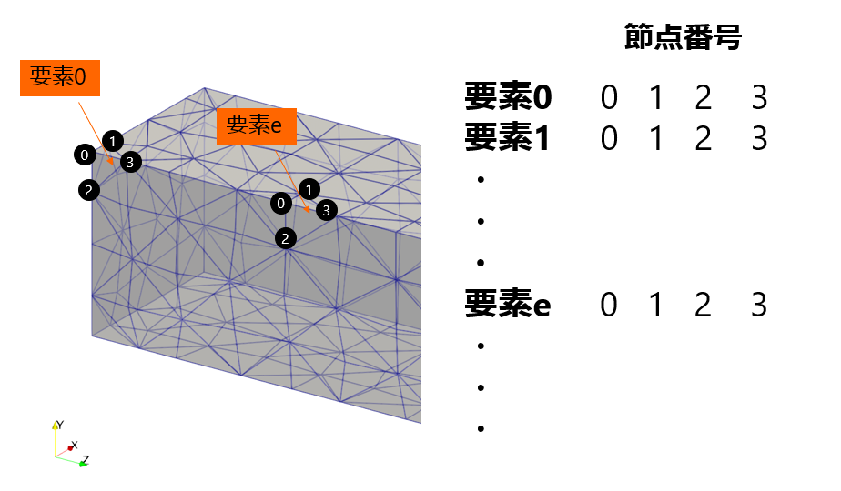
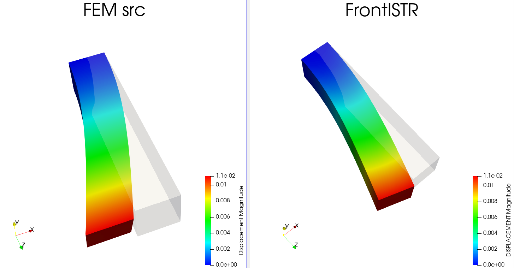
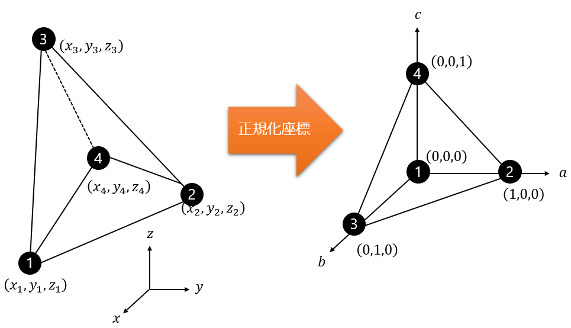

# FrontISTRから全体剛性行列Kと温度荷重行列Hを取り出す

こんにちは（@t_kun_kamakiri）。

今回は、FrontISTRの計算の中で使われている「全体剛性行列 $\boldsymbol K$」と「温度荷重行列 $\boldsymbol H$」を、実際にファイルとして取り出してみたお話です。

最終的にやりたいことは、節点の温度から節点の変位を一発で計算する行列 $\boldsymbol K^{-1}\boldsymbol H$ を作ることです。そのためには、まず $\boldsymbol K$ と $\boldsymbol H$ をFrontISTRから取り出す必要があります。

この記事では、次の順番で進めます。

- そもそも $\boldsymbol K$ や $\boldsymbol H$ が何者かを整理する
- FrontISTRの標準機能だけで $\boldsymbol K$ を取り出す
- 取り出した $\boldsymbol K$ を自作のPython FEMと比べて、正しく取り出せているか確認する
- 同じ発想で $\boldsymbol H$ を取り出す（標準機能でも、ソース改造でも）
- $\boldsymbol H$ が正しく出せているか確認する
- $\boldsymbol W=\boldsymbol K^{-1}\boldsymbol H$ を作り、$\boldsymbol u=\boldsymbol W\boldsymbol T$ の変位がFrontISTR熱解析と一致することを確かめる

---

## この記事で分かること

- FrontISTRから全体剛性行列 $\boldsymbol K$ をファイル出力する方法（ソース改造なし）
- 取り出した $\boldsymbol K$ を自作FEMと突き合わせて検証する手順
- 温度荷重行列 $\boldsymbol H$ を1列ずつ取り出す方法
- $\boldsymbol H$ をまとめて出力するためのソース改造の勘どころ
- $\boldsymbol W=\boldsymbol K^{-1}\boldsymbol H$ で温度から変位を求める方法と、特定2点の相対変位の取り出し方

*FrontISTR 5.9 / WSL2環境に構築*

---

## 1. なにを計算したいのか

構造解析でおなじみの式は、次のものです。

$$
\boldsymbol K\boldsymbol u = \boldsymbol f
$$

- $\boldsymbol K$：全体剛性行列（形状・材料で決まる、変形のしにくさ）
- $\boldsymbol u$：節点変位（求めたいもの）
- $\boldsymbol f$：節点荷重（外から与える力）

これは荷重$\boldsymbol{f}$を与えると、全体剛性行列$\boldsymbol K$を係数として変位$\boldsymbol{u}$が生じるというものです。

※逆に変位$\boldsymbol{u}$を与えると、全体剛性行列$\boldsymbol K$を係数として荷重$\boldsymbol{f}$が生じるというものでもあります。

ここで、荷重 $\boldsymbol f$ が「外から押す力」ではなく「温度が変わったことで生じる力」だとします。この温度による力は、節点温度 $\boldsymbol T$ に行列 $\boldsymbol H$ を掛けた形で書けます。

$$
\boldsymbol f_{\mathrm{thermal}} = \boldsymbol H\boldsymbol T
$$

なぜ温度が「力」になるのか、イメージを補足しておきます。材料は温度が上がると膨張しようとします（熱ひずみ $\alpha\Delta T$）。もし物体がどこにも拘束されず、全体が同じ温度で温まるだけなら、ただ自由に膨らむだけで力も応力も生じません。

ところが実際には、一部が固定されていたり、場所によって温度差があったりします。すると「膨らみたいのに膨らめない」部分が出てきて、そこに内部の力が生じます。この「膨張しようとする効果」を、**各節点に加える等価な力に置き換えたもの**が $\boldsymbol f_{\mathrm{thermal}}=\boldsymbol H\boldsymbol T$ です。等価節点熱荷重と呼びます。

この力で構造を解けば、実際の熱変形（温度によってどう変位するか）が求まる、という流れです。だから

$$
\boldsymbol K\boldsymbol u = \boldsymbol f_{\mathrm{thermal}}
$$

の $\boldsymbol u$ は、「温度変化 → 熱膨張 → （拘束や温度差で生じた力による）変位」を表します。ご質問のとおり、**温度が変わって熱膨張し、その結果として出てくる変位** がこの $\boldsymbol u$ です。

これを最初の式に入れると、次のようになります。

$$
\boldsymbol K\boldsymbol u = \boldsymbol H\boldsymbol T \quad\Longrightarrow\quad \boldsymbol u = \boldsymbol K^{-1}\boldsymbol H\,\boldsymbol T
$$

つまり $\boldsymbol K^{-1}\boldsymbol H$ は、**節点温度を入れると節点変位が返ってくる変換表**です。これがあれば、温度分布を変えるたびに解析し直さなくても、変位が掛け算だけで求められます。これがこの記事のゴールです。

そのために、まず材料になる $\boldsymbol K$ と $\boldsymbol H$ を、FrontISTRから取り出していきます。

---

## 2. 使ったモデルと単位系

題材は、片持ち梁のような3次元ソリッドモデルです。

| 項目 | 内容 |
|---|---|
| 要素 | C3D4（線形四面体）＝ FrontISTRの要素タイプ 341 |
| 規模 | 425節点、1403要素 |
| 材料 | FC300（鋳鉄） E=130000 MPa、ν=0.27、α=1.2×10⁻⁵ /K |
| 固定 | 端面25節点を完全固定 |

モデルは、この四面体要素をびっしり並べたものです。1つの要素は4つの節点（下図の 0・1・2・3）でできていて、どの要素がどの節点でできているか（要素-節点の対応）が下図右のような表になっています。



*四面体1次要素（341）のメッシュ。1要素が4節点でできており、右の表が「要素→節点」の対応です。*

自由度は1節点あたり x・y・z の3つなので、全体では次のサイズになります。

$$
n_{\mathrm{dof}} = 3 \times 425 = 1275
$$

したがって $\boldsymbol K$ は $1275\times1275$、$\boldsymbol H$ は $1275\times425$（行が自由度、列が節点温度）になります。

### TとHは具体的にどういう形か

言葉だけだと分かりにくいので、中身を書き下してみます。

まず温度ベクトル $\boldsymbol T$ は、425個の節点温度を上から順に並べただけの縦ベクトルです。

$$
\boldsymbol T = \begin{bmatrix} T_1 \\ T_2 \\ T_3 \\ \vdots \\ T_{425} \end{bmatrix} \quad(425\times1)
$$

$T_j$ が節点 $j$ の温度です。

一方 $\boldsymbol H$ は、行が自由度（節点×方向）、列が節点温度に対応する横長の行列です。行のラベルは「節点1のx, 節点1のy, 節点1のz, 節点2のx, …」、列のラベルは「$T_1, T_2, \dots, T_{425}$」です。

$$
\boldsymbol H = \begin{array}{c} \begin{array}{ccccc} \ \ T_1 & \ T_2 & \ T_3 & \cdots & T_{425} \end{array}\\[2pt] \begin{bmatrix} h_{1x,1} & h_{1x,2} & h_{1x,3} & \cdots & h_{1x,425} \\ h_{1y,1} & h_{1y,2} & h_{1y,3} & \cdots & h_{1y,425} \\ h_{1z,1} & h_{1z,2} & h_{1z,3} & \cdots & h_{1z,425} \\ h_{2x,1} & h_{2x,2} & h_{2x,3} & \cdots & h_{2x,425} \\ \vdots   & \vdots   & \vdots   & \ddots & \vdots     \\ h_{425z,1} & h_{425z,2} & h_{425z,3} & \cdots & h_{425z,425} \end{bmatrix} \end{array} \begin{array}{l} \!\!\leftarrow 節点1のx \\ \!\!\leftarrow 節点1のy \\ \!\!\leftarrow 節点1のz \\ \!\!\leftarrow 節点2のx \\ \ \ \vdots \\ \!\!\leftarrow 節点425のz \end{array}
$$

成分 $h_{2x,\,3}$ は「節点3の温度を1度上げたときに、節点2のx方向に生じる力」という意味です。掛け算 $\boldsymbol f=\boldsymbol H\boldsymbol T$ を成分で書くと、例えば節点2のx方向の力は次のように、全節点の温度の寄与を足し合わせたものになります。

$$
f_{2x} = h_{2x,1}\,T_1 + h_{2x,2}\,T_2 + \cdots + h_{2x,425}\,T_{425}
$$

ここで大事なのが、$\boldsymbol H$ の**1列だけ**を見ると何が分かるか、です。$\boldsymbol H$ の第 $j$ 列 $\boldsymbol H[:,j]$ は、「節点 $j$ だけを1度上げて、ほかの節点は0度にしたときに、全1275自由度へ生じる力」を並べたものになっています。この性質を、あとで $\boldsymbol H$ を取り出すときに使います（5章）。

### 単位系は mm-ton-s にそろえる

FrontISTRは単位を明示しません。入力した数値の組み合わせで単位が決まります。今回は自作Python側が `E=130000 MPa` で計算しているので、それに合わせて **mm-ton-s系**（＝N-mm系）にそろえました。

| 量 | 単位 |
|---|---|
| 長さ | mm |
| ヤング率・応力 | MPa（=N/mm²） |
| 力 | N |
| 密度 | tonne/mm³（FC300で 7.4×10⁻⁹） |

$\boldsymbol K$ の値そのものは、両者が同じ数値（同じE・同じ座標）を読めば一致します。単位系は「その数値が何GPaなのか」を解釈するときだけ効いてきます。

### 作業フォルダの全体構成

この記事で使うフォルダの全体像を先に載せておきます。どの章がどのフォルダの作業かを、あとで見返せるようにするためです。

```text
20260810_KinvH/
├── model/                      FrontISTR用（モデル変換・実行）
│   ├── inp2fistr.py            Abaqus .inp → FrontISTR .msh 変換スクリプト
│   ├── 001_K/                  全体剛性行列K を出力（3章）
│   ├── 003_Htest/              H の第2列だけ取り出す検証（5章／正解の基準）
│   ├── 004_H/                  標準機能で H 全体を組む（build_H.py・425回, 6章）
│   ├── 005_H_direct/           改造版 DUMPH=YES で H 全体を一発出力（6章）
│   └── 006_KinvH_test/         K⁻¹Hの変位をFrontISTRと比較（8章）
│
├── sample/…/Quad4_structual/   自作Python FEM（K比較用, 4章）
│   ├── Quad4_main.py           自作FEM本体
│   └── Kexport.py              K を保存するドライバ
│
├── post/                       後処理スクリプト
│   ├── read_fistr_matrix.py    CSR/MM/RHS ダンプを読む
│   ├── compare_K.py            自由度を整列して K 同士を比較
│   ├── K_dense_compare.py      行×列のラベル付き表を出す
│   ├── csr_to_mtx_csv.py       .csr → .mtx / CSV 変換
│   ├── compute_kinvH.py        K⁻¹H を計算
│   └── validate_kinvH.py       K⁻¹HとFrontISTRの変位を比較
│
├── patch/
│   └── frontistr_dumph_341.patch   DUMPH=YES のソース差分（6章）
│
└── docs/                       解説ドキュメント一式（この記事の元）
```

- `model/001_K` … 3章の $\boldsymbol K$ 出力
- `model/003_Htest` `004_H` `005_H_direct` … 5〜6章の $\boldsymbol H$ 出力の3ルート
- `sample/…/Quad4_structual` … 4章の $\boldsymbol K$ 比較に使う自作FEM
- `post/` … 比較・変換と $\boldsymbol K^{-1}\boldsymbol H$ の計算・検証

### サンプルファイルはどこにあるか

この記事で使った入力と出力は、`20260810_KinvH` の下にそのまま残してあります。改造版FrontISTRでHを出力する主サンプルは次のフォルダです。

```text
/mnt/d/work/002_CAE/frontistr/work/20260810_KinvH/frontistr/model/005_H_direct
```

このフォルダには、次のファイルが入っています。

| ファイル | 用途 |
|---|---|
| `FistrModel.msh` | 425節点、1403四面体要素のメッシュ |
| `FistrModel.cnt` | 材料、線膨張係数、温度、`DUMPH=YES` の設定 |
| `hecmw_ctrl.dat` | FrontISTRが読む入力ファイルの対応表 |
| `H_matrix.mtx` | 改造版FrontISTRが直接出力した $1275\times425$ のH |
| `dump_matrix_1_0.mm` | 同じ計算で出力したK |
| `dump_matrix_1_0.rhs` | 節点2だけに単位温度を与えた右辺ベクトル |
| `run_dumph.log` | 実際にFrontISTRを実行したときのログ |
| `README.md` | 実行コマンドとEasyISTR・ParaViewでの確認方法 |

その他の比較用サンプルは次のとおりです。

| フォルダ | 確認できること |
|---|---|
| `model/001_K` | FrontISTR標準機能によるKの出力 |
| `model/003_Htest` | 節点2の単位温度でHの第2列を取り出す方法 |
| `model/004_H` | 標準FrontISTRを425回実行して作ったH |
| `model/006_KinvH_test` | $\boldsymbol K^{-1}\boldsymbol H$ から求めた変位と比較するFrontISTR解析 |
| `patch/frontistr_dumph_341.patch` | FrontISTR 5.9に `DUMPH=YES` を追加するソース差分 |

`sample/README.md` にも、サンプルを使う順番をまとめてあります。

---

## 3. 全体剛性行列Kを取り出す

### 3.1 ソース改造はいりません

$\boldsymbol K$ を取り出すのに、FrontISTRのソースコードをいじる必要はありませんでした。`!SOLVER` の行に、行列を書き出すオプションを足すだけです。

```text
!SOLVER,METHOD=DIRECT,ITERLOG=NO,TIMELOG=YES, DUMPTYPE=CSR, DUMPEXIT=NO
 10000, 1
 1.0e-8, 1.0, 0.0
```

ここで追加したのは次の2つです。

- **DUMPTYPE**：解いている連立方程式の左辺の行列を、指定した形式でファイルに書き出します。`CSR`／`MM`（Matrix Market）／`BSR` が選べます。静解析なら、この左辺の行列がそのまま全体剛性行列 $\boldsymbol K$ です。
- **DUMPEXIT**：`YES` なら行列を書き出した直後に計算をやめます（$\boldsymbol K$ だけ欲しいとき）。`NO` ならそのまま解き続けるので、$\boldsymbol K$ と変位の両方が一度に手に入ります。

実行すると、次のファイルが出てきます。

| ファイル | 中身 |
|---|---|
| `dump_matrix_1_0.csr` | 全体剛性行列 $\boldsymbol K$ |
| `dump_matrix_1_0.rhs` | 右辺ベクトル（＝与えた荷重） |
| `FistrModel.res.0.1` | 変位（`DUMPEXIT=NO` のとき） |

中身も少しのぞいておきます。まず $\boldsymbol K$ の `.csr` ファイルは、先頭に行数・列数・非ゼロ数が書いてあります。

```text
%%CSR matrix real general
% nrow ncol nnonzero
1275 1275 41895        ← 1275×1275 の行列で、非ゼロは 41895 個
% index(0:nrow)         ← 各行が item/value の何番目から始まるかの区切り
0
12
24
 …
% item(1:nnonzero)      ← 各非ゼロの「列番号」
1
2
3
25
 …
% value(1:nnonzero)     ← 各非ゼロの「値」
 0.100000000000E+001
 0.000000000000E+000
 …
```

CSRは、$1275\times1275$ の巨大な行列をそのまま並べると大半が0で無駄なので、**非ゼロだけを「列番号（item）」と「値（value）」で持ち、各行の区切りを index で示す**、という省メモリの持ち方です（`.mtx` に変換すると `行 列 値` の三つ組で読めます）。

`.rhs` のほうは、長さ1275の右辺ベクトルを1行1成分で並べただけです。ほとんど0で、荷重を与えた自由度だけ値が入ります。

```text
 0.000000000000E+000     ← 1行目（節点1のx）… 荷重なしで0
 …
-0.100000000000E+003     ← 847行目 = 節点283のx方向に -100 N（与えたCLOAD）
```

847行目は $3\times(283-1)+1 = 847$ で「節点283のx方向」を指し、そこに与えた荷重 $-100\,\mathrm{N}$ が入っています。

### 3.2 出てくるのは「境界条件を入れたあと」のK

1つ気をつける点があります。書き出される $\boldsymbol K$ は、**境界条件を適用したあと**（ソルバーに入る直前）の行列です。固定した自由度は、行列の中で「対角が1、その行・列の残りが0」に置き換わっています。

これは、実際にファイルの中身にそのまま現れています。3.1で見た `.csr` の value の1個目が `0.100000000000E+001`（＝1.0）だったのを思い出してください。これは1行1列目の値で、$\boldsymbol K$ の $[1,1]$ 成分です。今回のモデルは節点1が固定端に入っているので、節点1のx自由度（1番目）は拘束されており、その行は対角だけ1・残りは0になっています。`.mtx`（三つ組）で見ても、拘束された自由度は同じ形です。

```text
1 1 1.0     ← 節点1のx（拘束）→ 対角だけ1
1 2 0.0     ← 同じ行の残りは0
1 3 0.0
2 2 1.0     ← 節点1のy（拘束）→ 対角だけ1
3 3 1.0     ← 節点1のz（拘束）→ 対角だけ1
 …
```

なぜこうするのかというと、拘束した自由度は「変位が0で決まっている」ので、その行の方程式を $1\times u_i = 0$、つまり $u_i = 0$ という単純な式に置き換えているためです。こうすると、$\boldsymbol K\boldsymbol u=\boldsymbol f$ を解いたときに、その自由度の変位が自動的に0になります。だから固定した自由度の行・列は、剛性の値ではなく「対角1・他0」に化けています。

境界条件を入れる前の生の $\boldsymbol K$ が欲しいときは、`!BOUNDARY` をコメントアウトして `DUMPEXIT=YES` で実行すれば取り出せます。ただし生の $\boldsymbol K$ は物体が宙に浮いた状態（剛体運動を含む）なので、そのままでは逆行列が計算できない特異行列になります。$\boldsymbol K^{-1}$ を扱うときは、固定自由度を除いたものを使います。

---

## 4. 取り出したKが正しいか確認する

FrontISTRから $\boldsymbol K$ らしきファイルは出ました。でも、これが本当に正しい剛性行列かは、別の方法で作った $\boldsymbol K$ と突き合わせないと分かりません。そこで、同じモデルを自作のPython FEM（`Quad4_main.py`）でも解いて、$\boldsymbol K$ を並べて比べました。


*行×列の表にした $\boldsymbol K$ を並べたもの。自由度をそろえると、同じセル（例：節点2のx-節点2のx＝389884…）の値が一致します。*

### 4.1 いちばんハマったのは「自由度の並び順」

同じ物理でも、行列の中で自由度をどう並べるかがソフトごとに違います。ここが最初の落とし穴でした。

| | 節点nの自由度の並び |
|---|---|
| FrontISTR | (x, y, z) の自然な順番 |
| 自作Python | x と y が入れ替わった (y, x, z) の順番 |

節点そのものの並び（1〜425番）は両者で同じです。違うのは各節点の中の x と y の順番だけでした。そのため、そのまま引き算すると43%もズレます。

そこで「各節点で x と y を入れ替える」並べ替えをしてから比べたところ、ピタリと合いました。

```text
[整列なし] ||Kf - Kp|| / ||Kf|| = 4.3e-01   ← 並びが違うので大きくズレる
[x,y整列 ] ||Kf - Kp|| / ||Kf|| = 2.3e-07   ← 一致（Python側 float32 の精度）
```

残った $2.3\times10^{-7}$ は、Python側が単精度（float32）で計算していることによる丸め誤差です。実質的に一致とみなせます。

### 4.2 変位でも念のため確認

行列だけでなく、同じ条件（X方向に−100N、端面固定）で解いた変位も比べました。



*左が自作FEM、右がFrontISTR。変形の形も最大変位もほぼ同じです。*

| | 最大変位 [mm] |
|---|---|
| FrontISTR | 1.118×10⁻² |
| Python | 1.107×10⁻² |

差の約1%は、やはりPythonの単精度＋逆行列を直接計算していることによるものです。$\boldsymbol K$ も変位も一致したので、FrontISTRから取り出した $\boldsymbol K$ は信頼できると判断しました。

---

## 5. 温度荷重行列Hを取り出す

$\boldsymbol K$ が取り出せたので、次は $\boldsymbol H$ です。ところがこちらは、$\boldsymbol K$ ほど素直にはいきませんでした。

この章から先は、$\boldsymbol H$ を出す方法を3通り試します。作業フォルダも3つに分けているので、先に対応を示しておきます。

| フォルダ | 方法 | 何をするか | 出るもの |
|---|---|---|---|
| `model/003_Htest` | 標準機能・**1列だけ** | 節点2に単位温度を与えて1回実行し、$\boldsymbol H$ の第2列だけ取り出す（5章） | `dump_matrix_1_0.rhs`（=Hの第2列） |
| `model/004_H` | 標準機能・**全425列** | `build_H.py` で節点1〜425に単位温度を順番に与え、425回実行して $\boldsymbol H$ 全体を組む（6章の冒頭） | `H_fistr.npz` |
| `model/005_H_direct` | 改造版・**1回で全部** | `DUMPH=YES` の改造版を1回実行し、$\boldsymbol H$ 全体を一発で出す（6章） | `H_matrix.mtx`（1275×425） |

`003_Htest` が基準（正解）、`004_H` が「改造なしでも全体を作れる」ことの確認、`005_H_direct` が「1回で出す」本命、という位置づけです。7章の検証では、`005_H_direct` が出した $\boldsymbol H$ を、まず第2列だけ `003_Htest` と突き合わせ（7.1）、さらに全425列を `004_H` と突き合わせます（7.3）。どちらも一致しました。

### 5.1 Hを直接出すキーワードは無い

先に結論です。**FrontISTRには「$\boldsymbol H$ をそのままファイルに書き出す」キーワードはありません。**

これは、FrontISTRのソースコードを検索して確かめました。WSLに落としてあるソース（`$HOME/src/FrontISTR`）の中を、`grep` で「行列出力に関わっていそうな文字列」を横断検索していきます。

```bash
cd $HOME/src/FrontISTR
# !SOLVER の DUMPTYPE がどこで読まれているか探す
grep -rn "DUMPTYPE" --include=*.f90 --include=*.F90 .
```

すると、入力を読んでいる箇所が1か所見つかります。

```text
fistr1/src/common/fstr_ctrl_common.f90:144:
    ... fstr_ctrl_get_param_ex( ctrl, 'DUMPTYPE ', dlist, 0, 'P', dmpt ) ...
```

その少し上に、`DUMPTYPE` が受け付ける値の一覧がありました。

```fortran
character(24) :: dlist = '0,1,2,3,NONE,MM,CSR,BSR '
```

`NONE / MM / CSR / BSR` しか無く、$\boldsymbol H$ を指定する値はどこにもありません。

### ダンプの本体を追って「何が出るか」を確かめる

値の一覧が分かっても、まだ「じゃあ実際にどのファイルが出るのか」は分かりません。そこで、`DUMPTYPE` を指定したときに実際に動く**親ルーチン** `hecmw_mat_dump`（`hecmw_matrix_dump.f90` の31行目）を読みます。ここを見ると、出力の流れがそのまま書いてあります。

```fortran
subroutine hecmw_mat_dump( hecMAT, hecMESH )
  select case( hecmw_mat_get_dump(hecMAT) )     ! ← DUMPTYPE の値で分岐
    case (NONE) ; return                          ! 何も出さずに戻る
    case (MM)   ; call hecmw_mat_dump_mm(hecMAT)  ! 係数行列K を MM 形式で書く
    case (CSR)  ; call hecmw_mat_dump_csr(hecMAT) ! 係数行列K を CSR 形式で書く
    case (BSR)  ; call hecmw_mat_dump_bsr(hecMAT) ! 係数行列K を BSR 形式で書く
  end select
  call hecmw_mat_dump_rhs(hecMAT)               ! ★分岐の外。必ず右辺ベクトルも書く
  if( dump_exit /= 0 ) stop ...                 ! DUMPEXIT=YES ならここで終了
end subroutine
```

流れを言葉にすると、次の3ステップです。

1. `DUMPTYPE` の値で分岐して、**係数行列（＝K）を、選んだ形式で1つだけ書き出す**。`select case` なので、MM・CSR・BSR のどれか1つが選ばれます。
2. その分岐が終わったあと、`select case` の**外側**で `hecmw_mat_dump_rhs` を呼び、**右辺ベクトルを書き出す**。分岐の外なので、`NONE` 以外なら必ず実行されます。
3. `DUMPEXIT=YES` なら、ここで `stop` してプログラムを終える。

この流れから、`DUMPTYPE` を付けて出てくるファイルは次の**2種類**だと分かります。

| ファイル | 中身 | 出どころ |
|---|---|---|
| `dump_matrix_*.mm` / `.csr` / `.bsr` | 係数行列（静解析ではK）。3つは同じKの保存形式違い | ステップ1の分岐 |
| `dump_matrix_*.rhs` | 右辺ベクトル $\boldsymbol f$ | ステップ2 |

> **右辺ベクトルとは：** $\boldsymbol K\boldsymbol u=\boldsymbol f$ という式の、イコールの右側 $\boldsymbol f$ のことです。英語で right-hand side（右側）と呼ぶので、頭文字をとって **RHS** とも書きます。FrontISTRが出すファイルは `dump_matrix_1_0.rhs` という名前で、この右辺ベクトル $\boldsymbol f$ の中身が入っています。物理的には「各自由度に加わっている力」です。

ステップ2で呼ばれる `hecmw_mat_dump_rhs`（同ファイル309行目〜）の中身も見ておきます。やっているのは、右辺ベクトル `hecMAT%B` を1成分ずつ `.rhs` に書き出すだけです。

```fortran
do i = 1, np*ndof
  write(iDump, lineFormat) hecMAT%B(i)    ! B（右辺ベクトル）を1成分ずつ書き出す
end do
```

この `hecMAT%B` こそが、連立方程式 $\boldsymbol K\boldsymbol u=\boldsymbol f$ の右辺 $\boldsymbol f$ そのものです。**温度を与えた解析では、この `B` の中身が温度荷重になっている** — これが、`.rhs` から $\boldsymbol H$ の1列を取り出せる理由につながります。

ここで温度を与えて解析すると、右辺のベクトル $\boldsymbol f$ の中身が「温度によって生じた荷重」に変わります。つまり、次の関係です。

$$
\boldsymbol f = \boldsymbol H\boldsymbol T
$$

大事なのは、出てくるのは行列 $\boldsymbol H$ ではなく、**与えた温度分布 $\boldsymbol T$ に対応する1本のベクトル $\boldsymbol H\boldsymbol T$** だという点です。FrontISTRは内部で $\boldsymbol H$ という行列を組み立てておらず、要素ごとに温度荷重ベクトルを計算して右辺に足し込んでいるだけなので、$\boldsymbol H$ をそのまま渡して出力する、ということができないのです。

### 5.2 「単位温度」を使えば、右辺ベクトルがHの1列になる

行列 $\boldsymbol H$ は出せなくても、**1列ずつなら取り出せます。** ここがこの記事のいちばんのポイントです。

$\boldsymbol H$ を列に分けて書きます。

$$
\boldsymbol H = \begin{bmatrix} \boldsymbol h_1 & \boldsymbol h_2 & \cdots & \boldsymbol h_{425} \end{bmatrix}
$$

いま、節点 $j$ の温度だけを1、ほかの節点を全部0にした温度ベクトルを $\boldsymbol e_j$ とします。これを掛けると、$\boldsymbol H$ の第 $j$ 列だけが残ります。

$$
\boldsymbol H\boldsymbol e_j = \boldsymbol h_j
$$

つまり、**節点 $j$ だけに温度1を与えて解析し、そのときの右辺ベクトルを取り出せば、それが $\boldsymbol H$ の第 $j$ 列そのもの**です。あとは全425節点について1回ずつ繰り返せば、$\boldsymbol H$ を丸ごと組み立てられます。ソース改造は不要です。

節点2に単位温度を与える設定はこうなります。この作業は次のフォルダで行っています。`FistrModel.cnt` にこの設定を書き、同じフォルダにメッシュ `FistrModel.msh` と `hecmw_ctrl.dat` を置いています。

```text
/mnt/d/work/002_CAE/frontistr/work/20260810_KinvH/frontistr/model/003_Htest/
├── FistrModel.cnt          ← 下の設定（節点2に単位温度）
├── FistrModel.msh          ← メッシュ
├── hecmw_ctrl.dat          ← 読み込むファイルの対応表
└── dump_matrix_1_0.rhs     ← 実行後に出てくる（＝Hの第2列）
```

`FistrModel.cnt` の中身は次のとおりです。

```text
!VERSION
 3
!SOLUTION,TYPE=STATIC
!TEMPERATURE
 2, 1.0
!SOLVER,METHOD=DIRECT,ITERLOG=NO,TIMELOG=NO, DUMPTYPE=MM, DUMPEXIT=YES
 10000, 1
 1.0e-8, 1.0, 0.0
!MATERIAL, NAME=FC300
!ELASTIC, TYPE=ISOTROPIC
 130000.0, 0.27
!DENSITY
 7.4e-9
!EXPANSION_COEFF
 1.2e-5
!END
```

設定のポイントは次のとおりです。

| 設定 | 役割 |
|---|---|
| `!TEMPERATURE 2,1.0` | 節点2だけに単位温度を与える（＝ $\boldsymbol e_2$ を作る） |
| `!EXPANSION_COEFF` | 温度から熱ひずみを求める線膨張係数。これが無いと温度荷重が0になる |
| `DUMPTYPE=MM` | 行列と右辺ベクトルを出力する |
| `DUMPEXIT=YES` | 出力したら解かずに終了する |
| `!CLOAD` を書かない | 温度以外の力を右辺に混ぜないため |
| `!BOUNDARY` を書かない | 境界条件を入れる前の生の列を得るため |

このフォルダに移動してFrontISTRを実行します。

```bash
cd /mnt/d/work/002_CAE/frontistr/work/20260810_KinvH/frontistr/model/003_Htest
~/local/frontistr/bin/fistr1
```

これで出てくる `dump_matrix_1_0.rhs` が、長さ1275のベクトル、すなわち $\boldsymbol H$ の第2列です。

### 5.3 Hの中身（物理的な意味）

なぜ右辺ベクトルが温度荷重になるのか、中身を少しだけ書いておきます。等方材料の熱ひずみは、線膨張係数 $\alpha$、温度変化 $T-T_0$ を使って次のように表せます。

$$
\boldsymbol\varepsilon_{\mathrm{thermal}} = \alpha(T-T_0) \begin{bmatrix} 1 & 1 & 1 & 0 & 0 & 0 \end{bmatrix}^{\mathsf T}
$$

この6成分のベクトルは、ひずみの並び $[\varepsilon_{xx},\ \varepsilon_{yy},\ \varepsilon_{zz},\ \gamma_{xy},\ \gamma_{yz},\ \gamma_{zx}]$ に対応しています（前半3つが伸び縮み＝垂直ひずみ、後半3つがせん断ひずみ）。$[1\ 1\ 1\ 0\ 0\ 0]$ の意味は次のとおりです。

- **前半の「1, 1, 1」**：x, y, z の3方向に**同じだけ伸びる**、という意味です。等方材料は温度が上がるとどの向きにも均等に膨張するので、3つとも同じ値（1）になります。
- **後半の「0, 0, 0」**：せん断ひずみは0、という意味です。温度が上がっても材料は角度がゆがむ（せん断する）ことはなく、ただ膨らむだけなので0です。

つまり、温度変化1度あたりのひずみは、3方向とも $\alpha$、せん断は0、ということを表したベクトルです。

この温度荷重の式は、仮想仕事の原理から導けます。少しだけ流れを書いておきます。

**（1）応力は「全ひずみ − 熱ひずみ」から生じる**

大事なのは、熱ひずみ自体は応力を生まないという点です。自由に膨張できれば力も応力もゼロだからです。応力は、全体のひずみ $\boldsymbol\varepsilon$ から熱ひずみ $\boldsymbol\varepsilon_{\mathrm{thermal}}$ を引いた「弾性ひずみ」から生じます。

$$
\boldsymbol\sigma = \boldsymbol D(\boldsymbol\varepsilon - \boldsymbol\varepsilon_{\mathrm{thermal}})
$$

**（2）仮想仕事の原理**

物体につり合う応力があるとき、内部の仮想仕事と外力の仮想仕事が等しくなります。仮想変位を $\delta\boldsymbol u$、それによる仮想ひずみを $\delta\boldsymbol\varepsilon$ とすると、

$$
\int_{V_e}\delta\boldsymbol\varepsilon^{\mathsf T}\boldsymbol\sigma\,\mathrm dV = \delta\boldsymbol u^{\mathsf T}\boldsymbol f
$$

**（3）FEMの関係を入れる**

有限要素では、ひずみは節点変位 $\boldsymbol u_e$ から $\boldsymbol\varepsilon=\boldsymbol B\boldsymbol u_e$ で作れます（$\delta\boldsymbol\varepsilon=\boldsymbol B\,\delta\boldsymbol u_e$）。これと（1）の応力を代入します。

$$
\int_{V_e}(\boldsymbol B\,\delta\boldsymbol u_e)^{\mathsf T}\boldsymbol D(\boldsymbol B\boldsymbol u_e - \boldsymbol\varepsilon_{\mathrm{thermal}})\,\mathrm dV = \delta\boldsymbol u_e^{\mathsf T}\boldsymbol f
$$

$\delta\boldsymbol u_e$ を外にくくり出して整理すると、

$$
\underbrace{\left(\int_{V_e}\boldsymbol B^{\mathsf T}\boldsymbol D\boldsymbol B\,\mathrm dV\right)}_{要素剛性 \boldsymbol K_e}\boldsymbol u_e - \int_{V_e}\boldsymbol B^{\mathsf T}\boldsymbol D\,\boldsymbol\varepsilon_{\mathrm{thermal}}\,\mathrm dV = \boldsymbol f
$$

**（4）熱ひずみの項を右辺に移す**

熱ひずみの項を右辺へ移すと、外力と同じ立場の「等価な節点荷重」として現れます。これが温度荷重です。

$$
\boldsymbol K_e\boldsymbol u_e = \boldsymbol f + \boldsymbol f_{\mathrm{thermal},e}, \qquad \boldsymbol f_{\mathrm{thermal},e} = \int_{V_e} \boldsymbol B^{\mathsf T}\boldsymbol D\,\boldsymbol\varepsilon_{\mathrm{thermal}}\,\mathrm dV
$$

要するに「熱ひずみを $\boldsymbol B^{\mathsf T}\boldsymbol D$ で節点力に変換して体積で積分したもの」が温度荷重で、その正体は $\boldsymbol K\boldsymbol u=\boldsymbol f$ を熱ひずみ込みで組み立てたときに右辺へ回ってくる項、というわけです。

材料が温度に依存せず初期温度を0とすれば、節点温度 $\boldsymbol T_e$ を積分の外に出せて、次の形になります。

$$
\boldsymbol f_{\mathrm{thermal},e} = \boldsymbol H_e\boldsymbol T_e, \qquad \boldsymbol H_e = \int_{V_e} \boldsymbol B^{\mathsf T}\boldsymbol D\, \alpha\begin{bmatrix} 1 & 1 & 1 & 0 & 0 & 0 \end{bmatrix}^{\mathsf T}\boldsymbol N\,\mathrm dV
$$

FrontISTRはこの $\boldsymbol H_e$ を明示的には作らず、$\boldsymbol H_e\boldsymbol T_e$（＝要素の温度荷重ベクトル）を直接計算して全体の右辺に足しています。だから単位温度を与えると、その足された結果＝ $\boldsymbol H$ の1列がそのまま右辺に現れる、というわけです。

### 具体的に数値で書いたHe

式だけだとイメージしにくいので、実際の要素で $\boldsymbol H_e$ を数値にしてみます。モデルの最初の四面体要素（節点 1・24・89・9）を使います。この要素はたまたま座標軸に沿った形をしていて、節点1が原点、節点24が $(5,0,0)$、節点89が $(0,6.61,0)$、節点9が $(0,0,8.62)$ にあります。

数字がどこから来るのかを、$\boldsymbol H_e$ の第1行（節点1のx方向、値は $-8.06$）を例に順番にたどります。

**手順1：単位温度による熱ひずみ**

節点温度を1度だけ上げると、線膨張係数 $\alpha=1.2\times10^{-5}$ ぶんだけ、x・y・zの各方向に伸びます。

$$
\varepsilon_{\mathrm{thermal}} = \alpha\times1 = 1.2\times10^{-5}
$$

**手順2：拘束されたときの熱応力**

もしこの伸びが完全に押さえ込まれたら、材料には応力が生じます。等方材料で3方向とも同じだけ伸びを止めた場合、生じる熱応力は次の式になります（$E$＝ヤング率、$\nu$＝ポアソン比）。

$$
\sigma_{\mathrm{thermal}} = \frac{E}{1-2\nu}\,\alpha\,\Delta T = \frac{130000}{1-2\times0.27}\times1.2\times10^{-5}\times1 = 3.39\ \mathrm{MPa}
$$

これが「単位温度で膨張しようとする力の強さ」で、x・y・z方向に同じ $3.39\,\mathrm{MPa}$ が働きます。

**手順3：応力を節点の力に変換する**

応力を節点の力に配り直すときに使うのが、形状関数 $N$ とその勾配 $\partial N_k/\partial x_i$ です。形状関数は、要素の中の値を4つの節点の値から補間する重みで、下図のように**実座標(x,y,z)の四面体を、扱いやすい正規化座標(a,b,c)の基準四面体に写して**定義します。



*実座標の四面体（左）を正規化座標（右）へ写して形状関数 $N$ を定義します。線形四面体では $N$ が座標の1次式になるので、その勾配 $\partial N_k/\partial x_i$ は要素内で一定です。*

この応力を、要素の形状を使って節点の力に配り直します。線形四面体では、節点 $k$ の方向 $i$ に生じる力は次の形になります。

$$
f_{k,i} = \underbrace{\frac{V}{4}}_{体積の重み}\times\underbrace{\frac{\partial N_k}{\partial x_i}}_{形状の勾配}\times\ \sigma_{\mathrm{thermal}}
$$

体積は $V=47.5\,\mathrm{mm}^3$ なので $V/4 = 11.9$ です。形状関数の勾配は、この軸沿いの要素では単純な逆数で、節点1のx方向は

$$
\frac{\partial N_1}{\partial x} = -\frac{1}{5} = -0.2
$$

です（節点1から節点24までのx方向の長さ5mmの逆数。原点から遠ざかる向きなのでマイナス）。

**手順4：数字を入れる**

$$
f_{1,x} = \frac{V}{4}\times\frac{\partial N_1}{\partial x}\times\sigma_{\mathrm{thermal}} = 11.9\times(-0.2)\times3.39 = -8.06
$$

これが $\boldsymbol H_e$ の第1行が $-8.06$ になる理由です。同じように、節点1のy方向は勾配 $-1/6.61=-0.151$ を使って $11.9\times(-0.151)\times3.39=-6.09$、z方向は $-1/8.62=-0.116$ で $-4.67$ になります。節点24・89・9は原点から離れる向きなので符号がプラスになり、それぞれ $+8.06,\ +6.09,\ +4.67$ です。

これらを並べると、次の $12\times4$ 行列になります（節点 1・24・89・9、体積 $V=47.5\,\mathrm{mm}^3$）。

$$
\boldsymbol H_e= \begin{array}{c} \begin{array}{cccc}\ \ T_1 & \ T_{24} & \ T_{89} & \ \ T_9\end{array}\\ \begin{bmatrix} -8.06 & -8.06 & -8.06 & -8.06 \\ -6.09 & -6.09 & -6.09 & -6.09 \\ -4.67 & -4.67 & -4.67 & -4.67 \\ \ \ 8.06 & \ \ 8.06 & \ \ 8.06 & \ \ 8.06 \\ 0 & 0 & 0 & 0 \\ 0 & 0 & 0 & 0 \\ 0 & 0 & 0 & 0 \\ \ \ 6.09 & \ \ 6.09 & \ \ 6.09 & \ \ 6.09 \\ 0 & 0 & 0 & 0 \\ 0 & 0 & 0 & 0 \\ 0 & 0 & 0 & 0 \\ \ \ 4.67 & \ \ 4.67 & \ \ 4.67 & \ \ 4.67 \end{bmatrix} \end{array} \begin{array}{l} \leftarrow 節点1\ x\\ \leftarrow 節点1\ y\\ \leftarrow 節点1\ z\\ \leftarrow 節点24\ x\\ \leftarrow 節点24\ y\\ \leftarrow 節点24\ z\\ \leftarrow 節点89\ x\\ \leftarrow 節点89\ y\\ \leftarrow 節点89\ z\\ \leftarrow 節点9\ x\\ \leftarrow 節点9\ y\\ \leftarrow 節点9\ z \end{array}
$$

- **行（12個）** … この要素の4節点 × (x, y, z)
- **列（4個）** … この要素の4節点の温度 $T_1, T_{24}, T_{89}, T_9$

見てのとおり、**4列がすべて同じ値**になっています。これは線形四面体（341）の性質です。熱荷重の式で $\int N_k\,dV = V/4$ がどの節点でも同じ値になるため、要素の $\boldsymbol H_e$ は次のようにまとまり、4列が同一になります。

$$
\boldsymbol H_e = \frac{V}{4}\,\boldsymbol B^{\mathsf T}\boldsymbol D\,\alpha \begin{bmatrix}1&1&1&0&0&0\end{bmatrix}^{\mathsf T} \times\begin{bmatrix}1&1&1&1\end{bmatrix}
$$

つまりこの要素では「4節点のどれを1度上げても、要素に生じる力は同じ」ということです。

### 全体のHへの組み上がり方

この $12\times4$ を、全体の $\boldsymbol H$（$1275\times425$）の「その要素の自由度の行」「その要素の節点の列」の位置に足し込みます。

$$
\boldsymbol H\big[\,3(\text{節点}-1)+\text{方向},\ \ \text{節点番号}\,\big]\ \mathrel{+}=\ \boldsymbol H_e
$$

全要素を足し合わせると、$\boldsymbol H$ の各列は「その節点を1度上げたときに全体へ生じる力」になります。7.1で見る節点2の列（`節点2x = −7.95` など）も、節点2を含む要素の $\boldsymbol H_e$ を足し集めた結果です。

---

## 6. Hをまとめて出すためのソース改造

前章の方法（1節点ずつ単位温度を与える）でも、425回くり返せば $\boldsymbol H$ 全体は作れます。実際その繰り返しはスクリプト `build_H.py` で自動化してあり、1回0.8秒ほどなので現実的ではあります。**425回まわす必要が絶対にあるわけではなく**、それを1回で済ませる別ルートも試したい、という動機です。そこで、`DUMPH=YES` という独自キーワードを追加して、1回の実行で $\boldsymbol H$ を丸ごと書き出せるようにしてみました。

```text
!SOLVER,METHOD=DIRECT,DUMPTYPE=MM,DUMPH=YES,DUMPEXIT=YES
```

### パッチが何をしているか

改造は `patch/frontistr_dumph_341.patch` の1枚にまとめてあります。中身は大きく2つに分かれます。

**(1) `!SOLVER` 行に `DUMPH=YES/NO` という入力キーワードを追加する（3ファイル）**

$\boldsymbol K$ のときの `DUMPTYPE` と同じように、`.cnt` の `!SOLVER` 行に `DUMPH=YES` と書けるようにする配線です。この時点ではまだ、`DUMPH=YES` と書いても何も起きません（値を受け取る箱を用意するだけ）。

| ファイル | やっていること |
|---|---|
| `fstr_ctrl_common.f90` | `!SOLVER` の読み取りに `DUMPH ` の1行（`NO,YES` を受け付ける）を追加。3章で見た `fstr_ctrl_get_SOLVER` の仲間として、`DUMPTYPE`・`DUMPEXIT` の並びに `DUMPH` を足しただけ |
| `fstr_setup.f90` | 読み取った値を、解析中に参照できる共有配列 `svIarray(36)` へ渡す（`DUMPTYPE` が31番、`DUMPEXIT` が32番、その隣の36番に `DUMPH` を割り当て） |
| `m_fstr.F90` | `svIarray(36)` の初期値を `0`（OFF）にする。`DUMPH` を書かない普通の解析には一切影響しないようにするため |

**(2) `DUMPH=YES` と書かれていたとき、$\boldsymbol H$ を計算して書き出す（1ファイル）**

本体は `fstr_ass_load.f90` に追加した `export_thermal_matrix_341` というサブルーチンです。温度荷重を組み立てる処理 `process_thermal_loads` の直後に、次の判定を差し込んでいます。

```fortran
if (svIarray(36) /= 0 .and. .not. thermal_matrix_exported) then
  call export_thermal_matrix_341(hecMESH, fstrSOLID)   ! Hを書き出す
  thermal_matrix_exported = .true.                     ! 二度と書かない
endif
```

`svIarray(36) /= 0` が「`DUMPH=YES` のときだけ」という意味で、`thermal_matrix_exported` フラグで「1回だけ」に制限しています。

追加したサブルーチンの中身がこの改造の肝で、次のことをしています。

- モデルの四面体一次要素341を1つずつ取り出す
- **要素の中の4節点に順番に単位温度を与える**（1番目の節点だけ温度1、残り0 → 次は2番目だけ1 …）
- そのたびに、FrontISTR標準の温度荷重ルーチン `TLOAD_C3` をそのまま呼ぶ。返ってくるのは、その単位温度に対する要素の節点荷重ベクトル（4節点×3方向＝12成分）
- 4回呼べば、それが要素の温度荷重行列 $\boldsymbol H_e$ の4本の列になる
- 各成分を「全体の何行目・何列目か」に対応させて、`H_matrix.mtx`（Matrix Market形式）に書き出す

$$
\boldsymbol H_e = \begin{bmatrix} \boldsymbol H_e\boldsymbol e_1 & \boldsymbol H_e\boldsymbol e_2 & \boldsymbol H_e\boldsymbol e_3 & \boldsymbol H_e\boldsymbol e_4 \end{bmatrix} \qquad(\boldsymbol e_k：局所節点kだけ1の単位温度)
$$

ポイントは、5章で説明した「単位温度を与えると温度荷重の1列が出てくる」という性質を、**要素の中で4回ぶん回している**だけ、という点です。物理を計算する `TLOAD_C3` 自体には一切手を入れておらず、FrontISTR標準の計算をそのまま呼び直しています。だからこそ、出てくる $\boldsymbol H$ は標準の温度荷重と一致します（検証は次章）。

なお、隣り合う要素は節点を共有するので、同じ行・列の値が別々の要素から複数回書き出されます。Matrix Market形式はそれを読み込み時に足し合わせる約束なので、共有節点の寄与が正しく合算されて全体の $\boldsymbol H$ になります。

### 具体的にどの行をどう変えたか

ここからは、実際にソースのどこを、どう書き換えたかを変更前・変更後で示します。順番は「(1) `DUMPH=YES` を読み取る配線 → (2) `DUMPH=YES` のときHを書き出す本体」です。

#### ① fstr_ctrl_common.f90：`DUMPH` を読めるようにする

`!SOLVER` 行を読む関数 `fstr_ctrl_get_SOLVER` に、`DUMPTYPE`・`DUMPEXIT` とまったく同じ書き方で `DUMPH` を1本ずつ足していきます。変更は5か所ですが、どれも「`DUMPEXIT` の隣に `DUMPH` を並べる」だけです。

**(a) 関数の引数リストに `dumph` を追加**

```fortran
! 変更前
      dumptype, dumpexit, usejad, ncolor_in, mpc_method, ...
! 変更後
      dumptype, dumpexit, dumph, usejad, ncolor_in, mpc_method, ...
```

**(b) その `dumph` の型宣言を追加**

```fortran
    integer(kind=kint) :: dumpexit
    integer(kind=kint) :: dumph      ! ← この1行を追加
    integer(kind=kint) :: usejad
```

**(c) 作業用の一時変数 `dmph` を追加**（`dmpx` などと同じ並び）

```fortran
! 変更前
    integer(kind=kint) :: iter, time, sclg, dmpt, dmpx, usjd, step
! 変更後
    integer(kind=kint) :: iter, time, sclg, dmpt, dmpx, dmph, usjd, step
```

**(d) 読み取り前の +1 と、読み取り本体の1行を追加**

3章で触れたとおり、この関数はいったん値に+1してから読み、あとで−1して戻す作りです。その流儀に合わせて2か所足します。

```fortran
! +1しておく側
    dmpx = dumpexit+1
    dmph = dumph+1                   ! ← 追加

! 実際に !SOLVER 行から NO/YES を読む側（DUMPEXITの真下に足す）
    if( fstr_ctrl_get_param_ex( ctrl, 'DUMPEXIT ','NO,YES ', 0, 'P', dmpx ) /= 0) return
    if( fstr_ctrl_get_param_ex( ctrl, 'DUMPH ',   'NO,YES ', 0, 'P', dmph ) /= 0) return  ! ← 追加
```

**(e) 最後に −1 して戻す側にも1行追加**

```fortran
    dumpexit = dmpx -1
    dumph = dmph -1                  ! ← 追加
    usejad = usjd -1
```

これで、`.cnt` に `DUMPH=YES`（または `NO`）と書けば、その値が変数 `dumph` に入るようになります。

#### ② fstr_setup.f90：読んだ値を共有配列に格納する

`fstr_ctrl_get_SOLVER` が読み取った値は、`svIarray` という共有配列に詰めて、解析のほかの場所から参照できるようにしています。ここに `DUMPH` の置き場所（36番）を割り当てます。

**(a) どの番号に何を入れるかのコメントを追加**

```fortran
    !   dumpexit   => svIarray(32)
    !   dumph      => svIarray(36)   ! ← 追加
    !   usejad     => svIarray(33)
```

**(b) 関数呼び出しの引数に `svIarray(36)` を差し込む**

①の(a)で引数に `dumph` を足したので、呼び出し側も同じ位置に配列要素を渡します。`dumptype`(31)・`dumpexit`(32) の次に `dumph`(36) を入れる形です。

```fortran
! 変更前
      svIarray(31), svIarray(32), svIarray(33), svIarray(34), ...
! 変更後
      svIarray(31), svIarray(32), svIarray(36), svIarray(33), svIarray(34), ...
```

#### ③ m_fstr.F90：既定値をOFFにする

`svIarray`（＝`hecMAT%Iarray`）の初期値をまとめて設定している場所に、36番＝0（OFF）を追加します。これで `DUMPH` を書かない普通の解析では、36番が0のままなので $\boldsymbol H$ 出力は絶対に走りません。

```fortran
    hecMAT%Iarray(35)=    3    ! = maxrecycle_precond
    hecMAT%Iarray(36)=    0    ! = dump thermal load matrix H   ← 追加
    hecMAT%Iarray(41)=    0    ! = solver_opt1
```

ここまでの①〜③で、`.cnt` に書いた `DUMPH=YES` が変数 `svIarray(36)` に届くようになりました。ただしこの値を見て何かをする処理はまだ無いので、この段階では $\boldsymbol H$ は出力されません。

#### ④ fstr_ass_load.f90：`DUMPH=YES` のときHを書き出す

ここが本体です。3か所を足します。

**(a) モジュール先頭に「もう出したか」フラグを追加**

```fortran
    implicit none

    logical, save :: thermal_matrix_exported = .false.   ! ← 追加

contains
```

**(b) 温度荷重を組んだ直後に、出力を呼ぶ判定を差し込む**

```fortran
    ! Process thermal loads (TLOAD)
    call process_thermal_loads(cstep, ctime, hecMESH, hecMAT, fstrSOLID)

    if (svIarray(36) /= 0 .and. .not. thermal_matrix_exported) then   ! ← 追加
      call export_thermal_matrix_341(hecMESH, fstrSOLID)              !   DUMPH=ONかつ未出力なら
      thermal_matrix_exported = .true.                                !   1回だけHを書く
    endif
```

②で36番に入れた `DUMPH` の値を、ここで `svIarray(36) /= 0` として見ています。

**(c) 新しいサブルーチン `export_thermal_matrix_341` を追加**

`calculate_thermal_load` の下、`end module` の直前に丸ごと追加します。中心は次のループです。要素の4節点に順番に単位温度を与え、標準の `TLOAD_C3` を呼び、返ってきた12成分を全体の行・列番号に対応させて書き出します。

```fortran
do k = 1, nn                       ! nn=4：要素の4節点を順番に
  tt(:) = 0.0d0
  tt(k) = 1.0d0                    ! ← k番目の節点だけ温度1（＝単位温度 e_k）
  call TLOAD_C3(etype, nn, xx, yy, zz, tt, tt0, &   ! ← 標準の温度荷重ルーチンを流用
    fstrSOLID%elements(icel)%gausses, vect, cdsys_ID, coords)
  do j = 1, nn                     ! 返ってきた節点荷重 vect(12成分) を書き出す
    do i = 1, ndof                 ! ndof=3：x,y,z
      write(iunit,"(I0,' ',I0,' ',e20.12e3)") &
        ndof*(nodLocal(j)-1)+i, &  ! 全体の「行」＝節点jのi方向の自由度番号
        nodLocal(k), &             ! 全体の「列」＝温度を与えた節点k
        vect(ndof*(j-1)+i)         ! その値
    enddo
  enddo
enddo
```

`tt(k)=1.0d0` が「$\boldsymbol e_k$（局所節点kだけ1の単位温度）」で、`TLOAD_C3` が返す `vect` が $\boldsymbol H_e\boldsymbol e_k$、すなわち要素Hの第k列です。これを `write` で「$\boldsymbol H$ の何行目・何列目か」に貼り付けているだけ、という構造になっています。ファイルの先頭にはMatrix Marketのヘッダ（行数＝節点数×3、列数＝節点数）も書いています。

### 改造版FrontISTRをコンパイルする

今回実際にコンパイルした環境は、Ubuntu 24.04.3 LTSを動かしたWSL2、GNU Fortran 13.3.0、GCC/G++ 13.3.0、CMake 3.28.3です。FrontISTRはバージョン5.9、Gitコミット `7f48eae0` を使いました。

ここでは、FrontISTR標準ソースが `$HOME/src/FrontISTR` にあるものとします。まず、パッチがそのソースに適用できるかを確認します。

```bash
cd $HOME/src/FrontISTR

git apply --check \
  /mnt/d/work/002_CAE/frontistr/work/20260810_KinvH/frontistr/patch/frontistr_dumph_341.patch
```

- `cd` は作業場所をFrontISTRソースの最上位へ移します。
- `git apply` はGit形式の差分をソースへ適用するコマンドです。
- `--check` はファイルを書き換えず、適用可能かだけを確認します。
- 行末の `\` は、コマンドが次の行へ続くことを示します。

成功時は通常何も表示されません。エラーが出なければ、`--check` を外して実際に適用します。

```bash
git apply \
  /mnt/d/work/002_CAE/frontistr/work/20260810_KinvH/frontistr/patch/frontistr_dumph_341.patch

git status --short
git diff --check
git diff --stat
```

- `git status --short` は、想定した4ファイルが変更されたかを表示します。
- `git diff --check` は、行末の不要な空白など差分の書式問題を調べます。問題がなければ何も表示されません。
- `git diff --stat` は、どのファイルに何行の追加・削除があるかを表示します。

次に、改造版専用の `build-dumph` フォルダへビルド設定を作ります。

```bash
cmake -S . -B build-dumph \
  -DCMAKE_BUILD_TYPE=RELEASE \
  -DCMAKE_INSTALL_PREFIX=$HOME/local/frontistr-dumph \
  -DWITH_MPI=OFF \
  -DWITH_OPENMP=ON \
  -DWITH_LAPACK=ON \
  -DWITH_MKL=OFF \
  -DWITH_MUMPS=OFF \
  -DWITH_METIS=OFF \
  -DWITH_NETCDF=OFF \
  -DWITH_REFINER=OFF \
  -DWITH_REVOCAP=OFF \
  -DWITH_TOOLS=OFF \
  -DWITH_DOC=OFF
```

- `-S .` は現在のフォルダをソースとして使う指定です。
- `-B build-dumph` はビルド用ファイルを標準版と別フォルダへ作る指定です。
- `CMAKE_INSTALL_PREFIX` は、コンパイル後の改造版をインストールする場所です。
- `WITH_MPI=OFF` はMPI領域分割を無効にします。今回のDUMPH実装は単一領域限定です。
- `WITH_OPENMP=ON` と `WITH_LAPACK=ON` はOpenMPとLAPACKを有効にします。

CMakeの設定が完了したら、次の順番でコンパイルとインストールを行います。

```bash
cmake --build build-dumph -j2
cmake --install build-dumph
```

- `cmake --build build-dumph` は、CMakeが作った設定を使ってFrontISTRをコンパイルします。
- `-j2` はビルド処理を2つ並行します。
- `cmake --install build-dumph` は、コンパイル済みの実行ファイルを `$HOME/local/frontistr-dumph` へコピーします。

コンパイルの最後に次が表示されれば、`fistr1` の作成は成功です。

```text
[100%] Built target fistr1
```

今回の検証で実際に成功したのは、`/tmp/frontistr-hsrc.1Rzr0X/build-h` への一時ビルドです。そこに生成された次の実行ファイルを使い、`model/005_H_direct` でHを出力しました。

```text
/tmp/frontistr-hsrc.1Rzr0X/build-h/fistr1/fistr1
```

`$HOME/local/frontistr-dumph` へのインストールは、読者が同じ環境を再現するための手順であり、今回はまだ実施していません。通常版と別の場所へ入れるのは、既存のFrontISTRを上書きしないためです。

恒久インストールまで完了した場合は、主サンプルのフォルダへ移動し、改造版の `fistr1` をフルパスで実行します。

```bash
cd /mnt/d/work/002_CAE/frontistr/work/20260810_KinvH/frontistr/model/005_H_direct
$HOME/local/frontistr-dumph/bin/fistr1 2>&1 | tee run_dumph.log
```

- `cd` はFrontISTRの3つの入力ファイルがある `005_H_direct` へ移動します。
- `$HOME/local/frontistr-dumph/bin/fistr1` は、通常版ではなく今回コンパイルした改造版を明示しています。
- `2>&1` は標準エラー出力を標準出力にまとめます。
- `tee run_dumph.log` は実行中の表示を画面で見ながら、同じ内容を `run_dumph.log` に保存します。

計算後は次のコマンドで出力を確認します。

```bash
ls -lh H_matrix.mtx dump_matrix_1_0.mm dump_matrix_1_0.rhs
grep "DUMPH: wrote" FSTR.msg
```

`ls -lh` はH、K、RHSの3ファイルが生成されたかを確認します。`grep` はFrontISTRのメッセージからDUMPHの出力完了行を探します。今回のモデルで成功すると、次のように表示されます。

```text
DUMPH: wrote H_matrix.mtx, shape=1275 425
```

パッチ適用から実行までの全コマンドとエラー時の確認方法は、`docs/05_手順_FrontISTR_DUMPH追加とビルド.md` により詳しくまとめてあります。

---

## 7. Hが正しいか確認する

改造版から `H_matrix.mtx` が出るようになりました。ここでも、ファイルが出ただけでは正しいとは言えないので、値を検証します。

### 7.1 標準の右辺ベクトルと突き合わせる

一番確実なのは、5章で取り出した**標準FrontISTRの右辺ベクトル**（節点2に単位温度を与えたときのもの）と、**改造版が出した $\boldsymbol H$ の第2列**が一致するか比べることです。標準側の温度荷重計算を「正解」として使う考え方です。

$$
\underbrace{\boldsymbol H[:,2]}_{\text{改造版が出したHの第2列}} \stackrel{?}{=} \underbrace{\boldsymbol f(T_2=1)}_{\text{標準FrontISTRの右辺ベクトル}}
$$

比べたのは1つの数字ではなく、長さ1275の2本のベクトルまるごとです。

具体的に、実際に取り出した中身を並べてみます。どちらも長さ1275ですが、節点2に温度を与えたときに力が出るのは、節点2とそれにつながる隣接節点だけなので、非ゼロは6成分しかありません（残り1269成分はすべて0）。その6成分を左右に並べると、次のようにぴったり一致しています。

| 自由度 | 標準の右辺ベクトル $\boldsymbol f(T_2=1)$（003_Htest） | 改造版の $\boldsymbol H[:,2]$（005_H_direct） |
|---|---:|---:|
| 節点2 x | −7.948368 | −7.948368 |
| 節点2 y | −5.298912 | −5.298912 |
| 節点2 z | +5.298913 | +5.298913 |
| 節点23 z | −5.298913 | −5.298913 |
| 節点42 x | +7.948368 | +7.948368 |
| 節点92 y | +5.298912 | +5.298912 |
| （他1269成分） | 0 | 0 |

- 節点2に温度1を与えると、まず節点2自身に $(-7.95,\,-5.30,\,+5.30)$ の力が出ます。
- 残りは、節点2と辺を共有する隣接節点（23・42・92）に分配された力です。
- 左右の列は全成分で完全に一致しました。

数値でまとめると次のとおりです。

- 非ゼロ成分：6 / 1275（残りはすべて0）
- 最大絶対差：`0.0`
- 相対誤差：`0.0`

**完全一致**です。改造版の $\boldsymbol H$ は、標準の温度荷重計算をきちんと再現できていることが確認できました。

### 7.2 自由膨張の合力がゼロになる

もう1つのチェックとして、全節点に同じ温度1を与えたとき（一様加熱）の合力を見ました。物体がどこも固定されていなければ、一様に温まった物体はただ自由に膨らむだけで、外向きの合力は生じないはずです。

$$
\boldsymbol f_{\mathrm{uniform}} = \boldsymbol H\boldsymbol 1, \qquad \sum_i f_{x,i}\approx0,\quad \sum_i f_{y,i}\approx0,\quad \sum_i f_{z,i}\approx0
$$

実際、各方向の合力は $10^{-10}$ 以下でした。物理的にも辻褄が合っています。

### 7.3 全425列でも標準ルートと一致する

7.1で比べたのは第2列だけでしたが、$\boldsymbol H$ 全体でも確かめておきます。比べる相手は、**改造なしの標準機能を425回まわして作った $\boldsymbol H$**（`004_H` の `build_H.py`）です。同じ $\boldsymbol H$ を、改造版の一発出力（`005_H_direct`）と、標準機能の425回（`004_H`）という**まったく別のルート**で作り、全体を突き合わせます。

| 作り方 | サイズ | 非ゼロ数 |
|---|---|---|
| 標準機能・425回（004_H） | 1275×425 | 13606 |
| 改造版・1回（005_H_direct） | 1275×425 | 13965 |

- 最大絶対差：`2.2e-10`
- 相対誤差：`1.5e-12`（倍精度の丸め誤差レベル）

全425列でも数値的に一致しました。第2列だけでなく、$\boldsymbol H$ 全体として、改造版と標準ルートが同じものを出していることが確認できました。

（非ゼロ数が 13606 と 13965 で少し違うのは、改造版が要素ごとに重複エントリを書き出す都合で、値がほぼ0の成分を明示的に残すか落とすかの差です。値そのものは一致しています。）

---

## 8. 温度から変位を求める（W = K⁻¹H）

$\boldsymbol K$ と $\boldsymbol H$ が揃ったので、いよいよ本命の「節点温度から節点変位への変換表」を作ります。

### 8.1 変換行列 W の定義

出発点は次の2つの関係です。

$$
\boldsymbol K\boldsymbol u=\boldsymbol f,\qquad \boldsymbol f=\boldsymbol H\boldsymbol T
$$

2つ目を1つ目に入れて $\boldsymbol u$ について解くと、

$$
\boldsymbol K\boldsymbol u=\boldsymbol H\boldsymbol T \quad\Longrightarrow\quad \boldsymbol u=\boldsymbol K^{-1}\boldsymbol H\,\boldsymbol T \equiv \boldsymbol W\boldsymbol T, \qquad \boldsymbol W:=\boldsymbol K^{-1}\boldsymbol H
$$

この $\boldsymbol W$ が、**節点温度 $\boldsymbol T$ を入れると節点変位 $\boldsymbol u$ が返ってくる変換行列**です。大きさは $\boldsymbol H$ と同じ行数・列数で、

$$
\boldsymbol W\in\mathbb R^{1275\times425}
$$

です（行＝自由度1275、列＝節点温度425）。一度 $\boldsymbol W$ を作っておけば、温度分布を変えるたびに解析し直さなくても、$\boldsymbol u=\boldsymbol W\boldsymbol T$ の掛け算だけで変位が出ます。

### 8.2 境界条件をどう入れるか

3.2で見たように、ダンプした $\boldsymbol K$（＝$\boldsymbol K_{bc}$）は境界条件適用済みで、固定自由度の行は「対角1・他0」になっています。一方 $\boldsymbol H$ は境界条件なしの生の行列です。この2つをそのまま掛けると不整合になるので、$\boldsymbol H$ 側にも同じ境界条件を入れます。

自由度を、固定していない自由 $f$ と固定 $c$ に分けて考えます。固定自由度は $\boldsymbol u_c=\boldsymbol 0$ です。$\boldsymbol K_{bc}$ はこの並びでブロックに書くと、

$$
\boldsymbol K_{bc}= \begin{bmatrix} \boldsymbol K_{ff} & \boldsymbol 0\\ \boldsymbol 0 & \boldsymbol I \end{bmatrix}, \qquad \begin{bmatrix} \boldsymbol K_{ff} & \boldsymbol 0\\ \boldsymbol 0 & \boldsymbol I \end{bmatrix} \begin{bmatrix}\boldsymbol u_f\\ \boldsymbol u_c\end{bmatrix} = \begin{bmatrix}(\boldsymbol H\boldsymbol T)_f\\ \boldsymbol 0\end{bmatrix}
$$

右辺の固定側を $\boldsymbol 0$ にするのがポイントです（固定点は $\boldsymbol u_c=\boldsymbol 0$ と決まっているため）。これを解くと、

$$
\boldsymbol u_f=\boldsymbol K_{ff}^{-1}(\boldsymbol H\boldsymbol T)_f, \qquad \boldsymbol u_c=\boldsymbol 0
$$

となり、自由自由度だけがちゃんと解かれ、固定自由度は自動的に0になります。実装上は「$\boldsymbol H$ の固定自由度の行を0に置き換えた $\boldsymbol H_{bc}$」を作り、

$$
\boldsymbol W=\boldsymbol K_{bc}^{-1}\boldsymbol H_{bc}
$$

を計算すればOKです。

### 8.3 列ごとに解く

$\boldsymbol W=\boldsymbol K_{bc}^{-1}\boldsymbol H_{bc}$ を、逆行列を明示的に作らずに列ごとに解きます。$\boldsymbol H_{bc}$ の第 $j$ 列を $\boldsymbol h_j$、$\boldsymbol W$ の第 $j$ 列を $\boldsymbol w_j$ とすると、

$$
\boldsymbol K_{bc}\,\boldsymbol w_j=\boldsymbol h_j \qquad(j=1,\dots,425)
$$

という連立1次方程式を425回解くだけです。$\boldsymbol K_{bc}$ は一度だけLU分解しておけば、各列は前進・後退代入で速く解けます。

計算した $\boldsymbol W$ は、$\boldsymbol K_{bc}\boldsymbol W=\boldsymbol H_{bc}$ をどれだけ満たすかで検算できます。今回の結果は

$$
\frac{\lVert \boldsymbol K_{bc}\boldsymbol W-\boldsymbol H_{bc}\rVert}{\lVert \boldsymbol H_{bc}\rVert}=4.3\times10^{-15}
$$

で、機械精度レベルまで解けています。

### 8.4 FrontISTRの熱応力解析と一致するか

$\boldsymbol W$ が本当に正しいかは、**普通にFrontISTRで熱応力解析した変位**と比べれば分かります。全425節点に一様に100度を与え、端面を固定した条件で、次の2つを比較しました。

- 予測：$\boldsymbol u_{\mathrm{pred}}=\boldsymbol W\boldsymbol T$（$\boldsymbol T$＝全節点100度）
- 正解：FrontISTRが解いた変位 $\boldsymbol u_{\mathrm{fistr}}$

結果は次のとおりです。

$$
\frac{\lVert \boldsymbol u_{\mathrm{pred}}-\boldsymbol u_{\mathrm{fistr}}\rVert}{\lVert \boldsymbol u_{\mathrm{fistr}}\rVert}=4.9\times10^{-10}
$$

節点ごとに見ても、変位はぴったり一致しています（単位 mm）。

| 節点 | 予測 $\boldsymbol W\boldsymbol T$ (x, y, z) | FrontISTR (x, y, z) |
|---|---|---|
| 283 | (−1.965e−3, 2.269e−4, 1.8471e−1) | (−1.965e−3, 2.269e−4, 1.8471e−1) |
| 100 | (1.2423e−2, −1.8094e−2, 4.6628e−2) | (1.2423e−2, −1.8094e−2, 4.6628e−2) |

$\boldsymbol W=\boldsymbol K^{-1}\boldsymbol H$ が、温度から変位を正しく再現できることが確認できました。

### 8.5 特定の1点・2点だけを取り出す

$\boldsymbol W$ は全自由度ぶんの変換表ですが、**知りたい点だけを行で抜き出す**こともできます。節点 $n$ の変位（x,y,z の3成分）は、$\boldsymbol W$ のうち節点 $n$ に対応する3行だけで決まります。この3行を $\boldsymbol W_n$（$3\times425$）と書くと、

$$
\boldsymbol u_n=\boldsymbol W_n\,\boldsymbol T, \qquad \boldsymbol W_n=\boldsymbol W[\,3(n-1){+}1:3n,\ :\,]
$$

です。全体（$1275\times425$）を持たなくても、この $3\times425$ さえあれば、その点の変位は温度から直接計算できます。

### 8.6 2点の相対変位に対応する W だけを抜き出す

「2点の変位の差」だけを知りたい場合も、行の抜き出しと引き算で作れます。節点1と節点2の変位差は、

$$
\boldsymbol u_1-\boldsymbol u_2 =\boldsymbol W_1\boldsymbol T-\boldsymbol W_2\boldsymbol T =(\boldsymbol W_1-\boldsymbol W_2)\,\boldsymbol T
$$

なので、$\boldsymbol W_1-\boldsymbol W_2$ という $3\times425$ の行列を1つ作れば、それが「その2点の相対変位を、温度から直接計算する専用の変換表」になります。

$$
\boldsymbol W_{1-2}:=\boldsymbol W_1-\boldsymbol W_2\in\mathbb R^{3\times425}, \qquad \boldsymbol u_1-\boldsymbol u_2=\boldsymbol W_{1-2}\,\boldsymbol T
$$

実際に節点283と節点100で作って確かめました。全節点100度のとき、

$$
\boldsymbol u_{283}-\boldsymbol u_{100} =\boldsymbol W_{283\text{-}100}\,\boldsymbol T =(-1.439\times10^{-2},\ 1.832\times10^{-2},\ 1.381\times10^{-1})\ \mathrm{mm}
$$

となり、$\boldsymbol u_{283}$ と $\boldsymbol u_{100}$ を別々に求めて引いた値と、機械精度（差 $10^{-17}$）で一致しました。$\boldsymbol W_{1-2}$ の各成分は「どの節点の温度が、この2点の相対変位にどれだけ効くか（mm/度）」を表す感度になっていて、温度センサの配置検討などにそのまま使えます。

### 8.7 計算プログラムの中身

この計算は `post/compute_kinvH.py` で行っています。要点だけ数式と対応させて説明します。

```python
# 1) K（境界条件適用後）と H（生）を読む
K = read_csr('model/001_K/K_bc.csr')      # K_bc  (1275x1275)
H = load_npz('model/004_H/H_fistr.npz')   # H     (1275x425)

# 2) 固定自由度を求め、H の該当行を0にする（8.2の H_bc）
fix_dof = fixed_dofs(read_fix_nodes(MSH)) # 固定25節点 -> 75自由度
Hbc = H.toarray().copy()
Hbc[fix_dof, :] = 0.0

# 3) K を1度だけLU分解し、列ごとに K w_j = h_j を解く（8.3）
solve = factorized(csc_matrix(K))         # LU分解を再利用
W = np.empty_like(Hbc)
for j in range(Hbc.shape[1]):
    W[:, j] = solve(Hbc[:, j])            # W = K^-1 H_bc

# 4) 温度場 T から変位 u = W T（8.1）
u = W @ T

# 5) 2点の相対変位 (W_1 - W_2) T（8.6）
Wdiff = W[3*(n1-1):3*(n1-1)+3, :] - W[3*(n2-1):3*(n2-1)+3, :]
u_rel = Wdiff @ T
```

- `factorized(K)` … $\boldsymbol K_{bc}$ を1回だけLU分解し、425列すべてに使い回す（毎回逆行列を作るより速い）。
- `Hbc[fix_dof,:]=0` … 8.2の「固定自由度の行を0にする」処理そのもの。
- `W[:, j] = solve(Hbc[:, j])` … $\boldsymbol K_{bc}\boldsymbol w_j=\boldsymbol h_j$ を解いて $\boldsymbol W$ の第 $j$ 列を得る。
- 行スライス `W[3*(n-1):3*n, :]` … 8.5の $\boldsymbol W_n$、その差が8.6の $\boldsymbol W_{1-2}$。

---

## 9. まとめと次にやること

ここまでで確認できたことを整理します。

- 全体剛性行列 $\boldsymbol K$ は、`DUMPTYPE` を付けるだけでソース改造なしに取り出せる
- 取り出した $\boldsymbol K$ は、自作FEMと（自由度の並びをそろえれば）一致した
- 温度荷重行列 $\boldsymbol H$ を直接出すキーワードは無いが、節点ごとに単位温度を与えれば右辺ベクトルが $\boldsymbol H$ の1列になる
- 1回で $\boldsymbol H$ を出したければ `DUMPH=YES` のソース改造で可能で、標準の計算と完全一致した
- 改造版の $\boldsymbol H$ は、第2列だけでなく**全425列**が標準ルート（425回実行）と一致した
- $\boldsymbol W=\boldsymbol K^{-1}\boldsymbol H$ を組み立て、$\boldsymbol u=\boldsymbol W\boldsymbol T$ の変位がFrontISTR熱解析と一致した（相対誤差 $4.9\times10^{-10}$）
- 2点の相対変位 $\boldsymbol u_1-\boldsymbol u_2=(\boldsymbol W_1-\boldsymbol W_2)\boldsymbol T$ を、行の抜き出しだけで作れることを確認した

まだ確認できていないのは、次のあたりです。

- 四面体一次要素341以外の要素、領域分割（MPI）、温度依存材料
- 一様でない温度場（温度勾配や部分加熱）での $\boldsymbol W\boldsymbol T$ とFrontISTR熱解析の比較
- 自作Python版 $\boldsymbol H$ との突き合わせ

$\boldsymbol K$・$\boldsymbol H$・$\boldsymbol W=\boldsymbol K^{-1}\boldsymbol H$ が揃い、温度から変位を掛け算だけで求められるようになりました。$\boldsymbol W$ の特定行を抜き出せば、注目する点や2点間の相対変位だけを、温度の関数として直接扱えます。
