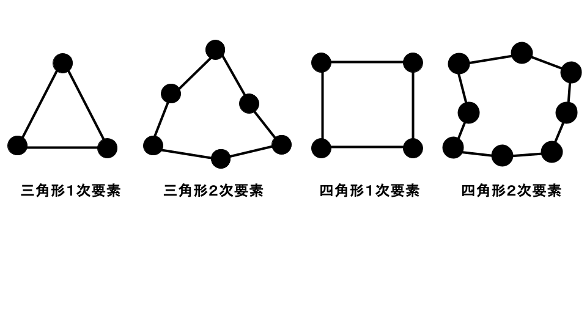
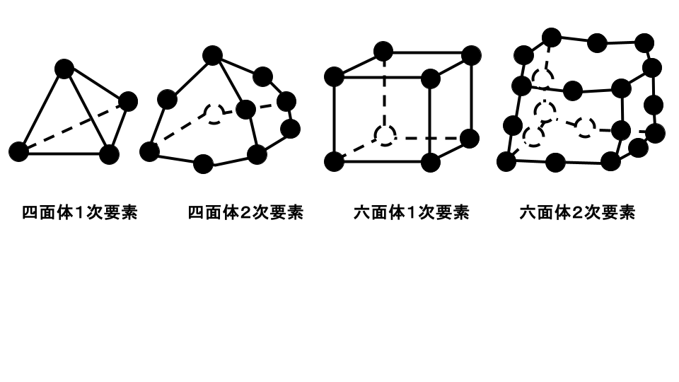
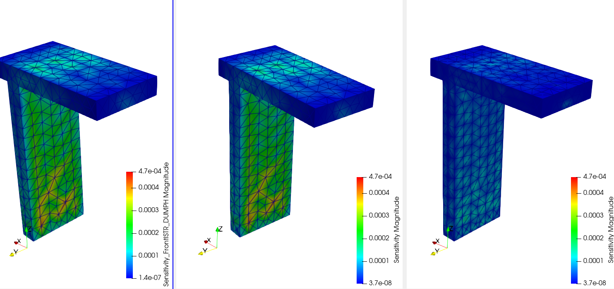
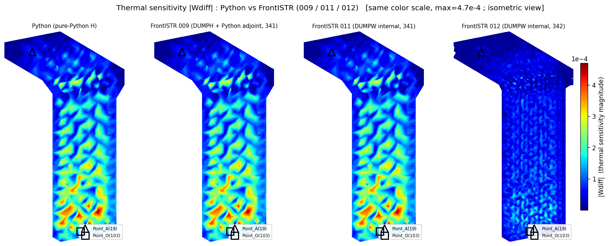
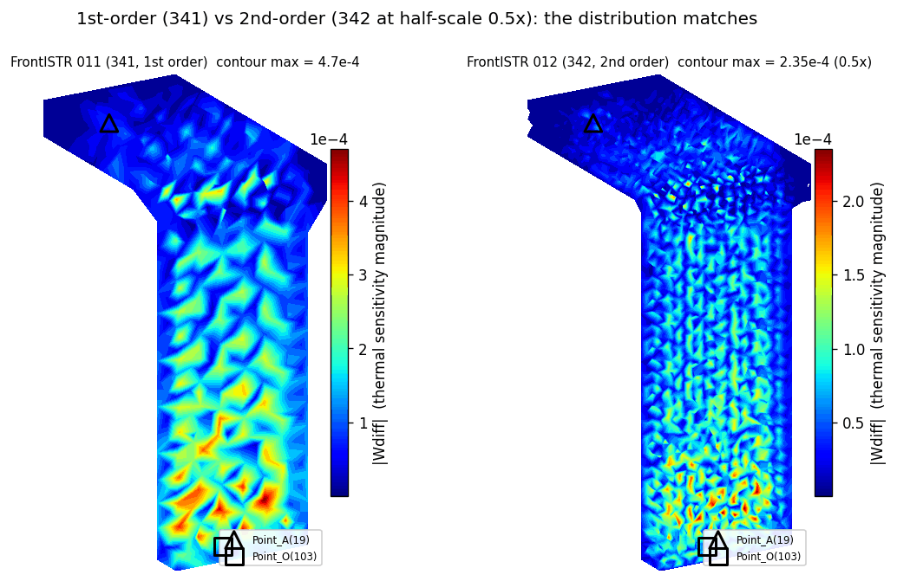

# 一次・二次四面体要素でのW出力とVTK・計算速度比較（DUMPW）

## 0. このドキュメントで分かること

- DUMPWパッチを当てたFrontISTRが、**一次四面体（341, C3D4）と二次四面体（342, C3D10）の
  両方**で、`K`・`H`・`W`・`VTK` を**1回の実行**で出力できること
- その裏にある**一次要素・二次要素それぞれの理論式**と、**プログラムのどこがどう対応しているか**
- **Point_A / Point_O をどこで設定するか**
- 一次版（`011_Tji_DUMPW`）と二次版（`012_Tji_DUMPW_342`）の**VTKと計算速度（4スレッド）の比較**

DUMPWの基本（アジョイント法・固定節点の扱い・別フォルダビルド）は
`docs/13_手順_FrontISTR内でW行列とVTKを出力.md` に書いてある。ここでは**二次要素対応**と
**4出力（K/H/W/VTK）**に絞って説明する。

---

## 1. Point_A / Point_O はどこで設定するか

**解析フォルダに置く `sensitivity_points.dat` というテキストファイル**で指定する。

```text
#Point_A, Point_O
19 103
```

- 左が **Point_A**（測定点）のグローバル節点番号、右が **Point_O**（基準点）のグローバル節点番号。
- 空白区切りで2つ書くだけ。`.cnt`（コントロールファイル）には書かない。
- `#` や `!` で始まる行はコメントとして読み飛ばす（上の `#Point_A, Point_O` のような見出しを付けてよい）。
- 角節点でも中間節点でも指定できる（二次要素なら中間節点番号も選べる）。

> **このファイルが無い（または中身が読めない）と、DUMPWはエラーで停止する**（終了コードは非0）。
> そのとき `FSTR.msg` と標準出力（`run_dumpw.log`）に、必要なファイル名と書き方が次のように出る。
> ```text
> DUMPW ERROR: cannot find/open "sensitivity_points.dat".
> DUMPW: the file "sensitivity_points.dat" is REQUIRED in the run directory.
>        Write ONE line with two global node ids: <Point_A> <Point_O>
>        (# or ! start a comment line). Example:
>          #Point_A, Point_O
>          19 103
> DUMPW ERROR: aborting because sensitivity_points.dat is missing or invalid.
> ```
> 同じエラーは、書式が壊れている場合や、指定した節点番号がメッシュに無い場合にも出る。

FrontISTR実行時に、この2つのグローバル節点番号を内部のローカル節点・自由度番号に変換し、
`FSTR.msg` に次のように確認メッセージが出る。

```text
DUMPW: Point_A global 19 -> local 19
DUMPW: Point_O global 103 -> local 103
```

プログラム上は `fistr1/src/analysis/static/fstr_ass_load.f90` の
`fstr_sensitivity_read_dofs` がこのファイルを読み、`3*(局所節点-1)+成分` で6自由度
（Point_A の x,y,z と Point_O の x,y,z）に変換している。

---

## 2. 出力される4つのファイル

`!SOLVER,METHOD=DIRECT,DUMPTYPE=MM,DUMPW=YES` を付けて `fistr1` を1回実行すると、
次の4つが**同じ1回の実行**で出る。

| 記号 | ファイル | 何の行列か | 出どころ |
|---|---|---|---|
| $K$ | `dump_matrix_1_0.mm` | 境界条件適用後の全体剛性行列 | FrontISTR標準の `DUMPTYPE=MM` |
| $H$ | `H_matrix.mtx` | 温度荷重変換行列（ $f_{\text{thermal}} = H T$ ）。(行,列)で整列・重複合算済み | DUMPW |
| $W$ | `Wdiff_fistr.txt` | 感度 $W_{\text{diff}}$ の数値（`節点番号 wx wy wz`） | DUMPW |
| $W$ | `sensitivity_Wdiff.vtk` | 同じ $W_{\text{diff}}$ をParaView用に可視化 | DUMPW |

いずれも一次要素（341）でも二次要素（342）でも同じように出る。

> **K・H を計算しているFortranプログラム（実コードと「ここです」の明示）**は
> **§4.6（K＝`STF_C3`）** と **§4.7（H＝`TLOAD_C3`）** に、数式と対応づけて載せてある。

---

## 3. 理論式：一次要素と二次要素で何が違うか

### 3.1 共通の枠組み（熱荷重行列 H）

温度を1℃上げると材料が膨張する。等方材料の熱ひずみは、線膨張係数を $\alpha$ 、温度差を
$\Delta T$ とすると

$$\varepsilon_{\text{th}} = \alpha\,\Delta T\,[1,\ 1,\ 1,\ 0,\ 0,\ 0]^{\mathsf T}$$

要素内部の温度は、節点温度 $T_k$ を形状関数 $N_k$ で内挿して表す。

$$\Delta T(\boldsymbol{\xi}) = \sum_{k=1}^{n} N_k(\boldsymbol{\xi})\,T_k$$

この熱ひずみが作る等価節点力（要素熱荷重ベクトル）は

$$f_e = \int_{V_e} B^{\mathsf T} D\,\varepsilon_{\text{th}}\;dV$$

で、 $B$ はひずみ-変位マトリクス、 $D$ は弾性マトリクスである。 $f_e$ は節点温度
$T_e = (T_1,\dots,T_n)$ について線形なので、要素熱荷重行列 $H_e$ が存在して

$$f_e = H_e\,T_e, \qquad H_e = \int_{V_e} B^{\mathsf T} D\,\alpha\,[1,1,1,0,0,0]^{\mathsf T}\,N\;dV$$

と書ける。**この式の形は一次でも二次でも同じ**。違うのは「 $N$ （形状関数）」と「 $B$ 」の中身、
そして $H_e$ の大きさである。

### 3.1.1 一次要素と二次要素の違い（節点配置）

「一次要素」と「二次要素」の違いは、**辺の途中に中間節点があるかどうか**である。二次要素は
各辺の中点に節点が増え、形状関数が二次式になるので、曲がった変形や応力の勾配をより正確に
表せる。まず2次元で見ると次のとおり（黒丸が節点）。



DUMPWが扱う3次元ソリッドでは、次の**四面体1次要素（341, C3D4, 4節点）**と
**四面体2次要素（342, C3D10, 10節点）**が対象である（六面体は参考）。



- **四面体1次要素（341）**：角の4節点だけ。
- **四面体2次要素（342）**：角4節点 + 各辺の中点6節点 = 10節点。

以下、この2つそれぞれについて、形状関数・ $H_e$ の大きさ・積分点の違いを見る。

### 3.2 一次四面体（341, C3D4）

- 節点数 $n = 4$ （角節点だけ）。
- 形状関数は体積座標そのもの（線形）。 $N_1 = 1-\xi-\eta-\zeta,\ N_2 = \xi,\ N_3 = \eta,\ N_4 = \zeta$ 。
- 微分すると定数なので、**ひずみ $B$ は要素内で一定**（定ひずみ要素）。積分は1点で厳密。
- $H_e$ の大きさは ${12 \times 4}$ （＝ ${3\cdot4}$ 行 × ${4}$ 列）。

### 3.3 二次四面体（342, C3D10）

- 節点数 $n = 10$ （角4 + 各辺の中点6）。
- 形状関数は二次式。 $a = 1-\xi-\eta-\zeta$ として
  （FrontISTRの `tet10n.f90` の実装そのまま）

$$N_1 = (2a-1)a,\quad N_2 = \xi(2\xi-1),\quad N_3 = \eta(2\eta-1),\quad N_4 = \zeta(2\zeta-1)$$

$$N_5 = 4\xi a,\quad N_6 = 4\xi\eta,\quad N_7 = 4\eta a,\quad N_8 = 4\zeta a,\quad N_9 = 4\xi\zeta,\quad N_{10} = 4\eta\zeta$$

- 微分が一次式なので、**ひずみ $B$ は要素内で場所によって変わる**（線形ひずみ要素）。
  積分は1点では足りず、**複数のガウス積分点**で数値積分する。
- $H_e$ の大きさは ${30 \times 10}$ （＝ ${3\cdot10}$ 行 × ${10}$ 列）。

### 3.4 感度行列 W（一次・二次で同じ）

全体行列 $K$ （ ${3n_{\text{node}}}$ 角）と $H$ （ ${3n_{\text{node}} \times n_{\text{node}}}$ ）ができれば、
感度行列は

$$W = K^{-1} H$$

測定点差は $W$ の Point_A の3行と Point_O の3行の引き算

$$W_{\text{diff}} = W[\text{Point A の3行}] - W[\text{Point O の3行}]$$

で、 ${3 \times n_{\text{node}}}$ になる。これを求めるのに全列を解くのは重いので、 $K$ の対称性を使う
**アジョイント（随伴）法**で、6本の $z_i = K^{-1} e_i$ （Point_A/Point_O の6自由度に立てた単位ベクトル）
だけを解く。

$$W_{\text{diff}}\text{ の各行} = e_i^{\mathsf T} K^{-1} H = (K^{-1} e_i)^{\mathsf T} H = z_i^{\mathsf T} H$$

この $W$ の式・アジョイント法は、要素が一次でも二次でも**まったく同じ**（ $K$ と $H$ が
できてしまえば、あとは要素の種類に依らない線形代数だから）。詳しい導出は `docs/12` を参照。

---

## 4. プログラム解説：どこが一次・二次を切り替えているか

要求（K・H・W・VTKを一次/二次で出す）を満たすために、パッチでは主に
`fistr1/src/analysis/static/fstr_ass_load.f90` の中を**要素の種類に依らないように一般化**した。

### 4.1 要素タイプ → 節点数

まず「この要素はDUMPWの対象か、対象なら何節点か」を返す小さな関数を用意した。

```fortran
integer(kind=kint) function fstr_sensitivity_solid_nnode(ic_type) result(nn)
  select case(ic_type)
    case(341); nn = 4    ! C3D4  : 一次四面体
    case(342); nn = 10   ! C3D10 : 二次四面体
    case default; nn = 0 ! それ以外は対象外
  end select
end function
```

要素ループはこの `nn` を使い、`nn == 0`（対象外）ならスキップする。配列は最大10節点
（`maxnn = 10`）で確保しておき、要素ごとに実際の `nn` の範囲だけ使う。

### 4.2 H の列は標準ルーチン TLOAD_C3 が計算する（一次・二次共通）

要素熱荷重行列 $H_e$ の列は、FrontISTRが通常の熱応力解析で使っている `TLOAD_C3` を
そのまま呼んで得る。局所節点 $k$ だけに単位温度 $e_k$ を与えると、その列 $H_e[:,k]$ が返る。

`TLOAD_C3(ic_type, nn, ...)` にこの $T_e$ を渡すと、返ってくるのが $H_e$ の第 $k$ 列である。

$$T_e = e_k \quad\Longrightarrow\quad H_e\,T_e = H_e\,e_k = H_e[:,k]$$

**重要な点**：`TLOAD_C3` は `ic_type`（341/342…）と `nn` を引数で受け取り、内部で正しい形状関数・
$B$ ・ガウス積分を選んでくれる。だからパッチ側は「実際の要素タイプと節点数を渡す」だけでよく、
二次要素の二次形状関数や多点積分を自前で書く必要はない。標準コードも
`if (ic_type == 341 .or. 351 .or. 342 .or. 352 .or. 362) call TLOAD_C3(...)` と同じ使い方をしている。

### 4.3 H を書きつつ W を足し込む

要素ループの中で、各列 $H_e[:,k]$ の12個（341）または30個（342）の値について、

1. `(全体行, 全体列, 値)` を配列に集める。
2. その場で $g_c = z_{A,c} - z_{O,c}$ （ $c=x,y,z$ ）と掛けて $W_{\text{diff}}$ に加算する。

```fortran
row = ndof*(nodLocal(j)-1) + i
ne = ne + 1
irow(ne) = row;  icol(ne) = kg;  hval(ne) = vect(ndof*(j-1)+i)   ! H の (行,列,値) を収集
g(1)=Z(row,1)-Z(row,4); g(2)=Z(row,2)-Z(row,5); g(3)=Z(row,3)-Z(row,6)
do c = 1, 3
  Wdiff(c,kg) = Wdiff(c,kg) + g(c) * vect(ndof*(j-1)+i)          ! -> Wdiff
enddo
```

要素ループが終わったら、集めた $H$ の項目を **(行, 列) で整列**し、**同じ(行,列)の重複を合算**して
から `H_matrix.mtx` に書き出す。節点を共有する要素からは同じ(行,列)が複数回出るが、これを
Fortran側で足し合わせるので、`H_matrix.mtx` は「1つの(行,列)につき1行、行→列の昇順」という
読みやすい形になる（整列にはヒープソートを使う）。

$W_{\text{diff}}$ のほうは要素ループ内で足し込み済みなので、 $H$ を密行列に展開する必要はない。

### 4.4 VTK は要素タイプでセルの書き方を変える

ここが一次・二次で**唯一、明示的に場合分け**しているところ。

| 要素 | VTKセル型 | 1セルの節点数 | 節点の並べ替え |
|---|---|---|---|
| 341 | `10`（VTK_TETRA） | 4 | そのまま |
| 342 | `24`（VTK_QUADRATIC_TETRA） | 10 | そのまま（並べ替え不要） |

```fortran
if (nn == 4) then
  write(iunit,"(I0,4(' ',I0))") 4, (nodLocal(j)-1, j=1,4)
else   ! nn == 10
  write(iunit,"(I0,10(' ',I0))") 10, (nodLocal(j)-1, j=1,10)
endif
```

**重要（ハマりどころ）**：ソルバー内部で得られる `hecMESH%elem_node_item` は、342要素では
**形状関数の節点順**（節点5〜10 = 辺(1,2),(2,3),(3,1),(1,4),(2,4),(3,4)の中点）になっている。
これは `VTK_QUADRATIC_TETRA` が期待する節点順と**まったく同じ**なので、DUMPWでは
**並べ替えは不要（恒等）**である。

> なお、FrontISTR標準のC言語VTK出力（`hecmw_fstr_output_vtk.c`）は `table342` で並べ替えを
> しているが、これは**メッシュファイルの生の節点順**（ソルバーが並べ替える前）を読んでいるため。
> 最初この `table342` をそのままDUMPWに持ち込んで、中間節点3つ（辺1-2, 2-3, 3-1）が入れ違い、
> ParaViewで要素形状が崩れた。ソルバー内部の `elem_node_item` は既にVTK順なので、そのまま
> 書くのが正しい（出力VTKの全要素で「中間節点＝正しい辺の中点」を検証済み、最大ずれ 1e-9）。

$K$ ・ $H$ ・ $W$ の数値計算のほうは、4.2のとおり `elem_node_item` をそのまま `TLOAD_C3` に
渡すだけで正しい（形状関数順で一貫している）。

### 4.5 Point_A / Point_O を読み取るプログラム

測定点の指定（`sensitivity_points.dat`）を読み、内部の自由度番号に変換しているのは
`fistr1/src/analysis/static/fstr_ass_load.f90` の **`fstr_sensitivity_read_dofs`** である。
呼び出しの流れは次のとおり。

```text
fstr_Newton （fstr_solve_NonLinear.f90）         … 変位solveの本体
  └ 変位solveの直後、DUMPW=YESなら
     if( svIarray(37) /= 0 .and. isLinear )       … DUMPWのスイッチ
       call fstr_dump_sensitivity(...)            … アジョイントの司令塔
        └ call fstr_sensitivity_read_dofs(...)     … ここで測定点ファイルを読む
```

`fstr_sensitivity_read_dofs` の中身（要点）:

```fortran
! 1) ファイルを開く（無ければ後でエラー停止。相対パス＝実行フォルダ基準）
open(iunit, file='sensitivity_points.dat', status='old', action='read', iostat=stat)

! 2) 先頭の「# / ! でないコメント以外の行」を1行読み、整数2つを取る
do
  read(iunit, '(A)', iostat=ios) line
  if (ios /= 0) exit
  lt = adjustl(line)
  if (len_trim(lt) == 0) cycle                 ! 空行スキップ
  if (lt(1:1) == '#' .or. lt(1:1) == '!') cycle ! コメントスキップ
  read(lt, *, iostat=stat) ga, go               ! ga=Point_A, go=Point_O（グローバル節点番号）
  exit
enddo

! 3) グローバル節点番号 -> ローカル節点番号（hecMESH%global_node_ID で探す）
do i = 1, hecMESH%n_node
  if (hecMESH%global_node_ID(i) == ga) na_local = i
  if (hecMESH%global_node_ID(i) == go) no_local = i
enddo

! 4) ローカル節点 -> 6自由度（各点の x,y,z）
dof6(1) = 3*na_local-2; dof6(2) = 3*na_local-1; dof6(3) = 3*na_local
dof6(4) = 3*no_local-2; dof6(5) = 3*no_local-1; dof6(6) = 3*no_local
```

- 「`3*(局所節点-1) + 成分`」で自由度番号にしている（成分 1=x, 2=y, 3=z）。
- この `dof6`（6個）が、アジョイントの右辺 $e_i$ （Point_A x/y/z, Point_O x/y/z）を立てる位置になる。
- ファイルが無い／読めない／節点番号がメッシュに無い、のいずれでも、必要なファイル名と
  書き方（`#Point_A, Point_O` / `19 103`）を `FSTR.msg` と標準出力に出して**エラー停止**する
  （§1参照）。

### 4.6 K行列を計算しているのはここ（`STF_C3`）

要素剛性行列 $K_e = \int_{V_e} B^{\mathsf T} D B \, dV \approx \sum_g w_g\, B_g^{\mathsf T} D B_g$
を計算しているFortranのプログラムはここです。

**ファイル**：`fistr1/src/lib/static_LIB_3d.f90`（サブルーチン `STF_C3`、50行目付近）。
その計算の中心はこの部分です（← のコメントが数式との対応）。

```fortran
do LX = 1, NumOfQuadPoints(etype)                          ! ← ガウス積分点 g のループ（341は1点, 342は複数点）
  call getQuadPoint( etype, LX, naturalCoord )
  call getGlobalDeriv(etype, nn, naturalcoord, elem, det, gderiv) ! ← 形状関数の空間微分 gderiv とヤコビアン det=det(J_g)
  call MatlMatrix( gausses(LX), D3, D, time, tincr, coordsys, temp ) ! ← 弾性マトリクス D
  wg = getWeight(etype, LX)*det                            ! ← 重み × ヤコビアン = w_g det(J_g)

  B(1:6,1:nn*ndof) = 0.0D0                                 ! ← ひずみ-変位マトリクス B を gderiv から組む
  do j = 1, nn
    B(1,3*j-2)=gderiv(j,1);  B(2,3*j-1)=gderiv(j,2);  B(3,3*j  )=gderiv(j,3)
    B(4,3*j-2)=gderiv(j,2);  B(4,3*j-1)=gderiv(j,1)
    B(5,3*j-1)=gderiv(j,3);  B(5,3*j  )=gderiv(j,2)
    B(6,3*j-2)=gderiv(j,3);  B(6,3*j  )=gderiv(j,1)
  enddo

  DB(1:6,1:nn*ndof) = matmul( D, B(1:6,1:nn*ndof) )        ! ← D·B
  do j = 1, nn*ndof
    do i = 1, nn*ndof
      stiff(i,j) = stiff(i,j) + dot_product( B(:,i), DB(:,j) )*wg  ! ← これが Σ_g w_g (B^T D B)
    enddo
  enddo
enddo
```

最後の `stiff(i,j) += dot_product(B(:,i),DB(:,j))*wg` が、まさに $\sum_g w_g\, B^{\mathsf T} D B$ の
各成分を足し込んでいる行です。341でも342でも同じ `STF_C3` が使われ、要素タイプ `etype` と
節点数 `nn` の違いは `NumOfQuadPoints`（積分点数）や `gderiv`（微分）の中で吸収されます。

**全体剛性 $K$ への組み立て**は `fistr1/src/analysis/static/fstr_CreateMatrix.f90` で、
`STF_C3(...)` が返した要素剛性 `stiff_mat` を `hecmw_mat_ass_elem(hecMAT, nn, nodLOCAL, stiff_mat)`
（実体は `hecmw1/src/solver/matrix/hecmw_mat_ass.f90`）で全体行列 `hecMAT` に足し込みます
（ $K = \sum_e P_e^{\mathsf T} K_e P_e$ ）。**ここはFrontISTR標準で、DUMPWは触っていません**。DUMPWは
出来上がった $K$ を `DUMPTYPE=MM` で `dump_matrix_1_0.mm` に出すだけです。

### 4.7 H行列を計算しているのはここ（`TLOAD_C3`）

要素熱荷重（＝ $H_e$ の列） $f_e = \int_{V_e} B^{\mathsf T} D\,\varepsilon_{\text{th}}\, dV$ 、
$\varepsilon_{\text{th}} = \alpha\,\Delta T\,[1,1,1,0,0,0]^{\mathsf T}$ 、 $\Delta T = \sum_k N_k T_k$
を計算しているのはここです。

**ファイル**：同じ `fistr1/src/lib/static_LIB_3d.f90`（サブルーチン `TLOAD_C3`、386行目付近）。
「節点温度ベクトル `TT` を渡すと $f_e = H_e T_e$ を返す」ルーチンで、計算の中心はこの部分です。

```fortran
do LX = 1, NumOfQuadPoints(etype)                          ! ← ガウス積分点 g のループ
  call getShapeFunc( ETYPE, naturalcoord, H(1:nn) )        ! ← 形状関数 N（変数名は H）
  call getGlobalDeriv( etype, nn, naturalcoord, ecoord, det, gderiv )
  wg = getWeight(etype, LX)*det                            ! ← w_g det(J_g)

  B(1:6,1:nn*NDOF)=0.0D0                                   ! ← B を組む（STF_C3 と同じ）
  do J=1,nn
    B(1,3*J-2)=gderiv(j,1);  B(2,3*J-1)=gderiv(j,2);  B(3,3*J  )=gderiv(j,3)
    B(4,3*J-2)=gderiv(j,2);  B(4,3*J-1)=gderiv(j,1)
    B(5,3*J-1)=gderiv(j,3);  B(5,3*J  )=gderiv(j,2)
    B(6,3*J-2)=gderiv(j,3);  B(6,3*J  )=gderiv(j,1)
  enddo

  TEMPC = dot_product( H(1:nn), TT(1:nn) )                 ! ← ΔT = Σ N_k T_k（節点温度 TT を内挿）
  call MatlMatrix( gausses(LX), D3, D, 1.d0, 0.0D0, coordsys, tempc ) ! ← 弾性マトリクス D
  ! （alp = 線膨張係数 α を材料から取得）
  THERMAL_EPS = ALP*(TEMPC-ref_temp) - alp0*(TEMP0-ref_temp) ! ← 熱ひずみの大きさ α·ΔT
  EPSTH(1:3) = THERMAL_EPS;  EPSTH(4:6) = 0.0D0            ! ← ε_th = αΔT·[1,1,1,0,0,0]

  SGM(:) = matmul( D(:,:), EPSTH(:) )                      ! ← D·ε_th
  VECT(1:nn*NDOF) = VECT(1:nn*NDOF) + matmul( SGM(:), B(:,:) )*wg ! ← これが f += w_g B^T (D ε_th)
enddo
```

`TEMPC = dot_product(H, TT)` が節点温度 `TT` について線形なので、返り値 `VECT`（ $=f_e$ ）も `TT` に
ついて線形＝ $f_e = H_e T_e$ です。**DUMPWはこの `TLOAD_C3` を、局所節点 $k$ だけ `TT(k)=1`（他は0）
にして呼ぶ**ことで $H_e$ の第 $k$ 列を1本ずつ取り出し（ $H_e e_k = H_e[:,k]$ ）、全体 $H$ を組み立てて
`H_matrix.mtx` に出します。この「Hを行列として組み立てて出す」部分（`fstr_sensitivity_export`）が
DUMPWパッチの追加分で、`STF_C3`・`TLOAD_C3` 自体（K・Hの物理計算）はFrontISTR標準のまま使っています。

---

## 5. 実行手順

### 5.1 ビルド（`docs/13` と同じ、別フォルダ）

```bash
cd $HOME/src/FrontISTR
git worktree add $HOME/src/FrontISTR-dumpw 7f48eae0
cd $HOME/src/FrontISTR-dumpw
# 改造を当てる（どちらか）
git apply /mnt/d/work/002_CAE/frontistr/work/20260810_KinvH/frontistr/patch/frontistr_dumpw_tet.patch
# もしくは改造ソースを直接コピー（cp -r はマージ＝5ファイルだけ上書き、他は残る）:
# cp -r /mnt/d/work/002_CAE/frontistr/work/20260810_KinvH/frontistr/patch/modified_src/fistr1 $HOME/src/FrontISTR-dumpw/
cmake -S . -B build-dumpw -DCMAKE_BUILD_TYPE=RELEASE \
  -DWITH_MPI=OFF -DWITH_OPENMP=ON -DWITH_LAPACK=ON \
  -DWITH_MKL=OFF -DWITH_MUMPS=OFF -DWITH_METIS=OFF \
  -DWITH_NETCDF=OFF -DWITH_REFINER=OFF -DWITH_REVOCAP=OFF \
  -DWITH_TOOLS=OFF -DWITH_DOC=OFF
cmake --build build-dumpw -j4
```

### 5.2 二次要素メッシュを作る（341 → 342 変換）

二次要素の検証メッシュは、一次のQuad4_FEM_Tjiメッシュ（`011_Tji_DUMPW/FistrModel.msh`）から
各辺に中間節点を足して作る。変換スクリプトを用意した。

```bash
cd /mnt/d/work/002_CAE/frontistr/work/20260810_KinvH
python3 post/convert_341_to_342.py \
    model/011_Tji_DUMPW/FistrModel.msh \
    model/012_Tji_DUMPW_342/FistrModel.msh
```

- 角節点570 + 中間節点2744 = **3314節点**、要素数は1699のまま（各四面体が4節点→10節点になる）。
- 中間節点は、FrontISTRの342ファイル規約
  （`節点5=辺(2,3)の中点, 6=辺(1,3), 7=辺(1,2), 8=辺(1,4), 9=辺(2,4), 10=辺(3,4)`）の順で書く。
  この規約は実サンプル（`B342.msh`）で実測して確認した。
- 固定節点群 `fix` には、元の角節点に加えて「両端がともに固定されている辺」の中点も含める
  （固定面を二次要素でも固定面のまま保つため）。

### 5.3 実行（4スレッド）

```bash
cd /mnt/d/work/002_CAE/frontistr/work/20260810_KinvH/frontistr/model/012_Tji_DUMPW_342
export OMP_NUM_THREADS=4
$HOME/src/FrontISTR-dumpw/build-dumpw/fistr1/fistr1 > run_dumpw.log 2>&1
```

`FSTR.msg` に次が出れば成功（`n_elem_solid` は341/342をまとめた3次元ソリッド要素数）。

```text
DUMPW: wrote H_matrix.mtx, sensitivity_Wdiff.vtk, Wdiff_fistr.txt; n_node= 3314  n_elem_solid= 1699
```

一次版（`011_Tji_DUMPW`）も同じ実行ファイルで動く。`FistrModel.cnt` は両方とも
`!SOLVER,METHOD=DIRECT,ITERLOG=NO,TIMELOG=YES,DUMPTYPE=MM,DUMPW=YES` としてある。

---

## 6. 検証：FrontISTR内部のWは正しいか

FrontISTR内部で計算した `Wdiff_fistr.txt` を、**同じ実行で出した $K$ と $H$ を読み込んで
Python（`scipy`）でアジョイント法をやり直した結果**と突き合わせた。両者は同じ $K,H$ から
出発するので、一致すれば「FrontISTR内部のアジョイント実装（341/342の一般化）が正しい」
と言える。材料は両ケースとも E=130000000, ν=0.27, CTE=1.2e-5 でそろえてある。

| ケース | 節点数 | 自由度 | 相対差 $\lVert W_{\text{fistr}} - W_{\text{py}}\rVert / \lVert W_{\text{py}}\rVert$ | 最大絶対差 |
|---|---|---|---|---|
| 341（`011`） | 570 | 1710 | `2.4e-8` | `1.2e-11` |
| 342（`012`） | 3314 | 9942 | `1.1e-7` | `2.3e-11` |

どちらも倍精度の丸め誤差レベルで一致した。342では角節点・固定節点（Point_O=節点103）・
中間節点（例：節点571）のいずれの列も一致している。**二次要素でもDUMPWのWは正しい**。

---

## 7. VTKの比較（一次 vs 二次）

両方とも `sensitivity_Wdiff.vtk` に、感度場 $W_{\text{diff}}$ をベクトル場 `Sensitivity` として
書き出す（ParaViewでGlyph／Warp／色分け表示できる）。構造の違いは次のとおり。

| | 341（`011`） | 342（`012`） |
|---|---|---|
| `POINTS` | 570 | 3314 |
| セル型（`CELL_TYPES`） | `10`（VTK_TETRA） | `24`（VTK_QUADRATIC_TETRA） |
| 1セルの節点数 | 4 | 10（中間節点は `tbl342` で並べ替え済み） |
| `CELLS` 行 | `570 … `（各 `4 n0 n1 n2 n3`） | `1699 18689`（各 `10 …`、 ${1699\times(10{+}1)}$ ） |
| `VECTORS Sensitivity` | 570行 | 3314行 |

二次要素は中間節点にも感度値を持つので、同じ形状でもコンタが滑らかになり、節点数が多いぶん
細かい分布が見える。342の中間節点は並べ替え不要（4.4のとおり `elem_node_item` がそのままVTK順）
なので、ParaViewで要素形状が崩れずに表示される。

> FrontISTRが書いた `sensitivity_Wdiff.vtk` と、Python（`post/write_sensitivity_vtk.py`相当）が
> 同じ $W_{\text{diff}}$ から書いたVTKは、節点値が一致する（第6章の数値一致がそのまま点データの
> 一致になる）。可視化の見た目も一致する。

実際にParaViewで開いて色分け（|Sensitivity|）表示したのが次の図（3つとも同じ色スケール、最大 `4.7e-4`）。
左は凡例が `Sensitivity_FrontISTR_DUMPH` で **FrontISTR DUMPH（一次要素）**、中央・右は **DUMPW出力**
（一次 341 と 二次 342）。同じ色スケールで見ると**二次(342)だけ青め**に見えるが、これは 7.2 で説明した
とおり節点値の基底が違うためで、間違いではない。



### 7.1 熱感度分布の絵（Python / FrontISTR 009・011・012 の4つ）

感度の大きさ $|W_{\text{diff}}|$ を、Python版とFrontISTR版3つで並べたのが次の図。左3枚（Python・009・011）は
どれも一次メッシュ（570節点）で、数値が一致しているので分布もそっくり。右端（012）は二次メッシュ
（3314節点）で、中間節点のぶん点が密になり、より細かい分布が見える。▲がPoint_A(19)、■がPoint_O(103)。



| 図の列 | 何の結果か | データ元 |
|---|---|---|
| Python (pure-Python H) | 自作PythonでHを作りアジョイントで解いたW | `model/008_Tji_compare/Wdiff_python_tji.npy` |
| FrontISTR 009 | DUMPHで出したK・HをPythonアジョイントで解いたW（341） | `model/009_Tji_H_direct/Wdiff_fistr_tji.npy` |
| FrontISTR 011 | DUMPWがFrontISTR内で出したW（341） | `model/011_Tji_DUMPW/Wdiff_fistr.txt` |
| FrontISTR 012 | DUMPWがFrontISTR内で出したW（342, 二次） | `model/012_Tji_DUMPW_342/Wdiff_fistr.txt` |

視点はdocs/11のParaViewの絵に合わせた斜め上からの等角ビュー（Z上向き、T字ブラケット）、
色は同じ線形スケール（`1.4e-7` 〜 `4.7e-4`）。この図を作るコマンド（`011`・`012` を実行して
`Wdiff_fistr.txt` を出したあと）:

```bash
cd /mnt/d/work/002_CAE/frontistr/work/20260810_KinvH
python3 post/plot_wdiff_distribution.py
# -> docs/img/dumpw_wdiff_python_009_011_012.png
```

右端（342）が左3枚より青い（値が小さく見える）のは、バグではなく一次・二次の離散化の違いに
よるもの。理由は次の **7.2** で詳しく説明する。

### 7.2 なぜ一次要素と二次要素で結果が違うのか

図を見ると左3枚（341）と右端（342）で分布が違う。これは**DUMPWのバグではない**
（第6章のとおり、各メッシュで「ダンプした $K$ ・ $H$ からPythonで解き直した $W$ 」と相対差 `1e-7`
で一致している＝どちらも自分の $K$ ・ $H$ に対しては正しい）。違いの理由は大きく2つある。

#### 理由1：要素の精度が違う（一次は「硬い」）

- **一次四面体（341）** は要素内でひずみが一定（定ひずみ要素）。曲げや応力の勾配を表すのが
  苦手で、**実際より硬めに出る**傾向がある。正確に解くには細かいメッシュが要る。
- **二次四面体（342）** は要素内でひずみが直線的に変化でき、曲げ・勾配を1要素でよく表せる。
  **同じメッシュなら二次のほうが真の連続解に近い。**

同じ形状・同じ要素数でも、一次と二次では計算される変位・感度が（真の解への近さの点で）違う。
メッシュを細かくしていけば両者は同じ答えに収束する。

#### 理由2： $W$ の「1節点あたりの値」が別の基底の係数だから（見た目の主因）

図で342が青く見える一番の理由はこちら。

- $W$ の第 $j$ 列は「**節点 $j$ に単位温度を与えたときの応答**」である。
- 「節点 $j$ に単位温度」とは、実際には**その節点の形状関数 $N_j$ の形の温度分布**を与えること。
- 一次の角節点の $N_j$ （線形の三角屋根）と、二次の角節点・中間節点の $N_j$ （二次のバンプ。角節点の
  $N_j$ は近傍でマイナスにもなる）は**まったく別の関数**である。したがって「1節点に単位温度」という
  摂動の中身が一次と二次で違い、節点ごとの $W$ の値も別の分布になる。
- とくに**二次要素の等価熱荷重は中間節点に集中し、角節点は小さく（時に負に）なる**という性質が
  あるため、342では**ピークが中間節点側に移り、角節点の値は小さく**なる。

実測（ $|W_{\text{diff}}|$ の大きさ）：

| | 最大 | 平均 | 備考 |
|---|---|---|---|
| 341 | `4.7e-4` | `1.1e-4` | 角節点にホットスポット |
| 342 | `2.3e-4` | `4.6e-5` | ピークは中間節点（角節点だけなら最大 `9.3e-5`） |

同じ色スケールだと342が青く見えるが、これは値が「間違って小さい」のではなく、**節点値の意味
（基底）が違うので分布が変わって見えている**ということである。

これを目で確かめたのが次の図。**左＝一次要素(341)を色スケール上限 `4.7e-4`**、
**右＝二次要素(342)を上限その0.5倍の `2.35e-4`** にしてある。二次側の上限を（ピークが
半分なので）半分に合わせると、**左右で分布の形がそっくりになる**＝柱の下部（Point_A/O近く）に
ホットスポットが出て、上の板は小さい、という同じパターン。つまり一次と二次は**分布の形は共通**で、
節点値の絶対スケールと基底が違うだけ、ということがはっきり分かる。



#### まとめ

- どちらも同じ物理を解いていて、**各メッシュ内では正しい**（Python照合で確認済み）。
- 違いは「一次は硬めで精度が低い／二次は精度が高い」＋「 $W$ の節点値が別の形状関数の係数なので
  直接は比較できない」の2点。
- **メッシュに依らない量**（例：ある滑らかな温度場に対する Point_A − Point_O の実際の相対変位）で
  比べれば、一次と二次は近づき、メッシュを細かくすれば一致する。

---

## 8. 計算速度の比較（4スレッド）

`OMP_NUM_THREADS=4` で計測した。比較対象は
**(A) FrontISTR内部（DUMPWが4出力すべてを1回で作る）** と
**(B) Python：FrontISTRが出した $K,H$ を読んでアジョイントで $W$ を出す** の2通り。

> **「因子分解」とは何か**：連立一次方程式 $K x = b$ を直接法で解くとき、まず係数行列 $K$ を
> $K = L U$ （下三角 $L$ × 上三角 $U$ ）の形に分解する。これを **LU分解（因子分解）** と呼ぶ。
> 一番重い計算はこの分解で、 $K$ のサイズ（自由度数）に強く依存する。いったん $L,U$ ができれば、
> 別の右辺 $b$ に対しては $Ly=b$ （前進代入）→ $Ux=y$ （後退代入）を解くだけで $x$ が求まり、
> これは分解に比べてずっと軽い。DUMPWは、変位を解くときに作った $L,U$ を**使い回して**、
> アジョイントの6本 $z_i$ を後退代入だけで求める（だから6本がとても速い）。
> 表の「うち因子分解」は、この $K=LU$ 分解にかかった時間のことである。

### 8.1 実測値（Linuxローカルディスク上で実行）

段階を縦（行）、メッシュを横（列）に並べた。上4行が **(A) FrontISTR内部（DUMPW）**、
下2行が **(B) Python** の内訳。

| 方式 | 処理段階 | 341（1710自由度） | 342（9942自由度） |
|---|---|---|---|
| (A) FrontISTR DUMPW | 因子分解（ $K=LU$ 、1回だけ） | `0.003 s` | `0.105 s` |
| (A) FrontISTR DUMPW | アジョイント6回solve（後退代入のみ） | 約 `0.001 s` | 約 `0.02 s`（各回約3 ms） |
| (A) FrontISTR DUMPW | H等のテキスト出力＋その他 | 残り | 残り（ここが最大） |
| (A) FrontISTR DUMPW | **合計** | **`0.22 s`** | **`1.86 s`** |
| (B) Python | 因子分解（ $K=LU$ 、scipy） | `0.012 s` | `0.302 s` |
| (B) Python | **合計**（K・H読み込み込み） | **`0.18 s`** | **`1.77 s`** |

「因子分解」と「アジョイント6回solve」を足しても合計にはまったく届かないことに注目
（342なら ${0.105 + 0.02 \approx 0.13}$ 秒に対し合計 `1.86` 秒）。差は下の8.2で説明するとおり、
ほとんどが行列のテキスト入出力（I/O）である。

### 8.2 読み取れること

- **W計算そのものは非常に軽い**。アジョイントの6本は因子分解を使い回した後退代入なので、
  342でも1回あたり約3 ms（6回で約0.02秒）。「因子分解1回＋後退代入6回」という設計どおり、
  節点数が増えてもsolve回数は6回のまま。
- **合計時間の大半は行列のテキスト出力（I/O）**。342の `H_matrix.mtx` は、整列・重複合算後で
  非ゼロ約22.9万個・約7 MB（生の要素寄与は ${1699 \times 10 \times 3 \times 10 = 50.97}$ 万個だが、
  節点共有による重複を合算してこの数になる）。この整形テキスト書き出しが、因子分解（0.1秒）より
  ずっと大きい。Python側(B)も、合計の大半は $K,H$ のテキスト読み込みである。
- FrontISTR内蔵の直接法（METIS並べ替え無しでビルド）の因子分解は、342で `0.105 s`。
  `scipy` のSuperLU（`0.302 s`）より速く、この規模では内蔵ソルバーで十分。
- **(A)と(B)はほぼ互角**（341で0.22 vs 0.18秒、342で1.86 vs 1.77秒）。速度差はほとんど無く、
  DUMPWの利点は「**Python不要・1コマンドで4出力**」という手軽さのほうにある。

### 8.3 注意：遅いファイルシステムだとI/O時間が伸びる

上はLinuxネイティブの高速ディスクでの値。WSL2からWindows側のドライブ（`/mnt/d/...`）に
直接書くと、整形テキストのI/Oが数倍遅くなる（実測で341が約1.1秒、342が約9.8秒）。
これは計算ではなくファイル書き込みの遅さなので、速度を測るときや大きいメッシュでは
**Linuxローカルディスクで実行**するとよい（結果ファイルだけ後で移動する）。

**補足：「Kの再ダンプ抑止」とは**。`DUMPTYPE=MM` は「solve（連立方程式を解く処理）を呼ぶたびに、
そのときの $K$ をファイルに書き出す」機能である。DUMPWは変位を解いたあと、アジョイントのために
**さらに6回solveを呼ぶ**。何もしないと、この6回でも毎回 $K$ が書き出されてしまい、同じ $K$
（342なら約21 MB）を合計7回もファイルに書く**無駄なI/O**になる（`dump_matrix_1_0.mm` 〜
`dump_matrix_7_0.mm` のように7組できてしまう）。そこでパッチでは、6回solveに入る前に
`hecmw_mat_set_dump(hecMATmpc, 0)` を呼んで**ダンプ機能を一時的にオフ**にしている。
これで $K$ の書き出しは最初の変位solveのときの1回だけになり、`dump_matrix_1_0.mm` が1組できる。
（もし `dump_matrix_2_0.*` 〜 `_7_0.*` が残っていたら、それはこの抑止を入れる前の古い実行の
残骸なので消してよい。）

---

## 9. どのフォルダのどれを見ればよいか

| 見たいもの | 場所 |
|---|---|
| DUMPWパッチ本体（341+342対応） | `patch/frontistr_dumpw_tet.patch` |
| パッチの日本語解説 | `patch/README.md`（`DUMPW` の節） |
| 341→342 変換スクリプト | `post/convert_341_to_342.py` |
| 一次要素の実行一式 | `model/011_Tji_DUMPW/` |
| 二次要素の実行一式 | `model/012_Tji_DUMPW_342/`（`FistrModel.cnt` / `hecmw_ctrl.dat` / `sensitivity_points.dat`） |
| 4出力（K/H/W/VTK） | 各フォルダの `dump_matrix_1_0.mm` / `H_matrix.mtx` / `Wdiff_fistr.txt` / `sensitivity_Wdiff.vtk` |
| DUMPWの基本（アジョイント・固定節点・ビルド） | `docs/13_手順_FrontISTR内でW行列とVTKを出力.md` |
| アジョイント法の詳しい数式 | `docs/12_手順_リファインメッシュでのK_H_W比較.md` |
